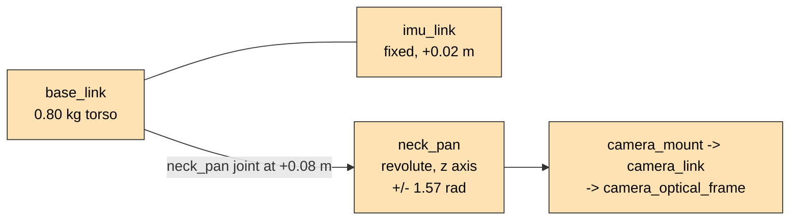
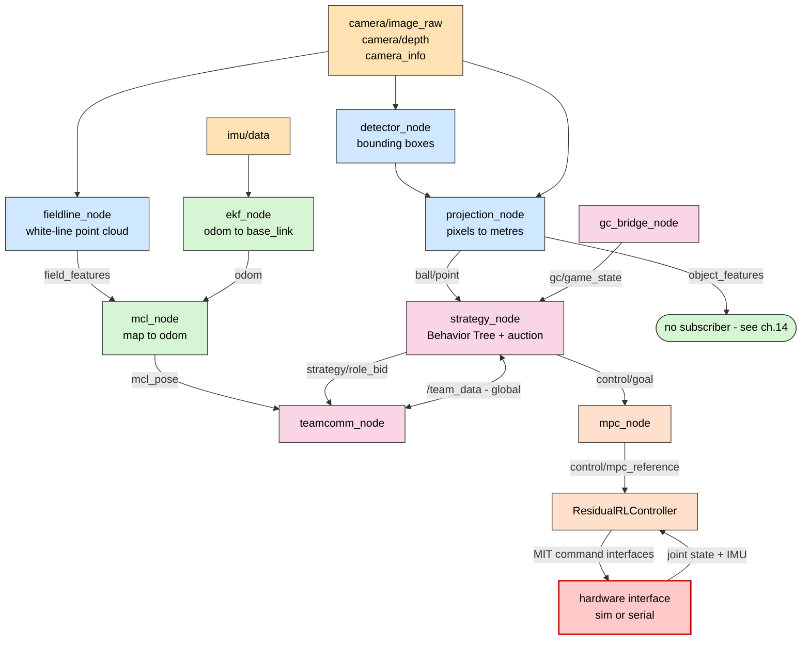
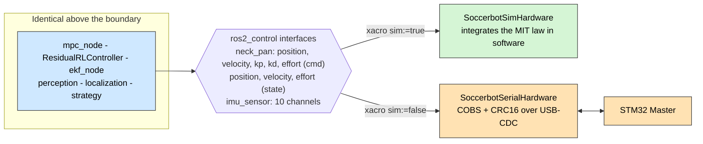
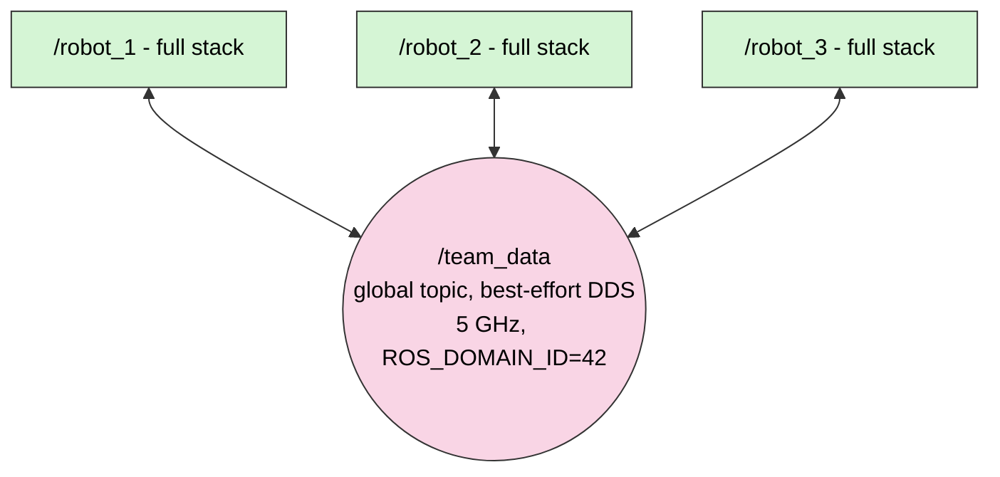
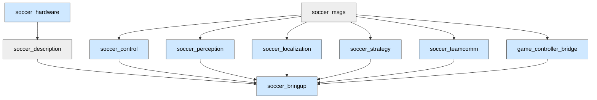

# 01 — System Overview

> **In one sentence:** `soccer-bot` is a complete, layered RoboCup Humanoid League
> software stack in which every architectural layer is implemented and wired
> through the same package boundaries the full 20-DOF robot will use — currently
> exercised by a deliberately minimal one-joint robot.

---

## 1. What the robot is today

The physical model in this repository is a **placeholder**, and that is a
deliberate decision (**[D-01](02-design-decisions.md#d-01)**).

| Full humanoid            | soccer-bot placeholder                            | Still exercises                                         |
| ------------------------ | ------------------------------------------------- | ------------------------------------------------------- |
| 20+ actuators            | **one** `neck_pan` revolute joint                 | `ros2_control`, MIT impedance command, MPC, residual RL |
| Multi-camera stereo rig  | **one** camera (synthetic in sim, ZED Mini on HW) | detection, field-line extraction, 3D projection         |
| Body IMU + foot pressure | **one** IMU                                       | Tier-1 EKF odometry                                     |
| Walk / kick / get-up     | **scan and track the ball**                       | Behavior Trees, role auction, MPC modes                 |

The placeholder's job is to stand on a field, **pan its camera to find and track
the ball**, **localize itself** from field lines, and **obey the GameController**
while negotiating roles with teammates. That single behaviour touches every layer
from L0 to L5.



Growing this into the real humanoid means **expanding the URDF and the policies**,
not re-architecting: the hardware interface is already generic over _N_ joints
(chapter [08](08-hardware-interface.md)), and the firmware already drives seven
Robostride actuators (chapter [09](09-firmware-and-actuators.md)).

---

## 2. Frequency domains

The organising principle of the whole system is the **frequency contract**: slow
cognition must never be able to stall the fast control loop
(**[D-02](02-design-decisions.md#d-02)**).

| Layer | Name                   | Rate                     | Where it runs    | Packages                             |
| ----- | ---------------------- | ------------------------ | ---------------- | ------------------------------------ |
| L5    | Mission                | ~2 Hz (GC broadcast)     | Jetson           | `game_controller_bridge`             |
| L4    | Strategy               | 10 Hz tick, 4 Hz comms   | Jetson           | `soccer_strategy`, `soccer_teamcomm` |
| L3    | Perception             | camera rate (~20–30 Hz)  | Jetson           | `soccer_perception`                  |
| L3    | Global localization    | 10 Hz                    | Jetson           | `soccer_localization` (`mcl_node`)   |
| L2    | Local state estimation | 200 Hz                   | Jetson           | `soccer_localization` (`ekf_node`)   |
| L1    | Whole-body control     | 50 Hz MPC, 100 Hz policy | Jetson           | `soccer_control`, `soccer_hardware`  |
| L0    | Real-time actuation    | 200 Hz bridge, kHz FOC   | STM32 + actuator | `soccer-firmware` submodule          |

Each layer is a **separate process** (or a separate physical target), so a segfault
in `detector_node` cannot stall `mpc_node`, and neither can stall the actuator's
onboard impedance loop. Three independent watchdogs enforce this in the actuation
path — see [09 §5](09-firmware-and-actuators.md#5-safety-three-watchdogs).

> **Why the rates are what they are.** The 1 kHz "PD on an MCU" number from the
> original blueprint is obsolete: the Robostride actuators close the torque loop
> **onboard**. The Jetson therefore streams _setpoints_, not torques, and the rate
> it needs is set by the policy (~50–100 Hz), not by the motor
> (**[D-24](02-design-decisions.md#d-24)**).

---

## 3. End-to-end data flow



The complete, exact interface list — every topic name, message type and QoS
setting — is in [03 — ROS 2 Interfaces](03-ros-2-interfaces.md).

---

## 4. The two boundaries that make the system work

Almost every other decision follows from these two.

### 4.1 The `ros2_control` boundary (sim ↔ real)

The identical ROS graph runs in simulation and on the robot. The **only**
difference is which hardware plugin `ros2_control` loads, selected by a single
xacro argument (**[D-03](02-design-decisions.md#d-03)**).



### 4.2 The camera contract (driver ↔ perception)

Perception never names a vendor topic. It subscribes to four **driver-agnostic**
topics, and either a synthetic node or a real ZED Mini fills them
(**[D-08](02-design-decisions.md#d-08)**).

| Contract topic     | Type                     | Filled in sim by                                           | Filled on hardware by                         |
| ------------------ | ------------------------ | ---------------------------------------------------------- | --------------------------------------------- |
| `camera/image_raw` | `sensor_msgs/Image`      | `sim_camera_node`                                          | ZED `~/rgb/color/rect/image` (remapped)       |
| `camera_info`      | `sensor_msgs/CameraInfo` | _(not published)_                                          | ZED `~/rgb/color/rect/camera_info` (remapped) |
| `camera/depth`     | `sensor_msgs/Image`      | _(not published)_                                          | ZED `~/depth/depth_registered` (remapped)     |
| `imu/data`         | `sensor_msgs/Imu`        | _(not published — [⚠ Gap](14-status-and-roadmap.md#g-04))_ | ZED `~/imu/data` (remapped)                   |

Swapping the ZED for another camera is a change to one launch file. Details in
[04 §1](04-perception.md#1-the-camera-contract).

---

## 5. Multi-robot: identity is a namespace

Every robot runs the **identical container and the identical launch file**. A
robot's identity is a ROS namespace plus a `player_id` parameter — nothing is
forked per robot (**[D-05](02-design-decisions.md#d-05)**).



- `robot.launch.py` pushes the whole graph under `/<robot_name>`.
- `team.launch.py` includes `robot.launch.py` _N_ times with `robot_name=robot_i`,
  `player_id=i`.
- The **only** global topic is `/team_data`. There is no master, no coach, and no
  central planner — required by the Humanoid League rules
  (**[D-06](02-design-decisions.md#d-06)**).

---

## 6. Repository map

```text
soccer-bot/
├── .github/workflows/ci.yml     CI: colcon build+test, ruff lint, arm64 image push
├── .devcontainer/               VS Code dev container (wraps Dockerfile.dev)
├── docs/                        ← you are here
│   └── archive/                 original blueprints and bring-up records
├── ros2_ws/
│   ├── colcon.meta              RelWithDebInfo default, compile_commands for C++ pkgs
│   └── src/
│       ├── soccer_msgs/         [IDL]  8 interface definitions
│       ├── soccer_description/  [xacro] URDF + ros2_control tags + controllers.yaml
│       ├── soccer_hardware/     [C++]  sim + serial ros2_control system plugins
│       ├── soccer_control/      [C++]  mpc_node + ResidualRLController plugin
│       ├── soccer_perception/   [Py]   detector, fieldline, projection, camera model
│       ├── soccer_localization/ [Py]   ekf_node (Tier-1), mcl_node (Tier-2), field model
│       ├── soccer_strategy/     [C++]  BehaviorTree.CPP + deterministic role auction
│       ├── soccer_teamcomm/     [Py]   TeamData broadcast over DDS
│       ├── game_controller_bridge/ [Py] UDP 3838/3939 to gc/game_state
│       └── soccer_bringup/      [launch] namespacing, sim camera, ZED camera launch
├── soccer-firmware/             [submodule] STM32 Master/Slave to Robostride CAN
├── sim/                         [Py]   Isaac Lab task, domain randomization, ES training, ONNX export
├── hardware/                    CAD / PCB placeholders (Git LFS)
├── deploy/
│   ├── docker/                  Dockerfile.jetson (2 targets), .ci, .dev, entrypoint
│   ├── compose/                 robot + sim compose, DDS profiles, ZED param override
│   ├── ansible/                 provision.yml (host fixes) + deploy.yml (fleet)
│   └── toolchains/              arm-none-eabi CMake toolchain for MCU work
├── tools/                       mock GameController, camera calibration, dev shell
└── Makefile                     build / build-pkg / clean / sim / robot
```

### Package dependency graph



`soccer_hardware` is a **build-time leaf** — nothing links against it. It is loaded
at runtime by `pluginlib`, which is why `soccer_description` declares it as an
`exec_depend` rather than a build dependency.

---

## 7. Target platform

| Item            | Choice                                                                  | Decision                                                                 |
| --------------- | ----------------------------------------------------------------------- | ------------------------------------------------------------------------ |
| ROS distro      | **Jazzy Jalisco** (LTS to May 2029), Ubuntu 24.04                       | [D-04](02-design-decisions.md#d-04)                                      |
| Onboard compute | Jetson Orin Nano Super 8 GB (proven); Orin NX 16 GB (production target) | [D-32](02-design-decisions.md#d-32)                                      |
| JetPack         | **7.2 / L4T R39.2**, CUDA 13.2, sm_87                                   | [D-32](02-design-decisions.md#d-32), [D-33](02-design-decisions.md#d-33) |
| Camera          | ZED Mini on USB 3.0, ZED SDK 5.4                                        | [D-09](02-design-decisions.md#d-09), [D-35](02-design-decisions.md#d-35) |
| Middleware      | CycloneDDS default, FastDDS fallback, `ROS_DOMAIN_ID=42`                | [D-39](02-design-decisions.md#d-39), [D-44](02-design-decisions.md#d-44) |
| Actuation       | Robostride QDD actuators, MIT mode, via STM32 Master/Slave              | [D-23](02-design-decisions.md#d-23), [D-24](02-design-decisions.md#d-24) |
| Training        | Isaac Lab on an x86 RTX workstation, ONNX out                           | [D-28](02-design-decisions.md#d-28)                                      |

---

## 8. Where to go next

- The **why** behind every table entry above: [02 — Design Decisions](02-design-decisions.md)
- The **exact** graph: [03 — ROS 2 Interfaces](03-ros-2-interfaces.md)
- The **honest ledger** of what is stubbed: [14 — Status & Roadmap](14-status-and-roadmap.md)
