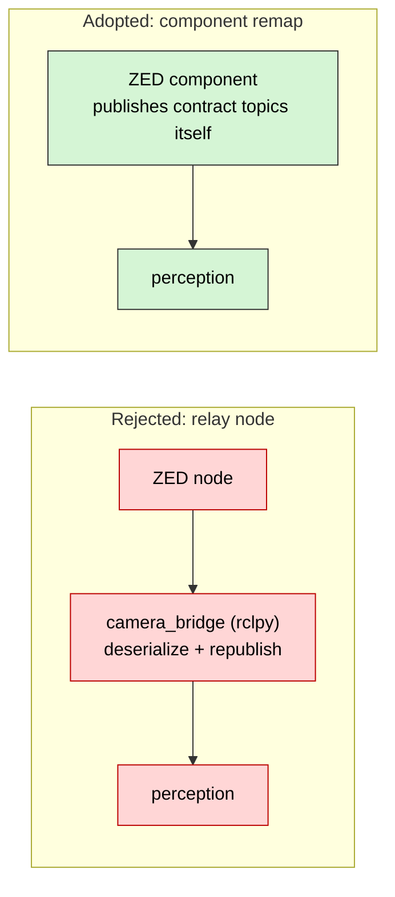
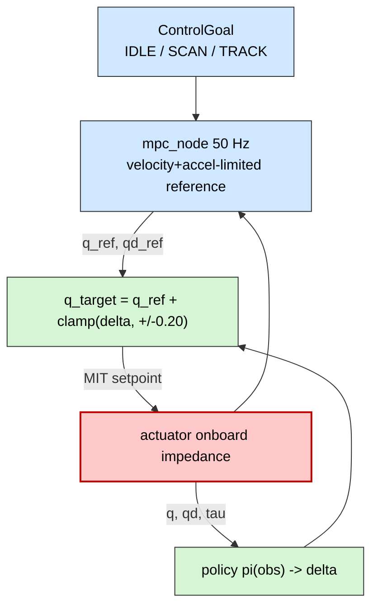

# 02 — Design Decisions

Every non-obvious choice in the repository, with the reasoning and the options that
were rejected. Chapters 01 and 04–14 link back here with the tag **D-nn**.

**How to read an entry.** _Decision_ is what was done. _Why_ is the argument.
_Rejected_ lists what was considered and the specific reason it lost. _Cost_ names
the price paid — every decision has one; an entry with no cost is usually a
decision that has not been thought through.

| Status tag         | Meaning                                                            |
| ------------------ | ------------------------------------------------------------------ |
| **Adopted**        | Implemented and load-bearing                                       |
| **Provisional**    | Implemented, but chosen to be cheap to reverse; expected to change |
| **Verified on HW** | Proven on the actual Jetson + ZED hardware, June 2026              |
| **Planned**        | Agreed, not yet implemented — see [14](14-status-and-roadmap.md)   |

---

## Index

| Area                                                    | Records                                                                                                                       |
| ------------------------------------------------------- | ----------------------------------------------------------------------------------------------------------------------------- |
| [A. Architecture](#a-architecture)                      | [D-01](#d-01) [D-02](#d-02) [D-03](#d-03) [D-04](#d-04) [D-05](#d-05) [D-06](#d-06) [D-07](#d-07)                             |
| [B. Perception](#b-perception)                          | [D-08](#d-08) [D-09](#d-09) [D-10](#d-10) [D-11](#d-11) [D-12](#d-12)                                                         |
| [C. Localization](#c-localization)                      | [D-13](#d-13) [D-14](#d-14) [D-15](#d-15) [D-16](#d-16)                                                                       |
| [D. Strategy & coordination](#d-strategy--coordination) | [D-17](#d-17) [D-18](#d-18) [D-19](#d-19) [D-20](#d-20)                                                                       |
| [E. Control & actuation](#e-control--actuation)         | [D-21](#d-21) [D-22](#d-22) [D-23](#d-23) [D-24](#d-24) [D-25](#d-25) [D-26](#d-26) [D-27](#d-27)                             |
| [F. Simulation & learning](#f-simulation--learning)     | [D-28](#d-28) [D-29](#d-29) [D-30](#d-30) [D-31](#d-31)                                                                       |
| [G. Compute platform](#g-compute-platform)              | [D-32](#d-32) [D-33](#d-33) [D-34](#d-34) [D-35](#d-35) [D-36](#d-36) [D-37](#d-37) [D-38](#d-38) [D-39](#d-39) [D-40](#d-40) |
| [H. DevOps](#h-devops)                                  | [D-41](#d-41) [D-42](#d-42) [D-43](#d-43) [D-44](#d-44)                                                                       |

---

## A. Architecture

### D-01 — Build the whole architecture around a deliberately minimal robot

**Status:** Adopted

**Decision.** The URDF describes one revolute joint (`neck_pan`), one camera and one
IMU — but _every_ layer L0–L5 is fully implemented around it.

**Why.** The expensive risk in a multi-year robot program is not writing a walking
controller; it is discovering, six months in, that the package boundaries, the
`ros2_control` interfaces, the message contracts or the deployment flow are wrong.
A one-joint robot exercises all of those _end to end_ on a laptop, today, at a
fraction of the cost. Growing to 20 DOF then means editing the URDF and training new
policies — the hardware interface, the framing protocol, the launch structure and
the CI are already generic over _N_ joints.

**Rejected.**

| Alternative                                     | Why not                                                                                                |
| ----------------------------------------------- | ------------------------------------------------------------------------------------------------------ |
| Model the full 20-DOF humanoid first            | Nothing runs until the whole robot exists; integration bugs surface last, when they are most expensive |
| Skip the robot model, unit-test components only | Never proves the boundaries; sim-to-real parity is untestable                                          |

**Cost.** Some constants (`pan_limit`, the single-joint MPC, the 6-element observation
vector) are placeholder-shaped and will need re-derivation for the real robot.

**Implemented in.** `ros2_ws/src/soccer_description/urdf/soccerbot.urdf.xacro`

---

### D-02 — Isolate loops by frequency, in separate processes

**Status:** Adopted

**Decision.** Six layers, each at its own rate, each in its own process (or on its own
silicon). Communication is exclusively via ROS topics or the serial wire protocol.

**Why.** This is the property that makes a robot survive a bad frame or a Python
exception. If perception and control share a process, a 400 ms garbage-collection
pause in the vision code becomes a 400 ms gap in the joint command. Splitting by
frequency means the failure modes are _bounded_: `detector_node` crashing produces
stale detections, which the Behavior Tree already treats as "ball lost"
(`ball_timeout`, 1.0 s), and the control loop keeps running on the last `ControlGoal`.

**Rejected.**

| Alternative                                           | Why not                                                                                                                                                                             |
| ----------------------------------------------------- | ----------------------------------------------------------------------------------------------------------------------------------------------------------------------------------- |
| One monolithic node                                   | Any fault is a total fault; no per-layer restart; no rate isolation                                                                                                                 |
| Composable nodes in one container for the whole stack | Zero-copy is attractive, but a single process means a single crash domain. Composition _is_ used where it pays and the risk is contained — the ZED driver container ([D-09](#d-09)) |

**Cost.** More inter-process serialization. For large images this cost is real and had
to be engineered around — see [D-37](#d-37), [D-38](#d-38).

**Implemented in.** `ros2_ws/src/soccer_bringup/launch/robot.launch.py`

---

### D-03 — `ros2_control` is the single sim/real boundary

**Status:** Adopted

**Decision.** Simulation and hardware differ by exactly one thing: which
`hardware_interface::SystemInterface` plugin is loaded. The switch is the xacro
argument `sim:=true|false`, threaded through from `robot.launch.py`.

**Why.** Sim-to-real transfer fails when the sim and the robot run _different code_.
Putting the boundary at `ros2_control` means the controller, the MPC, the estimator,
the perception stack, the strategy and the launch files are byte-identical in both
cases. Any behaviour observed in simulation is produced by the same software that
runs on the robot; only the plant differs. It also means the sim plugin can implement
_the actual actuator law_ (`tau = kp*(q*-q) + kd*(qd*-qd) + tau_ff`), so the
policy sees the same command semantics in both worlds.

**Rejected.**

| Alternative                                 | Why not                                                                                                           |
| ------------------------------------------- | ----------------------------------------------------------------------------------------------------------------- |
| Gazebo/Isaac ROS bridge as the sim boundary | Introduces a second, different command path; the simulator's controller stack is not the robot's controller stack |
| `if sim:` branches inside nodes             | Branch-per-node multiplies untested combinations; the "sim" path silently rots                                    |

**Cost.** Custom command interfaces (`kp`, `kd`) are non-standard `ros2_control`
names, so off-the-shelf controllers (e.g. `joint_trajectory_controller`) cannot drive
this robot without adaptation.

**Implemented in.** `ros2_ws/src/soccer_description/urdf/soccerbot.ros2_control.xacro`,
`ros2_ws/src/soccer_hardware/`

---

### D-04 — ROS 2 Jazzy Jalisco

**Status:** Adopted · Verified on HW

**Decision.** Jazzy Jalisco on Ubuntu 24.04, everywhere — workstation, CI, container,
robot.

**Why.** Three independent constraints converge on Jazzy:

1. **Support window.** Humble reaches EOL in **May 2027**, inside this program's
   competition cycle; Jazzy runs to **May 2029**.
2. **JetPack coupling.** JetPack 7.2 ships an **Ubuntu 24.04** userspace. Jazzy is the
   distro that natively matches it — no backport gymnastics, no 22.04 compatibility
   layer.
3. **Vendor alignment.** ZED SDK 5.x and the current Isaac ROS line both target
   Jazzy / 24.04.

**Rejected.**

| Alternative        | Why not                                                    |
| ------------------ | ---------------------------------------------------------- |
| Humble             | EOL May 2027; mismatched with the 24.04 JetPack userspace  |
| Kilted Kaiju       | Non-LTS, EOL Dec 2026                                      |
| Lyrical (May 2026) | Too new; third-party (ZED, `ros2_control`) support is thin |

**Cost.** None material. This decision retired the earlier "Path A / Path B / Path C"
Jetson-generation dilemma in the archived blueprint: JetPack 7.2 made Jazzy native on
Orin, so no container-userspace workaround is needed.

---

### D-05 — A robot's identity is a ROS namespace, not a build

**Status:** Adopted

**Decision.** Every robot runs the same image, the same launch file and the same
parameters. `robot.launch.py` pushes the graph under `/<robot_name>` and passes
`player_id`; `team.launch.py` includes it _N_ times.

**Why.** The alternative — per-robot branches, per-robot images or per-robot config
trees — guarantees drift. With namespacing, "robot 2 behaves differently from robot 1"
is impossible unless a _parameter_ differs, which is a one-line diff to inspect. It
also makes a 3-robot scrimmage in simulation identical in structure to the real team.

**Rejected.**

| Alternative                              | Why not                                                                              |
| ---------------------------------------- | ------------------------------------------------------------------------------------ |
| Per-robot config repos or branches       | Drift; a fix applied to one robot silently misses others                             |
| Distinguish robots by DDS partition only | Topic names collide in tooling (`ros2 topic list`), and RViz/rosbag become ambiguous |

**Cost.** All intra-robot topics must be **relative** (`camera/image_raw`, not
`/camera/image_raw`). One accidental leading slash breaks multi-robot isolation
silently — a review checklist item.

---

### D-06 — Fully decentralized team: no master, no off-field coach

**Status:** Adopted

**Decision.** Robots share only a lightweight `/team_data` message. Every robot
computes the _same_ role assignment locally. There is no leader election, no central
planner and no off-field computer issuing commands.

**Why.** Two reasons, one of which is non-negotiable:

1. **Rules.** The Humanoid League forbids external computation or human control during
   play. Only robot-to-robot team communication is legal. An off-field "coach"
   architecture — proposed in one of the archived source documents — is illegal.
2. **Failure tolerance.** A master is a single point of failure on a Wi-Fi link that
   _will_ drop. With a deterministic local computation, a robot that loses the network
   still plays; it simply bids alone.

**Rejected.**

| Alternative                           | Why not                                                                                                                                               |
| ------------------------------------- | ----------------------------------------------------------------------------------------------------------------------------------------------------- |
| Off-field coach / centralized planner | Rules violation                                                                                                                                       |
| Elected leader among robots           | Election protocol is state to get wrong under packet loss, for no gain over a deterministic function                                                  |
| STP (Skills / Tactics / Plays)        | Designed for the _wheeled_ Small-Size League with global overhead vision; the coordination assumptions do not hold for per-robot egocentric humanoids |

**Cost.** Every robot must see the same bids to agree. Under packet loss, robots can
transiently disagree about who is striker. Accepted: the auction re-runs at 10 Hz, so
disagreement is short-lived and self-correcting.

---

### D-07 — Monorepo, with firmware as a git submodule

**Status:** Adopted

**Decision.** One repository pins software, simulation, deployment and hardware
placeholders together. `soccer-firmware/` is a **submodule**, not a subdirectory.

**Why.** A monorepo makes "which firmware goes with this ROS commit?" answerable by a
single SHA. But firmware is developed by a different team on a different cadence, with
STM32CubeIDE project files and a different toolchain; vendoring it inline would mean
every ROS commit churns firmware history and vice versa. A submodule gives the pinning
benefit without merging the histories.

**Rejected.**

| Alternative                      | Why not                                                     |
| -------------------------------- | ----------------------------------------------------------- |
| Separate repos, no pinning       | Version-matching becomes tribal knowledge                   |
| Firmware inlined in the monorepo | Two teams, two cadences, two toolchains sharing one history |

**Cost.** `git clone --recursive` is required, and a submodule bump is an explicit,
easily-forgotten commit.

---

## B. Perception

### D-08 — A driver-agnostic camera contract

**Status:** Adopted · Verified on HW

**Decision.** Perception subscribes to four fixed, relative topics —
`camera/image_raw`, `camera_info`, `camera/depth`, `imu/data` — and never to a vendor
topic name.

**Why.** The ZED SDK is a large, GPU-bound, licensed, JetPack-coupled dependency. If
perception named ZED topics directly, then (a) every developer would need a ZED to run
perception, (b) replacing the camera would touch every perception node, and (c) the
simulator could not stand in. With the contract, a rosbag, a synthetic renderer or a
different camera are all interchangeable sources.

This is what makes the "no-GPU developer" workflow possible: record the four contract
topics once on the Jetson, replay them anywhere.

**Rejected.**

| Alternative                         | Why not                                                   |
| ----------------------------------- | --------------------------------------------------------- |
| Subscribe to ZED topics directly    | Couples the whole stack to one vendor and to a GPU        |
| An abstraction library in each node | Same coupling, more code, and untestable without hardware |

**Cost.** ZED topic names must be mapped somewhere — see [D-09](#d-09).

**Implemented in.** `ros2_ws/src/soccer_bringup/launch/camera.launch.py`

---

### D-09 — Remap the ZED **component** rather than run a relay node

**Status:** Adopted · Verified on HW · _supersedes the `camera_bridge` node_

**Decision.** `camera.launch.py` loads `stereolabs::ZedCamera` as a **composable
node** into a container and applies the contract remappings to the component itself.
There is no relay process.

**Why.** The earlier design used an `rclpy` node that subscribed to the ZED topics and
republished them under contract names. That is one extra process, one extra
serialize/deserialize round trip **per multi-megabyte frame**, and it runs under the
Python GIL. Because `launch_ros.descriptions.ComposableNode` accepts `remappings` and
forwards them to the container as `remap_rules`, the ZED node can simply publish the
contract topics directly — the mapping is free.

It also preserves a future optimisation: the container is created with
`use_intra_process_comms=True`, so a C++ perception component co-loaded into the same
container gets **zero-copy** frames. A Python relay would have foreclosed that
permanently.

**Rejected.**

| Alternative                                       | Why not                                                                            |
| ------------------------------------------------- | ---------------------------------------------------------------------------------- |
| `camera_bridge` relay node (previous design)      | Extra hop, extra copy, Python GIL on the highest-bandwidth path, blocks zero-copy  |
| Launch-level `SetRemap` on the ZED launch include | The ZED node is _composable_; `SetRemap` does not reach into a component container |
| Rename the contract to the ZED names              | Breaks [D-08](#d-08)                                                               |

**Cost.** The remap targets are relative, so the component's namespace must match
`robot_name` exactly, or the topics land in the wrong place. Documented in the launch
file's docstring.

---

### D-10 — Object detection and field-line extraction are different problems

**Status:** Adopted

**Decision.** `detector_node` produces sparse `BoundingBoxes` for ball / goalpost /
robot. A separate `fieldline_node` produces a dense white-line point cloud. They are
different nodes with different outputs and different future models.

**Why.** A bounding box around a goalpost is mostly grass — it is a poor localization
landmark. Conversely, field lines are thin, continuous, _non-instance_ structures; an
object detector has no representation for them. Treating them as one problem forces a
single model to be bad at both. Splitting them means each can be replaced
independently: an instance detector (RF-DETR is the target) for objects, and semantic
segmentation for lines.

**Rejected.**

| Alternative                                         | Why not                                                                                                                                                      |
| --------------------------------------------------- | ------------------------------------------------------------------------------------------------------------------------------------------------------------ |
| One multitask network (YOEO-style)                  | Attractive for compute, but couples two replacement schedules and caps both at the weaker head's ceiling. Kept as a fallback if the compute budget forces it |
| Detect line _intersections_ only, as object classes | Discards most of the line information the particle filter weights against                                                                                    |

**Implemented in.** `ros2_ws/src/soccer_perception/soccer_perception/detector_node.py`,
`fieldline_node.py`

---

### D-11 — Ship classical CV placeholders behind the final message contracts

**Status:** Provisional

**Decision.** Both vision nodes currently use HSV thresholding. `detector_node` has an
unused `engine_path` parameter reserved for a TensorRT engine. The **published
messages are the final contract**.

**Why.** The message contract is the expensive, architecture-defining part; the model
behind it is not. Shipping classical CV means the entire downstream graph — projection,
MCL, strategy, teamcomm — is exercised and testable **today, on any laptop, without a
GPU**. Dropping in RF-DETR later changes one node's internals and nothing else. The
same argument applies to `fieldline_node`.

**Rejected.**

| Alternative                   | Why not                                                           |
| ----------------------------- | ----------------------------------------------------------------- |
| Wait for the trained detector | Blocks all downstream development on an ML deliverable            |
| Publish a stub/empty message  | Downstream nodes are never actually exercised with plausible data |

**Cost.** HSV thresholds are lighting-fragile and will not survive a competition venue.
This is understood and tracked — see [14 §G-01](14-status-and-roadmap.md#g-01). The
constants are documented in [04 §3](04-perception.md#3-detector_node).

---

### D-12 — Prefer stereo depth, fall back to flat-ground homography automatically

**Status:** Adopted

**Decision.** `projection_node` uses the depth image when a valid depth sample exists
at the detection's ground-contact pixel, and otherwise intersects the pixel ray with
the ground plane. `use_depth` defaults to `true`; the fallback is automatic, not a
launch-time choice.

**Why.** Flat-ground homography assumes the object touches a perfectly flat floor at a
perfectly known camera height and tilt. It was the single largest error source in the
predecessor monocular pipeline: a 2 cm error in assumed mount height becomes a large
range error at 4 m, and it is simply wrong for anything not on the ground (a goalpost's
mid-point, an airborne ball). Stereo depth measures range directly.

Making the fallback **automatic** rather than a flag means one node is correct in
simulation (no depth published) and on hardware (depth published), with no launch
variant to get wrong.

**Rejected.**

| Alternative         | Why not                                               |
| ------------------- | ----------------------------------------------------- |
| Depth only          | Node dies in simulation and on any monocular rig      |
| Homography only     | Known-bad accuracy; discards the ZED's main advantage |
| Two launch profiles | A configuration to get wrong, for no benefit          |

**Implemented in.**
`ros2_ws/src/soccer_perception/soccer_perception/projection_node.py`,
`camera_model.py`

---

## C. Localization

### D-13 — Two tiers: EKF for odometry, MCL for field pose

**Status:** Adopted

**Decision.** `ekf_node` publishes `odom → base_link` at 200 Hz. `mcl_node` publishes
`map → odom` at 10 Hz. They are not alternatives; they are different jobs.

**Why.** The recurring argument "EKF or particle filter?" is a category error. They
answer different questions:

|          | Tier 1 — `ekf_node`                        | Tier 2 — `mcl_node`                                  |
| -------- | ------------------------------------------ | ---------------------------------------------------- |
| Question | _How have I moved since the last instant?_ | _Where am I on the field?_                           |
| Property | Smooth, high-rate, drifts globally         | Globally anchored, low-rate, discrete jumps          |
| Belief   | Unimodal (correct — motion is unimodal)    | **Multi-modal** (necessary — the field is symmetric) |
| Frame    | `odom → base_link`                         | `map → odom`                                         |

This is the standard REP-105 `map → odom → base_link` tree. Control and gait need the
_smooth_ frame (a jumping pose estimate would destabilise a controller); strategy needs
the _global_ frame.

**Rejected.**

| Alternative                                              | Why not                                                                                                                                      |
| -------------------------------------------------------- | -------------------------------------------------------------------------------------------------------------------------------------------- |
| One global EKF/UKF                                       | Cannot represent "I am equally likely at either end of a symmetric field"; ICP-style matching can lock onto the wrong half and never recover |
| One particle filter, no odometry tier                    | Control would consume a jumpy, 10 Hz pose                                                                                                    |
| Visual SLAM (cuVSLAM / ZED VSLAM) as the field localizer | Good odometry, wrong tool for this job — see [D-14](#d-14)                                                                                   |

---

### D-14 — The global tier is a particle filter, and visual SLAM is not

**Status:** Adopted

**Decision.** `mcl_node` is a Monte-Carlo particle filter over static field features.
Visual-inertial odometry is treated as a Tier-1 _input_, never as the field authority.

**Why.** Four properties of a RoboCup pitch defeat generic visual SLAM:

| Property of the environment          | Consequence                                                                                                        |
| ------------------------------------ | ------------------------------------------------------------------------------------------------------------------ |
| The pitch is near-uniform green      | Point-feature SLAM finds few stable keypoints when the head looks down                                             |
| The field is full of _moving_ robots | Violates the static-scene assumption of VO/VSLAM                                                                   |
| Violent gait and head motion         | Motion blur destroys point descriptors; a blurred _line_ is still a line                                           |
| The field is **symmetric**           | SLAM gives a pose relative to where it started, in its own map. Loop closure does not tell you which goal is yours |

Static field geometry — lines, goalposts, the centre circle — is the reliable anchor,
and a particle filter is the belief representation that can hold two hypotheses about a
symmetric field simultaneously. This matches what the leading open-source Humanoid
League teams ship.

**Cost.** MCL needs a good measurement model and enough particles; see
[D-15](#d-15), [D-16](#d-16). Realistic accuracy is a **5–15 cm / few-degree** class
result, not millimetres — strategy must be written to tolerate that.

---

### D-15 — Weight particles against a pre-baked likelihood field

**Status:** Adopted

**Decision.** `field_model.py` rasterizes the field lines into a grid, runs a Euclidean
distance transform, and converts distance to likelihood with a Gaussian
(`sigma = 0.15 m`, `resolution = 0.05 m`). Weighting an observed point is a single
array lookup.

**Why.** The naive measurement model — for each observed point, find the nearest field
line segment — costs _O(points × segments)_ per particle, per frame. With 300 particles
and 200 observed points that is prohibitive at 10 Hz on a Jetson. The distance
transform pre-computes the nearest-line distance for _every_ cell once at startup,
turning the inner loop into an **O(1)** lookup. This is the efficient form of Chamfer
matching.

**Rejected.**

| Alternative                      | Why not                                                                    |
| -------------------------------- | -------------------------------------------------------------------------- |
| Nearest-segment search per point | Too slow at the required particle count                                    |
| Ray casting against the map      | Meaningless for a camera looking at line paint; designed for range sensors |

**Cost.** The likelihood field bakes in a fixed field geometry (6.0 × 4.0 m). Changing
field size means rebuilding the grid — cheap, but it is a startup constant, not a
runtime parameter.

---

### D-16 — Re-seed a fraction of particles every resample ("explorer particles")

**Status:** Adopted

**Decision.** On each resample, `ceil(explorer_frac * N)` particles (default 5 %) are
replaced with uniform random poses over the field.

**Why.** A converged particle filter has thrown away every hypothesis except the one it
believes. That is exactly wrong for RoboCup, where a robot is routinely _picked up_ —
penalty removal, manual placement, a fall — and put back somewhere else. Without
re-seeding, the filter stays confidently wrong forever. Explorer particles give a
continuous, cheap probability of rediscovering the true pose: the kidnapped-robot
problem solved by construction rather than by a special-case detector.

**Rejected.**

| Alternative                         | Why not                                                             |
| ----------------------------------- | ------------------------------------------------------------------- |
| Detect kidnapping and re-initialise | Needs a reliable detector for the event; the failure mode is silent |
| Never resample away diversity       | Wastes particles on hypotheses the data has already eliminated      |

**Cost.** 5 % of particles are always uninformative, and the pose estimate carries a
small permanent bias toward the field centre. Accepted; the alternative failure is
much worse.

---

## D. Strategy & coordination

### D-17 — Behavior Trees, with roles as loadable XML

**Status:** Adopted

**Decision.** `strategy_node` uses BehaviorTree.CPP. `striker.xml`, `supporter.xml` and
`goalie.xml` live in `trees/` and are loaded at runtime; changing a robot's behaviour is
a data change.

**Why.** The predecessor architecture used a monolithic finite state machine. FSMs make
_reactivity_ expensive: every new "but abort if the ball moves" rule adds transitions to
every state, and the transition count grows quadratically. Behavior Trees make
priority-ordered fallback the default structure, which is exactly how soccer behaviour is
described ("track the ball if you see it, otherwise scan"). BT.CPP additionally gives
live introspection via Groot2 — being able to _watch_ the tree tick during a match is
worth a lot at a competition.

Keeping trees as XML means a role change is not a rebuild, and the role can be swapped
at runtime when the auction result changes.

**Rejected.**

| Alternative              | Why not                                                   |
| ------------------------ | --------------------------------------------------------- |
| Monolithic FSM           | Transition explosion; poor reactivity; hard to debug live |
| Hard-coded C++ behaviour | Every tactical tweak is a recompile and a redeploy        |

---

### D-18 — Role assignment is a deterministic function, not a negotiation

**Status:** Adopted

**Decision.** Each robot publishes a bid (cost = distance to ball) on the global
`/team_data`. Every robot runs the identical `assign_role()` over _all_ bids and takes
its own result. Ties break on the lowest `player_id`.

**Why.** A negotiation protocol needs message ordering, acknowledgements, timeouts and a
tie-break rule anyway — and all of that state can desynchronise under packet loss. A
pure function over a shared input set needs none of it: given the same bids, every robot
_must_ reach the same assignment. Determinism is what removes the need for a protocol.
Robot dropout needs no special handling either: the bid simply stops appearing and the
next tick promotes someone else.

**Rejected.**

| Alternative                              | Why not                                                                      |
| ---------------------------------------- | ---------------------------------------------------------------------------- |
| Contract-net / explicit auction protocol | Protocol state to desynchronise, for an answer a pure function already gives |
| Central assigner                         | Forbidden by [D-06](#d-06)                                                   |

**Cost.** Correctness depends on robots seeing the same bid set. With best-effort QoS
they transiently may not — accepted, because the assignment re-runs at 10 Hz.

**Verified by.** `ros2_ws/src/soccer_strategy/test/test_role_auction.cpp` — four gtest
cases covering static goalie, closest-becomes-striker, dropout re-assignment, and
deterministic tie-break.

---

### D-19 — The goalie is statically assigned, not auctioned

**Status:** Adopted

**Decision.** `goalie_id` (default 1) always receives `ROLE_GOALIE` and never enters the
striker auction.

**Why.** RoboCup rules treat the goalkeeper specially — it is the only robot allowed
inside its own goal area in certain situations, and a goalie swap mid-play is both
tactically bad and rules-awkward. Making it a parameter rather than an auction outcome
removes a whole class of "both robots left the goal" failure.

**Cost.** A dead goalie is not replaced. Acceptable, and a deliberate rules-aligned
choice.

---

### D-20 — The GameController is the ultimate authority, gated at the tree root

**Status:** Adopted

**Decision.** Every behaviour tree begins with an `IsNotHalted` condition. It returns
`SUCCESS` only when `gamestate == PLAYING` **and** `penalized == false`. Anything else
falls through to `Idle`.

**Why.** Referee compliance must not be an emergent property of the AI. Putting it at the
_root_ of every tree means there is exactly one place to audit, and no role subtree can
possibly act while halted or penalized. It is a structural guarantee rather than a
convention.

The bridge also sends the mandatory return packet on UDP 3939 at ~1 Hz, because a robot
that never replies is flagged by the GameController regardless of what it does on the
field.

**Implemented in.** `ros2_ws/src/soccer_strategy/src/bt_nodes.cpp`,
`ros2_ws/src/game_controller_bridge/`

---

## E. Control & actuation

### D-21 — Hierarchical MPC plus a _bounded_ residual RL policy

**Status:** Adopted (MPC live, policy inference [⚠ Gap](14-status-and-roadmap.md#g-02))

**Decision.** A model-based node generates a physically-grounded reference trajectory.
A learned policy adds a small correction on top. The final command is
`q_target = q_ref + clamp(policy(obs), ±0.20 rad)`.

**Why.** The two failure modes of the alternatives are opposite and both fatal:

- **Pure MPC** is debuggable and precise but brittle against unmodelled dynamics —
  friction, backlash, contact shocks, a push.
- **End-to-end RL** absorbs all of that but is unpredictable, hard to certify, and can
  emit a command that destroys the robot.

The residual formulation takes the good half of each. The MPC guarantees a physically
meaningful, inspectable trajectory (which matters for precise kicks and rules
compliance); the policy only ever _perturbs_ it, within a hard bound, so the worst case
is bounded degradation rather than instability.

**Rejected.**

| Alternative           | Why not                                                              |
| --------------------- | -------------------------------------------------------------------- |
| Pure MPC              | Cannot absorb model error, contact shocks, pushes                    |
| End-to-end RL         | Unbounded failure modes; not certifiable; sim-to-real gap is a cliff |
| RL tuning MPC weights | Slow, indirect, still cannot react within a control cycle            |

---

### D-22 — Hard-clamp the residual; no policy means zero residual

**Status:** Adopted

**Decision.** `residual_limit_rad = 0.20` is applied in C++ after inference, not learned
as a soft constraint. If `policy_path` is empty or the load fails, the controller logs a
warning and runs **pure MPC**.

**Why.** A learned bound is a bound the policy can violate. A clamp in the controller
cannot be violated by any policy, including a corrupted engine file, a mis-exported
model or a NaN. This turns "the RL policy is broken" from a safety incident into a
performance regression.

Defaulting to zero residual makes _pure MPC the safe default state of the system_ — the
robot is fully functional before any policy exists, and rolling back a bad policy is
deleting a file.

**Cost.** The policy cannot help beyond ±0.20 rad. That is the point.

**Implemented in.**
`ros2_ws/src/soccer_control/src/residual_rl_controller.cpp`

---

### D-23 — The joint command is the full MIT impedance tuple

**Status:** Adopted

**Decision.** Each joint exposes five _command_ interfaces — `position`, `velocity`,
`kp`, `kd`, `effort` — and three _state_ interfaces — `position`, `velocity`, `effort`.
`kp` and `kd` are custom `ros2_control` interface names.

**Why.** Robostride actuators are quasi-direct-drive motors whose entire advantage is
**per-cycle variable impedance**: stiff in stance, compliant in swing, soft on ball
contact. A command that fixes `kp`/`kd` at configuration time throws that away and
reduces an expensive QDD actuator to a servo. For legged locomotion this is not
optional.

`effort` carries the **feed-forward torque** `tau_ff`, not a torque _command_ — the
actuator's onboard loop adds it to the impedance term.

Measured `effort` is a **state** interface for a separate reason: the residual-RL
observation vector includes measured torque, and if the robot cannot measure torque then
the observation differs between simulation and reality and the policy does not transfer.
This makes the current-sense path a hardware requirement, not a nice-to-have.

**Rejected.**

| Alternative                                      | Why not                                                     |
| ------------------------------------------------ | ----------------------------------------------------------- |
| `position` + `effort` only (the original design) | Discards variable impedance                                 |
| Fixed gains in `controllers.yaml`                | Same problem, moved to a config file                        |
| Torque command only                              | Puts the impedance loop back on the non-real-time Linux box |

---

### D-24 — The fast loop lives on the actuator; the Jetson streams setpoints

**Status:** Adopted

**Decision.** No PD or torque loop runs on the Jetson. The Robostride actuator closes
the MIT impedance loop onboard. The STM32 Master/Slave pair does **safety, aggregation
and CAN bridging**, not control.

**Why.** Linux is not a hard-real-time system: scheduling jitter, page faults and DDS
latency are all unbounded at millisecond scale. The invariant "the hard real-time loop is
never on the Linux box" is preserved — what changed from the original blueprint is only
its _location_: it moved from a custom MCU PD loop to inside the actuator, where the
encoder and the current sense already are. That is strictly better: it removes a
communication hop from the tightest loop.

The consequence is that the Jetson's required command rate is set by the _policy_
(~50–100 Hz), not by the _motor_ (kHz). This is why the "RL policy runs at 500–1000 Hz"
claim in one of the archived proposals is corrected everywhere in this documentation.

**Rejected.**

| Alternative                         | Why not                                                                                 |
| ----------------------------------- | --------------------------------------------------------------------------------------- |
| Motors wired to the Jetson          | No hard real-time guarantee; a scheduling hiccup becomes a torque glitch                |
| Custom 1 kHz PD on the Master STM32 | Duplicates a loop the actuator already runs better, and adds a CAN round trip inside it |

---

### D-25 — COBS + CRC16-CCITT framing, all joints per frame

**Status:** Adopted

**Decision.** USB-CDC carries COBS-encoded frames terminated by `0x00`, with a 16-byte
header and a CRC16-CCITT (`poly 0x1021`, `init 0xFFFF`) over header + payload. One frame
carries **all** joints.

**Why, per element:**

| Element                              | Reason                                                                                                                                                                                                                                                                                |
| ------------------------------------ | ------------------------------------------------------------------------------------------------------------------------------------------------------------------------------------------------------------------------------------------------------------------------------------- |
| **COBS**                             | USB-CDC is a byte stream with no framing. COBS guarantees `0x00` never appears inside a frame, so a single byte is an unambiguous delimiter and a receiver can always resynchronise after corruption. Overhead is under 0.4 %                                                         |
| **CRC16-CCITT**                      | USB has its own CRC, but the path also crosses SPI and CAN. An end-to-end check catches corruption anywhere in the chain                                                                                                                                                              |
| **All joints per frame**             | One frame is one heartbeat. The watchdog becomes trivial (did a frame arrive?), latency is bounded, the frame is fixed-size and allocation-free, and there is no per-motor request storm                                                                                              |
| **float32 engineering units on USB** | USB-FS bandwidth is ample (~400 B × 500 Hz ≈ 200 kB/s vs 1.5 MB/s available). Sending SI floats decouples the host contract from Robostride's 16-bit CAN packing — the actuator can be swapped without touching the USB contract. The Master converts float to CAN uint16 at the edge |

**Rejected.**

| Alternative                     | Why not                                                                                                     |
| ------------------------------- | ----------------------------------------------------------------------------------------------------------- |
| Length-prefixed framing         | Cannot resynchronise after a corrupt length byte                                                            |
| micro-ROS over the serial link  | Heavier, ties MCU firmware to a ROS release, and buys nothing over a 16-byte header for a fixed message set |
| Robostride's bit-packing on USB | Couples the host to the actuator vendor for no bandwidth benefit                                            |
| Per-motor request/response      | N round trips per cycle; latency and jitter scale with joint count                                          |

**Status of this contract.** The host and firmware implementations currently
**disagree** on the telemetry struct layout — a real, unresolved defect documented in
[09 §4.4](09-firmware-and-actuators.md#44-known-contract-divergence) and tracked as
[G-03](14-status-and-roadmap.md#g-03).

---

### D-26 — Three independent watchdogs

**Status:** Adopted

**Decision.** Safety is enforced at three levels, none of which depends on the others.

| Watchdog         | Where                             | Timeout | Action                                            |
| ---------------- | --------------------------------- | ------- | ------------------------------------------------- |
| Host             | `SoccerbotSerialHardware::read()` | 100 ms  | Return `ERROR`, halting the controller manager    |
| Slave, per motor | `motor_runtime`                   | 200 ms  | `ARMED_MIT → ARMED_HOLD → IDLE`, then CAN disable |
| Actuator         | Robostride onboard                | vendor  | Fault handling and disable                        |

**Why.** Each watchdog covers the failure of the layer above it. The host watchdog
catches a dead MCU. The Slave watchdog catches a dead _Jetson_ — and it must, because a
crashed host cannot detect its own crash. Defence in depth is the whole design: no single
component's failure leaves a torque applied.

**Cost.** Three timeouts that must be mutually consistent (host 100 ms < slave 200 ms) or
the system flaps. This ordering is intentional: the host notices first and can react
gracefully before the slave force-disables.

---

### D-27 — "No-MCU degraded mode" on the serial hardware interface

**Status:** Adopted

**Decision.** If the serial port cannot be opened, `on_activate()` still returns
`SUCCESS` and `read()`/`write()` become no-ops.

**Why.** Two reasons. First, `ros2_control` 4.x has a known crash-on-`ERROR` behaviour
during activation, so returning `ERROR` takes down the whole process rather than
degrading. Second, and more usefully, it lets the _entire rest of the graph_ —
perception, localization, strategy — run on a development box or on a robot whose MCU is
unplugged. You get the full stack minus actuation instead of nothing.

This is **not** a safety hole: with no port there is no actuator to command. Once a port
_is_ open, the 100 ms watchdog applies normally.

**Cost.** A missing MCU is a warning in the log rather than a hard failure, which can be
missed. Bring-up procedure in [13](13-operations-runbook.md) checks for it explicitly.

---

## F. Simulation & learning

### D-28 — Train in Isaac Lab on the workstation; ship ONNX

**Status:** Adopted

**Decision.** Reinforcement learning runs on an x86 RTX workstation. The deliverable to
the robot is an **ONNX file**, converted to a TensorRT engine on-device.

**Why.** This deliberately **decouples the training stack from the robot's ROS distro**.
Isaac Lab pulls Isaac Sim and a large PyTorch/CUDA tree; none of that belongs on a robot
or in a robot container. Because the interface between them is a serialised model file,
the training environment can be upgraded, downgraded or replaced without touching the
robot image. It also means the choice of simulator does _not_ constrain the onboard ROS
version — only Isaac _ROS_ (the runtime acceleration libraries) would, and those are
optional here.

**Rejected.**

| Alternative               | Why not                                                                                              |
| ------------------------- | ---------------------------------------------------------------------------------------------------- |
| Train on the robot        | Erratic exploration destroys hardware; Orin has neither the compute nor the RAM                      |
| Cloud GPU rental          | For continuous RL, owning beats renting on cost; also removes an internet dependency at competitions |
| Ship PyTorch to the robot | Enormous runtime dependency for what is a matrix multiply after export                               |

---

### D-29 — A dependency-free numpy environment mirrors the Isaac task

**Status:** Adopted

**Decision.** `sim/tasks/soccerbot_reach_env.py` contains both the Isaac Lab
configuration and a plain-numpy `NumpyReachEnv` with the same observation layout, action
space and reward.

**Why.** Isaac Lab requires an NVIDIA GPU. Without a fallback, the entire
train → export → deploy chain would be unrunnable and untestable for most contributors
and for CI. With the numpy environment, the _pipeline_ is exercisable on any laptop, so
pipeline bugs are found separately from physics bugs.

**Cost.** Two environments that can drift apart. Mitigated by sharing `OBS_DIM`,
`ACT_DIM` and `RESIDUAL_LIMIT` constants in one module.

---

### D-30 — Evolution Strategies for the placeholder policy

**Status:** Provisional

**Decision.** `sim/train_residual.py` uses ES (population 32, `sigma = 0.08`,
`lr = 0.03`) over a 6→16→1 tanh network, not PPO.

**Why.** For a **1-DOF, 6-observation** problem, ES is roughly 100 lines, has no
autodiff dependency, needs no GPU, parallelises trivially and has three hyperparameters.
PPO would need a full RL framework to solve a problem that ES solves in a few thousand
rollouts. The point of this script is to prove the _pipeline_, not to be the final
learning algorithm.

**Rejected.** PPO / SAC — correct for the real humanoid, disproportionate here; adopting
them is expected when the robot grows (the Isaac Lab config is where that lands).

**Cost.** ES does not scale to a 20-DOF policy. This script is explicitly transitional.

---

### D-31 — The observation vector is identical in sim and in the controller

**Status:** Adopted

**Decision.** Both the training environment and `ResidualRLController` use
`[q, qd, q_ref, qd_ref, gyro_z, command]` in that exact order. The C++ source carries the
comment _"obs MUST match the Isaac Lab task layout."_

**Why.** A silently reordered or rescaled observation is the classic sim-to-real failure:
the model loads, runs, produces plausible-looking numbers, and behaves wrongly. There is
no runtime check that can catch it, so it has to be a maintained invariant with the
constraint written at both ends.

**Cost.** Any change to the observation requires a coordinated edit in two languages plus
a policy retrain. Making that painful is intentional.

**⚠ Note.** Element 4 is _measured effort_ in the controller but `gyro_z` in the sim
environment's naming. Reconciling this is [G-05](14-status-and-roadmap.md#g-05).

---

## G. Compute platform

### D-32 — Jetson Orin, JetPack 7.2 / L4T R39.2, Jazzy native

**Status:** Adopted · Verified on HW

**Decision.** Development and validation on **Orin Nano Super 8 GB** (sm_87), JetPack
7.2 / L4T R39.2, Ubuntu 24.04, CUDA 13.2. Production target is **Orin NX 16 GB**.

**Why.** JetPack 7.2's Ubuntu 24.04 userspace makes Jazzy the _native_ distro — no
container-userspace trick, no distro mismatch ([D-04](#d-04)). The Orin Nano fits a
KidSize power budget (~25 W in Super mode, ~67 INT8 TOPS) and proved sufficient for
ZED NEURAL_LIGHT depth plus the full graph. Its **8 GB shared CPU/GPU RAM is the
binding constraint** once a transformer detector is added, which is why the production
target is the 16 GB NX.

**Rejected.**

| Alternative                            | Why not                                                                                             |
| -------------------------------------- | --------------------------------------------------------------------------------------------------- |
| Orin Nano 8 GB as the production brain | RAM ceiling: ZED + RF-DETR + full graph together do not fit                                         |
| AGX Orin 64 GB on the robot            | Power and weight outside a KidSize budget                                                           |
| Jetson Thor on every robot             | Cost; retained as a bench/lead-robot option, same JetPack 7 / Jazzy base so deployment is unchanged |

---

### D-33 — Generic CUDA base image, not `l4t-jetpack`

**Status:** Adopted · Verified on HW

**Decision.** `Dockerfile.jetson` builds from `nvcr.io/nvidia/cuda:13.2.1-devel-ubuntu24.04`.
Two adaptations are applied: `/usr/local/cuda/compat` is **deleted**, and a synthetic
`/etc/nv_tegra_release` describing R39.2 is **created**.

**Why.** There is no `l4t-jetpack` image for r39 — it does not exist. JetPack 7.2 is
essentially stock Ubuntu 24.04 with a CUDA 13 userspace, and the NVIDIA Container Toolkit
injects the Tegra driver libraries at run time. So a generic CUDA base is not a
workaround; it is the correct base.

The two adaptations exist for concrete reasons:

- `cuda/compat` contains **discrete-GPU forward-compatibility driver libraries**. On a
  Tegra SoC they _shadow_ the injected Tegra driver and cause runtime failures.
- The **ZED SDK installer checks for `/etc/nv_tegra_release`** to decide it is on a
  Jetson. Inside a container that file is absent, so the installer must be told.

**Rejected.** Building on an r38 L4T base (wrong CUDA/driver ABI) or hand-rolling an L4T
base (R39 exists only on-device).

**Cost.** Both adaptations are undocumented-by-vendor and could break on a JetPack bump —
flagged as a known fragility in [11 §6](11-compute-platform.md#9-known-fragilities).

---

### D-34 — Two containers: a fat camera driver and a lean app

**Status:** Adopted · Verified on HW

**Decision.** `Dockerfile.jetson` has two selectable targets sharing one base:
`zed-driver-image` (~19 GB, ZED SDK + TensorRT + wrapper) and `soccer-app-image` (lean,
the compiled workspace only).

**Why.** These two artifacts have completely different change rates and different
audiences. The driver image is huge, JetPack-coupled and rebuilt when the SDK changes —
maybe twice a year. The app image is small and rebuilt on **every commit**. Fusing them
would mean every application change re-pushes 19 GB, and every developer would need the
licensed ZED SDK to run application code.

Split, they also **restart independently**: the app can crash-loop through a bad config
while the camera keeps streaming and its cached TensorRT engines stay warm (that engine
build costs 6–7 minutes).

**Rejected.**

| Alternative              | Why not                                                                     |
| ------------------------ | --------------------------------------------------------------------------- |
| One image                | 19 GB per app change; ZED SDK required by every developer; coupled restarts |
| Two separate Dockerfiles | Bases drift apart; duplicated maintenance                                   |

---

### D-35 — Pin TensorRT to 10.16.2.10 with unversioned symlinks and compatibility mode

**Status:** Adopted · Verified on HW

**Decision.** Three coordinated measures in `Dockerfile.jetson`:

1. Install TensorRT from the **L4T** repo with apt pin priority **700** (over NGC's
   older 10.16.1.11), giving **10.16.2.10**.
2. Create unversioned symlinks: `libnvinfer.so → libnvinfer.so.10`, and the same for
   `libnvinfer_lean`, `libnvinfer_plugin`, `libnvonnxparsers`.
3. Set `ZED_SDK_TENSORRT_VERSION_COMPATIBILITY_MODE=1`.

**Why.** Each measure fixes an observed failure:

| Measure            | Failure it prevents                                                                                                                                                                            |
| ------------------ | ---------------------------------------------------------------------------------------------------------------------------------------------------------------------------------------------- |
| The pin            | NGC's sbsa repo ships 10.16.1.11; JetPack 7 is tested against the L4T 10.16.2.10 build. The mismatch makes `neural_depth_light_5` engine serialization fail with API usage error 6             |
| The symlinks       | The ZED SDK `dlopen`s **unversioned** SONAMEs; the runtime packages ship only versioned ones. Missing `libnvinfer_lean.so.10` reported as `CORRUPTED SDK INSTALLATION` at 90 % of engine build |
| Compatibility mode | Makes the SDK's version gate degrade gracefully instead of hard-failing on a minor drift                                                                                                       |

**Cost.** This is the most fragile part of the image, and it is version-locked to
JetPack 7.2. A JetPack bump requires re-validating all three.

---

### D-36 — Force CDI mode; never use `--runtime nvidia`

**Status:** Adopted · Verified on HW

**Decision.** `provision.yml` sets
`NVIDIA_CTK_CDI_GENERATE_DISABLED_HOOKS=enable-cuda-compat` and
`mode = "cdi"` in `/etc/nvidia-container-runtime/config.toml`. GPU access is always
`--gpus all`.

**Why.** `nvidia-container-toolkit` 1.19.1 generates a CDI spec containing a broken
`enable-cuda-compat` hook. On a Jetson it panics with `slice bounds out of range [:73]`,
which aborts **every** GPU container start. Disabling the hook at generation time fixes
it — but only if the runtime actually uses the CDI path. Forcing `mode = "cdi"` prevents
`--runtime nvidia` from falling back to the legacy CSV path, which re-introduces the
hook. **Both** changes are required; either alone leaves the failure reachable.

**Verification.** `grep -c enable-cuda-compat /var/run/cdi/nvidia.yaml` must print `0`.
`provision.yml` asserts this.

---

### D-37 — Grab at HD720, not HD1080

**Status:** Adopted · Verified on HW

**Decision.** `zed_params_override.yaml` sets `general.grab_resolution: HD720`.

**Why.** Measured on the Orin Nano: HD1080 produces ~6 MB RGB frames and ~8 MB depth
maps, and NEURAL_LIGHT depth inference at that resolution is GPU-bound to ~11 Hz.
HD720 halves the frame size (~2.7 MB RGB, ~3.7 MB depth), makes the frames fit inside a
tuned DDS shared-memory segment ([D-38](#d-38)), and speeds up depth inference.

Detecting a ball at competition range does not require 1080p; sustaining ~20 Hz through
the whole pipeline does.

**Cost.** Lower angular resolution for distant objects — to be re-validated when the
real detector lands. Reversing this is a one-line YAML change with no image rebuild
(though the first start re-optimises the TensorRT depth engine, ~6–7 minutes).

---

### D-38 — Enlarge the DDS shared-memory segment and kernel socket buffers

**Status:** Adopted · Verified on HW

**Decision.** `fastdds_profile.xml` declares a **16 MB** SHM segment with an 8 MB max
message size. `provision.yml` installs `/etc/sysctl.d/60-zed-dds-buffers.conf` with
`rmem_max = wmem_max = 16 MB`, `netdev_max_backlog = 10000`, `ipfrag_time = 3`,
`ipfrag_high_thresh = 128 MB`.

**Why.** This fixed the single worst bug found during bring-up. Symptom: small topics
(`camera_info`, `imu`) flowed at full rate while `image_raw` and `depth` collapsed to
**~1.3 Hz**. That fingerprint — small fine, large dead — is diagnostic of a DDS transport
size limit, not of QoS or node health.

Root cause: FastDDS's default shared-memory segment is **512 KB**. A 6 MB frame does not
fit, so FastDDS **silently** falls back to fragmented UDP — 40–100 fragments per frame at
30 fps — which overwhelms loopback reassembly.

Measured result:

| Configuration                   | `image_raw` | `depth`     |
| ------------------------------- | ----------- | ----------- |
| HD1080, default 512 KB SHM      | 1.3 Hz      | 2.7 Hz      |
| HD1080, kernel buffers only     | 1.5 Hz      | 3.0 Hz      |
| **HD720 + 16 MB SHM (FastDDS)** | **18.3 Hz** | **17.5 Hz** |
| **HD720 + CycloneDDS**          | **19.8 Hz** | **19.2 Hz** |

The kernel tuning alone was **not** sufficient (1.3 → 1.5 Hz) — it is retained as
hardening for the UDP path and for future multi-machine team comms over Wi-Fi.

**Cost.** ~16 MB of `/dev/shm` per DDS participant (~320 MB for a typical graph); fine
on 8 GB.

---

### D-39 — CycloneDDS by default, FastDDS as a one-variable fallback

**Status:** Adopted · Verified on HW

**Decision.** `RMW_IMPLEMENTATION` defaults to `rmw_cyclonedds_cpp`. Both containers
mount both profile files, so `RMW_IMPLEMENTATION=rmw_fastrtps_cpp` switches the whole
stack with no rebuild.

**Why.** Stereolabs documents CycloneDDS as the most extensively tested middleware for
the ZED ROS 2 wrapper, and it measured faster here (19.8 vs 17.8 Hz on `image_raw`).
Keeping FastDDS one environment variable away matters because DDS problems are
notoriously implementation-specific: being able to swap middleware in seconds turns a
multi-day debugging session into a bisection step.

**Note.** CycloneDDS shared-memory (Iceoryx) is _not_ enabled — it needs an external
`iox-roudi` daemon, and loopback with a 10 MB receive buffer already reaches full rate.
The complexity is not currently justified.

---

### D-40 — Best-effort sensor QoS end to end

**Status:** Adopted · Verified on HW

**Decision.** Camera, depth, IMU and `/team_data` all use best-effort, `KEEP_LAST`,
small-depth QoS. Set on the publisher via the ZED `qos_overrides`, and on subscribers via
`qos_profile_sensor_data` / `SensorDataQoS()`.

**Why.** This is REP-2003's sensor-data idiom, and on large fragmented messages
`RELIABLE` is actively harmful: one lost UDP fragment triggers NACK-driven
retransmission, which causes head-of-line blocking and latency spikes on a stream where
the _next_ frame is already better than the retransmitted one. At 30 fps, dropping a
frame is invisible; a 200 ms stall is not.

The same reasoning applies to `/team_data`, which models a lossy UDP team channel — a
stale teammate pose is worth less than a fresh one.

**Cost.** QoS must match at both ends or the topic silently does not connect. This bit
the project once already (a stale image with a `RELIABLE` subscriber). Checking
`ros2 topic info -v` is in the bring-up checklist.

---

## H. DevOps

### D-41 — Build the GPU image on-device, the CPU image in cloud CI

**Status:** Adopted

**Decision.** GitHub Actions builds and pushes only the CPU `Dockerfile.ci` runtime image
(`linux/arm64`, under QEMU). The 19 GB `zed-driver-image` is built on the Jetson itself.

**Why.** Building a 19 GB CUDA + licensed-SDK image under QEMU emulation on a hosted
runner is impractical: emulated arm64 compilation is roughly an order of magnitude
slower, and redistributing the ZED SDK through a registry has licensing implications.
Meanwhile the CPU image has no CUDA, no SDK, builds in minutes, and is the artifact that
actually changes every commit.

**Rejected.** Building everything in cloud CI (impractical); building everything
on-device (wastes robot time on an artifact CI can produce). A self-hosted arm64 runner
is the natural upgrade if fleet size grows.

---

### D-42 — Ansible splits one-time provisioning from repeatable deployment

**Status:** Adopted

**Decision.** `provision.yml` establishes host state (CDI fixes, swap, sysctl).
`deploy.yml` pulls pinned images and restarts containers. They are separate playbooks.

**Why.** They have different frequencies and different risk. Provisioning touches
`/etc`, creates swap and restarts system services — run rarely, reviewed carefully.
Deployment is run on every release and must be boring. Merging them would make a routine
deploy carry the risk of a host-level change.

Both are idempotent, so re-running either is safe — the property that makes "is this
robot configured correctly?" answerable by _running the playbook again_.

---

### D-43 — 8 GB swap on-device, for builds only

**Status:** Adopted · Verified on HW

**Decision.** `provision.yml` creates an 8 GB swapfile, and **skips it** when
`pull_images=true`.

**Why.** Compiling `zed_components` exhausts 8 GB of RAM and the build is OOM-killed
without swap. But swap on a robot that only _pulls_ images is pure downside — it invites
the kernel to page out a real-time-adjacent process. The conditional makes the cost
apply only where the benefit exists.

**Related.** The build also uses `MAKEFLAGS="-j4"` and `--parallel-workers 2` for the same
reason — unconstrained parallelism is what makes colcon OOM on a small board.

---

### D-44 — `ROS_DOMAIN_ID=42`, not 0

**Status:** Adopted

**Decision.** Every container, dev container and playbook sets `ROS_DOMAIN_ID=42`.

**Why.** Domain 0 is the default, so _everything_ on the network is on it — including
other people's laptops, other teams at a competition venue, and stray nodes. A non-zero
domain isolates the fleet. It also gives developers a free isolation mechanism: two
people can run full stacks against the same Jetson on domains 41 and 43 without
discovering each other's nodes.

**Cost.** A shell that forgets to export it sees an empty `ros2 topic list` — the single
most common "nothing works" report. It is the first check in
[13 §5](13-operations-runbook.md#5-troubleshooting).

---

## Decisions that were reversed

Recording reversals matters as much as recording decisions.

| Was                                         | Now                                                                                | Why it changed                                                                                                                |
| ------------------------------------------- | ---------------------------------------------------------------------------------- | ----------------------------------------------------------------------------------------------------------------------------- |
| 1 kHz PD loop on a custom MCU               | Onboard MIT impedance in the Robostride actuator; Master does safety + aggregation | Actuator selection changed. The _principle_ (hard real-time off Linux) is unchanged — only the location moved ([D-24](#d-24)) |
| `camera_bridge` rclpy relay node            | Direct remapping of the ZED composable node                                        | Removed a process, a copy and the GIL from the highest-bandwidth path ([D-09](#d-09))                                         |
| Robot named `minibot`                       | Renamed `soccerbot` throughout                                                     | The name implied a toy; the architecture is the real robot's                                                                  |
| Command = `position` + `effort`             | Full MIT tuple, generic over _N_ joints                                            | Fixed-gain commands discard the QDD actuator's main capability ([D-23](#d-23))                                                |
| Off-field "coach" (in an archived proposal) | Fully decentralized                                                                | Humanoid League rules forbid external computation during play ([D-06](#d-06))                                                 |
| YOLOv5 + AGPL                               | RF-DETR (Apache-2.0) as the target                                                 | Licensing, small-data domain transfer, and crowded-scene accuracy                                                             |
| HD1080 grab                                 | HD720                                                                              | Measured: ~1.3 Hz vs ~19 Hz end to end ([D-37](#d-37))                                                                        |
