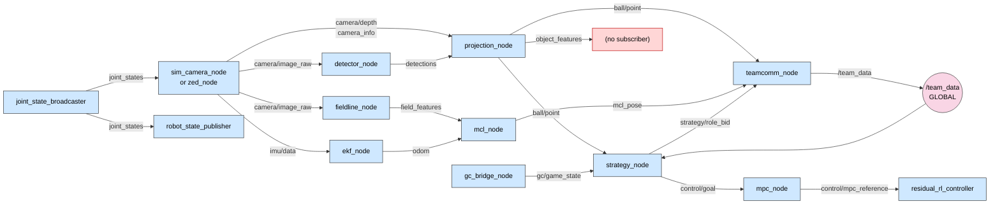
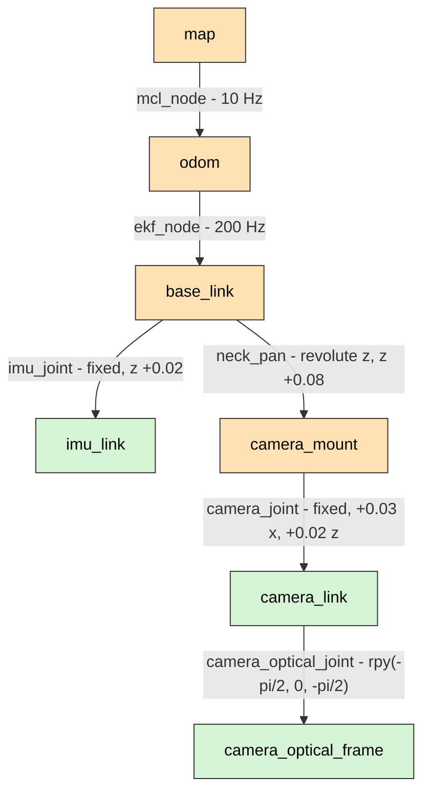

# 03 — ROS 2 Interfaces

The complete, verified interface surface: every node, topic, message, QoS profile,
TF frame and parameter that exists in the repository today.

> **Namespacing.** Every node except the ZED container is launched inside
> `PushRosNamespace(robot_name)`. Topic names in this chapter are written
> **relative**, exactly as the code declares them; at runtime they resolve to
> `/<robot_name>/<topic>`. The single exception is `/team_data`, which is
> deliberately global ([D-06](02-design-decisions.md#d-06)).

---

## 1. Node inventory

| Node                      | Package                       | Lang   | Rate                     | Present when  |
| ------------------------- | ----------------------------- | ------ | ------------------------ | ------------- |
| `robot_state_publisher`   | `robot_state_publisher`       | C++    | on change                | always        |
| `controller_manager`      | `controller_manager`          | C++    | **100 Hz**               | always        |
| `joint_state_broadcaster` | `ros2_controllers`            | C++    | 100 Hz                   | always        |
| `imu_sensor_broadcaster`  | `ros2_controllers`            | C++    | 100 Hz                   | always        |
| `residual_rl_controller`  | `soccer_control` (plugin)     | C++    | 100 Hz                   | always        |
| `mpc_node`                | `soccer_control`              | C++    | **50 Hz**                | always        |
| `sim_camera_node`         | `soccer_bringup`              | Python | 30 Hz                    | `camera:=sim` |
| `zed_node`                | `zed_components` (composable) | C++    | ~20 Hz                   | `camera:=zed` |
| `detector_node`           | `soccer_perception`           | Python | camera rate              | always        |
| `fieldline_node`          | `soccer_perception`           | Python | camera rate              | always        |
| `projection_node`         | `soccer_perception`           | Python | detection rate           | always        |
| `ekf_node`                | `soccer_localization`         | Python | **200 Hz**               | always        |
| `mcl_node`                | `soccer_localization`         | Python | **10 Hz**                | always        |
| `strategy_node`           | `soccer_strategy`             | C++    | **10 Hz**                | always        |
| `teamcomm_node`           | `soccer_teamcomm`             | Python | **4 Hz**                 | always        |
| `gc_bridge_node`          | `game_controller_bridge`      | Python | 50 Hz poll / 1 Hz return | always        |

`joint_state_broadcaster`, `imu_sensor_broadcaster` and `residual_rl_controller` are
not processes — they are controller plugins running **inside** the
`controller_manager` process at its `update_rate`.

---

## 2. Topic graph



### 2.1 Topic reference

| Topic                        | Type                                      | Published by                    | Subscribed by                                    | QoS                                    |
| ---------------------------- | ----------------------------------------- | ------------------------------- | ------------------------------------------------ | -------------------------------------- |
| `camera/image_raw`           | `sensor_msgs/Image`                       | `sim_camera_node` \| `zed_node` | `detector_node`, `fieldline_node`                | sensor data (best-effort, keep-last 5) |
| `camera_info`                | `sensor_msgs/CameraInfo`                  | `zed_node`                      | `projection_node`                                | sensor data                            |
| `camera/depth`               | `sensor_msgs/Image` (`32FC1`, metres)     | `zed_node`                      | `projection_node`                                | sensor data                            |
| `imu/data`                   | `sensor_msgs/Imu`                         | `zed_node`                      | `ekf_node`                                       | sensor data                            |
| `detections`                 | `soccer_msgs/BoundingBoxes`               | `detector_node`                 | `projection_node`                                | reliable, depth 10                     |
| `field_features`             | `soccer_msgs/FieldFeatureArray`           | `fieldline_node`                | `mcl_node`                                       | reliable, depth 10 / 5                 |
| `object_features`            | `soccer_msgs/FieldFeatureArray`           | `projection_node`               | **none** — [G-06](14-status-and-roadmap.md#g-06) | reliable, depth 10                     |
| `ball/point`                 | `geometry_msgs/PointStamped`              | `projection_node`               | `strategy_node`, `teamcomm_node`                 | reliable, depth 10                     |
| `odom`                       | `nav_msgs/Odometry`                       | `ekf_node`                      | `mcl_node`                                       | reliable, depth 20                     |
| `mcl_pose`                   | `geometry_msgs/PoseWithCovarianceStamped` | `mcl_node`                      | `teamcomm_node`                                  | reliable, depth 10                     |
| `gc/game_state`              | `soccer_msgs/GameState`                   | `gc_bridge_node`                | `strategy_node`                                  | reliable, depth 10                     |
| `strategy/role_bid`          | `soccer_msgs/RoleBid`                     | `strategy_node`                 | `teamcomm_node`                                  | reliable, depth 10                     |
| `control/goal`               | `soccer_msgs/ControlGoal`                 | `strategy_node`                 | `mpc_node`                                       | reliable, depth 10                     |
| `control/mpc_reference`      | `std_msgs/Float64MultiArray`              | `mpc_node`                      | `residual_rl_controller`                         | reliable, depth 10                     |
| `joint_states`               | `sensor_msgs/JointState`                  | `joint_state_broadcaster`       | `robot_state_publisher`, `sim_camera_node`       | reliable                               |
| `imu_sensor_broadcaster/imu` | `sensor_msgs/Imu`                         | `imu_sensor_broadcaster`        | **none** — [G-04](14-status-and-roadmap.md#g-04) | system default                         |
| **`/team_data`**             | `soccer_msgs/TeamData`                    | `teamcomm_node` (every robot)   | `strategy_node` (every robot)                    | **sensor data**, best-effort, depth 5  |

> **QoS is a compatibility contract, not a preference.** A best-effort publisher
> cannot satisfy a reliable subscriber; the topic simply does not connect and
> nothing logs an error. The camera chain and `/team_data` are best-effort on both
> sides by design ([D-40](02-design-decisions.md#d-40)); everything else is
> reliable on both sides. Verify with `ros2 topic info -v <topic>`.

### 2.2 Non-ROS interfaces

| Interface      | Direction     | Detail                                                                                         |
| -------------- | ------------- | ---------------------------------------------------------------------------------------------- |
| UDP **3838**   | in            | GameController control packets (`RGme`, struct v12)                                            |
| UDP **3939**   | out           | GameController return packets (`RGrt`), ~1 Hz                                                  |
| `/dev/ttyACM0` | bidirectional | USB-CDC to the STM32 Master, 1 000 000 baud, COBS + CRC16 ([09](09-firmware-and-actuators.md)) |

---

## 3. TF tree



| Transform                            | Broadcaster             | Kind                         | Rate   |
| ------------------------------------ | ----------------------- | ---------------------------- | ------ |
| `map → odom`                         | `mcl_node`              | dynamic, corrective          | 10 Hz  |
| `odom → base_link`                   | `ekf_node`              | dynamic, smooth              | 200 Hz |
| `base_link → camera_mount`           | `robot_state_publisher` | dynamic, from `joint_states` | 100 Hz |
| `base_link → imu_link`               | `robot_state_publisher` | fixed                        | once   |
| `camera_mount → camera_link`         | `robot_state_publisher` | fixed                        | once   |
| `camera_link → camera_optical_frame` | `robot_state_publisher` | fixed                        | once   |

This is the REP-105 layout. Two properties matter:

- **`odom → base_link` never jumps.** Controllers and the gait consume it, and a
  discontinuous pose destabilises a feedback loop.
- **`map → odom` absorbs every correction.** When MCL revises the global estimate —
  including a large jump after a kidnapping — the discontinuity lands _here_, above
  the smooth frame.

`camera_optical_frame` follows REP-103 optical convention (z forward, x right,
y down), which is what `projection_node`'s pinhole maths assumes.

---

## 4. Message catalogue — `soccer_msgs`

Eight definitions. All are project-specific; standard types are used everywhere
else deliberately, so off-the-shelf ROS tooling works without adapters.

### `BoundingBox.msg` / `BoundingBoxes.msg`

```text
float64 probability
int64   xmin, ymin, xmax, ymax
int64   xbase, ybase        # ground-contact pixel (bottom-centre)
int16   id
string  class_id            # "ball" | "goalpost" | "robot"
```

`BoundingBoxes` wraps a `Header` and a `BoundingBox[]`.

> **Why `xbase`/`ybase` exists.** The box centre is the wrong point to project: for
> anything standing on the field, the _ground-contact_ pixel is what maps to a floor
> coordinate. Carrying it explicitly means the detector — which knows the object
> class — decides where the contact point is, rather than the projection node
> guessing ([04 §5](04-perception.md#5-projection_node)).

### `FieldFeature.msg` / `FieldFeatureArray.msg`

```text
uint8 TYPE_LINE_POINT=0
uint8 TYPE_L_JUNCTION=1
uint8 TYPE_T_JUNCTION=2
uint8 TYPE_X_JUNCTION=3
uint8 TYPE_GOALPOST=4
uint8 TYPE_CENTER_CIRCLE=5

uint8                type
geometry_msgs/Point  position     # metres, base_link frame
float64              confidence
```

One message type carries both dense line points and sparse landmarks. That keeps
the MCL measurement interface singular: it consumes `FieldFeature[]` and does not
care which front-end produced them.

### `GameState.msg`

```text
uint8 GAMESTATE_INITIAL=0, READY=1, SET=2, PLAYING=3, FINISHED=4
uint8 gamestate
bool  penalized
bool  first_half
uint8 own_score, rival_score
int32 seconds_remaining
```

A _decoded_ view of the 55-byte GameController wire struct. The bridge owns the
wire format; nothing downstream parses UDP ([D-20](02-design-decisions.md#d-20)).

### `ControlGoal.msg`

```text
uint8 MODE_IDLE=0, MODE_SCAN=1, MODE_TRACK=2
uint8   mode
float64 target_bearing      # radians, base_link frame
```

The complete L4 → L1 interface. Strategy expresses _intent_; it never sends joint
angles. That is what lets the MPC change its trajectory generation, or the robot
grow to 20 DOF, without touching the Behavior Trees.

### `RoleBid.msg`

```text
uint8 ROLE_UNASSIGNED=0, ROLE_STRIKER=1, ROLE_SUPPORTER=2, ROLE_GOALIE=3
uint8   role
float64 cost                # distance to ball; 1e6 when the ball is stale
```

### `TeamData.msg`

```text
std_msgs/Header       header
uint8                 player_id
uint8 STATUS_INACTIVE=0, STATUS_ACTIVE=1, STATUS_PENALIZED=2
uint8                 status
geometry_msgs/Pose2D  pose
bool                  localized
geometry_msgs/Pose2D  ball_pose
bool                  ball_detected
float64               ball_confidence
RoleBid               bid
```

The **entire** inter-robot contract. It is small on purpose: it must survive a
congested competition Wi-Fi channel shared with every other team
([06 §4](06-strategy-and-coordination.md#5-teamcomm_node)).

---

## 5. `ros2_control` interfaces

Declared in `soccerbot.ros2_control.xacro`, implemented by both hardware plugins.

| Interface                                | Direction | Range      | Purpose                                        |
| ---------------------------------------- | --------- | ---------- | ---------------------------------------------- |
| `neck_pan/position`                      | command   | ±1.57 rad  | MIT `q_des`                                    |
| `neck_pan/velocity`                      | command   | ±6.0 rad/s | MIT `qd_des`                                   |
| `neck_pan/kp`                            | command   | 0 – 500    | MIT position gain                              |
| `neck_pan/kd`                            | command   | 0 – 50     | MIT damping gain                               |
| `neck_pan/effort`                        | command   | ±3.0 N·m   | MIT `tau_ff` feed-forward                      |
| `neck_pan/position`                      | state     | —          | measured angle                                 |
| `neck_pan/velocity`                      | state     | —          | measured angular velocity                      |
| `neck_pan/effort`                        | state     | —          | measured torque (needed by the RL observation) |
| `imu_sensor/orientation.{x,y,z,w}`       | state     | —          | body attitude                                  |
| `imu_sensor/angular_velocity.{x,y,z}`    | state     | —          | body rates                                     |
| `imu_sensor/linear_acceleration.{x,y,z}` | state     | —          | body accelerations                             |

`kp` and `kd` as _command_ interfaces are the non-standard part, and the reason is
in [D-23](02-design-decisions.md#d-23).

---

## 6. Parameters

### 6.1 Launch arguments — `robot.launch.py`

| Argument        | Default   | Effect                                                                                |
| --------------- | --------- | ------------------------------------------------------------------------------------- |
| `robot_name`    | `robot_1` | Namespace for the entire graph                                                        |
| `player_id`     | `1`       | Identity in `/team_data` and the GameController return packet                         |
| `team_number`   | `1`       | GameController team filter                                                            |
| `sim`           | `true`    | Selects the `ros2_control` hardware plugin ([D-03](02-design-decisions.md#d-03))      |
| `camera`        | `sim`     | `sim` runs `sim_camera_node`; `zed` expects the ZED container                         |
| `camera_model`  | `zedm`    | ZED model config file                                                                 |
| `launch_driver` | `false`   | Include `camera.launch.py` in-process (normally the camera container runs separately) |

`team.launch.py` adds `num_robots` (default `2`) and loops `robot.launch.py`.

### 6.2 Node parameters

| Node                      | Parameter             | Default                 | Meaning                                                                    |
| ------------------------- | --------------------- | ----------------------- | -------------------------------------------------------------------------- |
| `detector_node`           | `image_topic`         | `camera/image_raw`      | Input contract topic                                                       |
|                           | `engine_path`         | `""`                    | TensorRT engine; empty selects the HSV fallback                            |
| `fieldline_node`          | `image_topic`         | `camera/image_raw`      | Input contract topic                                                       |
|                           | `max_points`          | `200`                   | Cap on published line points per frame                                     |
| `projection_node`         | `use_depth`           | `true`                  | Prefer stereo depth over flat-ground ([D-12](02-design-decisions.md#d-12)) |
| `mcl_node`                | `num_particles`       | `300`                   | Particle count                                                             |
|                           | `explorer_frac`       | `0.05`                  | Fraction re-seeded per resample ([D-16](02-design-decisions.md#d-16))      |
| `mpc_node`                | `pan_limit`           | `1.57`                  | Joint limit mirror (rad)                                                   |
|                           | `max_velocity`        | `4.0`                   | Reference velocity clamp (rad/s)                                           |
|                           | `max_acceleration`    | `12.0`                  | Reference acceleration clamp (rad/s²)                                      |
|                           | `scan_rate`           | `0.6`                   | Scan sweep frequency (Hz)                                                  |
| `residual_rl_controller`  | `joint`               | `neck_pan`              | Controlled joint                                                           |
|                           | `reference_topic`     | `control/mpc_reference` | MPC reference input                                                        |
|                           | `policy_path`         | `""`                    | ONNX policy; empty means pure MPC ([D-22](02-design-decisions.md#d-22))    |
|                           | `residual_limit_rad`  | `0.20`                  | Hard residual clamp                                                        |
|                           | `effort_limit`        | `3.0`                   | Feed-forward torque clamp (N·m)                                            |
| `strategy_node`           | `player_id`           | `1`                     | This robot's id                                                            |
|                           | `goalie_id`           | `1`                     | Statically assigned goalie ([D-19](02-design-decisions.md#d-19))           |
|                           | `ball_timeout`        | `1.0`                   | Seconds before a ball observation is stale                                 |
| `teamcomm_node`           | `player_id`           | `1`                     | Identity stamped into `TeamData`                                           |
|                           | `rate_hz`             | `4.0`                   | Broadcast rate                                                             |
| `gc_bridge_node`          | `team_number`         | `1`                     | Filter for incoming packets                                                |
|                           | `player_id`           | `1`                     | Index into the player array                                                |
|                           | `data_port`           | `3838`                  | GameController → robot                                                     |
|                           | `return_port`         | `3939`                  | Robot → GameController                                                     |
| `sim_camera_node`         | `ball_bearing`        | `0.3`                   | Synthetic ball bearing (rad)                                               |
|                           | `hfov`                | `1.05`                  | Synthetic horizontal FOV (rad)                                             |
|                           | `width` / `height`    | `640` / `480`           | Synthetic image size                                                       |
| `SoccerbotSimHardware`    | `sim_inertia`         | `0.01`                  | Plant inertia (kg·m²)                                                      |
|                           | `sim_damping`         | `0.05`                  | Plant viscous damping                                                      |
| `SoccerbotSerialHardware` | `serial_port`         | `/dev/ttyACM0`          | USB-CDC device                                                             |
|                           | `baud_rate`           | `1000000`               | Line rate                                                                  |
|                           | `watchdog_timeout_ms` | `100`                   | Host watchdog ([D-26](02-design-decisions.md#d-26))                        |

Site overrides live in
`ros2_ws/src/soccer_bringup/config/soccerbot_params.yaml`.

---

## 7. Verifying the graph on a running robot

```bash
export ROS_DOMAIN_ID=42                    # first, always (D-44)

ros2 node list                             # expect ~14 nodes under /robot_1
ros2 topic list -t                         # names + types
ros2 topic hz  /robot_1/camera/image_raw   # expect ~19-20 Hz on HW
ros2 topic info -v /robot_1/camera/image_raw   # QoS on BOTH ends must match
ros2 run tf2_tools view_frames             # writes frames.pdf
ros2 control list_hardware_interfaces      # all 11 interfaces claimed
ros2 control list_controllers              # 3 controllers, all "active"
```

Expected rates are tabulated in
[13 §3](13-operations-runbook.md#3-verification-baselines).
