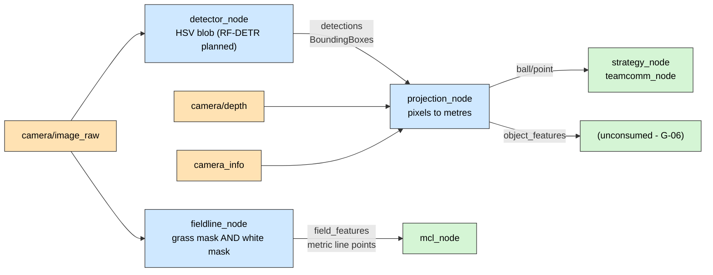
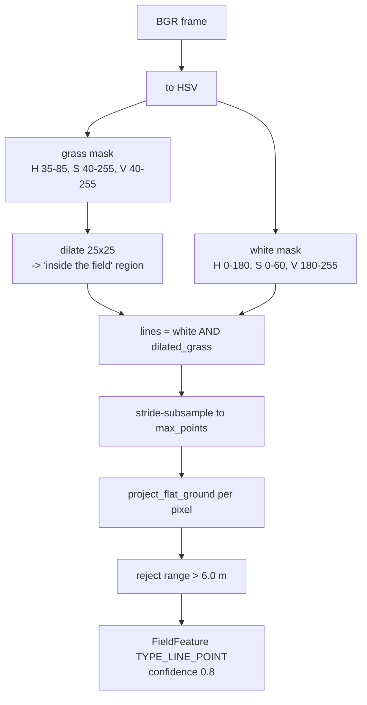

# 04 — Perception (L3)

Turns images into **metric observations**: where the ball is, and where the white
lines are. Nothing downstream ever sees a pixel.



---

## 1. The camera contract

Perception subscribes only to these four names. Which process fills them is a
launch-time detail ([D-08](02-design-decisions.md#d-08)).

| Contract topic     | Type                     | Encoding / units                                 |
| ------------------ | ------------------------ | ------------------------------------------------ |
| `camera/image_raw` | `sensor_msgs/Image`      | `bgr8`                                           |
| `camera_info`      | `sensor_msgs/CameraInfo` | `K = [fx, 0, cx; 0, fy, cy; 0, 0, 1]`            |
| `camera/depth`     | `sensor_msgs/Image`      | `32FC1`, **metres**, registered to the RGB frame |
| `imu/data`         | `sensor_msgs/Imu`        | REP-145                                          |

| Source            | How it fills the contract                                                                                                                                         |
| ----------------- | ----------------------------------------------------------------------------------------------------------------------------------------------------------------- |
| `sim_camera_node` | Publishes `camera/image_raw` only. Depth, `camera_info` and IMU are absent — perception degrades to its fallbacks by design ([D-12](02-design-decisions.md#d-12)) |
| ZED Mini          | The `stereolabs::ZedCamera` **component** publishes the contract topics itself via remaps ([D-09](02-design-decisions.md#d-09))                                   |
| rosbag            | Replay of a recording made on hardware — the reason a developer needs no GPU                                                                                      |

---

## 2. `sim_camera_node` — the synthetic camera

`ros2_ws/src/soccer_bringup/soccer_bringup/sim_camera.py`

A 30 Hz renderer producing a green pitch, one white horizontal line, and an orange
ball whose image position is a function of the **actual `neck_pan` angle**.

```python
rel = ball_bearing - pan               # pan read from joint_states
visible = abs(rel) <= hfov / 2
x = w/2 - (rel / (hfov/2)) * (w/2)     # linear FOV mapping
y = 0.62 * h                           # fixed apparent range
```

| Element  | Value                                                                       |
| -------- | --------------------------------------------------------------------------- |
| Pitch    | BGR `(60, 140, 60)`                                                         |
| Line     | white, at 70 % image height                                                 |
| Ball     | BGR `(0, 140, 255)`, radius 16 px                                           |
| Defaults | `ball_bearing = 0.3 rad`, `hfov = 1.05 rad`, `640 × 480`, 30 Hz, sensor QoS |

**Why it subscribes to `joint_states`.** The point is not photorealism — it is
**closing the loop**. Because the rendered ball moves when the joint moves, the
whole chain (detector → projection → strategy → MPC → controller → hardware →
`joint_states` → renderer) is a genuine closed feedback loop. A static test image
would exercise the same nodes but prove nothing about the loop.

**What it deliberately does not do:** publish depth, `camera_info` or IMU. That
forces the fallback paths to be exercised every time anyone runs the sim, so they
cannot silently rot.

---

## 3. `detector_node`

`ros2_ws/src/soccer_perception/soccer_perception/detector_node.py`

|            |                                                                 |
| ---------- | --------------------------------------------------------------- |
| Subscribes | `camera/image_raw` (sensor QoS)                                 |
| Publishes  | `detections` — `soccer_msgs/BoundingBoxes` (reliable, depth 10) |
| Parameters | `image_topic`, `engine_path` (`""` selects HSV)                 |

### 3.1 Current algorithm — HSV blob detection


| Constant      | Value                     | Reason                                                                           |
| ------------- | ------------------------- | -------------------------------------------------------------------------------- |
| Hue           | 5 – 25                    | Orange RoboCup ball in OpenCV's 0–180 hue scale                                  |
| Saturation    | 120 – 255                 | Rejects washed-out highlights and white paint                                    |
| Value         | 120 – 255                 | Rejects shadow                                                                   |
| Median blur   | 5 × 5                     | Removes salt-and-pepper speckle without eroding the blob edge, unlike a Gaussian |
| Min area      | 25 px²                    | Below this, a blob is indistinguishable from noise                               |
| Confidence    | `min(1.0, area / 2000.0)` | A monotone, bounded stand-in for a real detector score                           |
| Contact point | `(x + w/2, y + h)`        | Bottom-centre of the box — where the ball touches the ground                     |

### 3.2 Why it is written this way

- **The message is the contract, not the model** ([D-11](02-design-decisions.md#d-11)).
  `engine_path` is already declared and threaded through; replacing HSV with a
  TensorRT engine is a change inside this file only.
- **Confidence is published even though HSV has no notion of it**, because the
  field is part of the contract and downstream code (`ball_confidence` in
  `TeamData`) must be exercised.
- **`xbase`/`ybase` are computed here**, not in `projection_node`, because the
  contact point is class-dependent: bottom-centre for a ball, the base of a
  goalpost, the feet of a robot. The detector knows the class.

⚠ **Known limitation.** HSV thresholds are lighting-dependent and will fail in a
competition venue. Tracked as [G-01](14-status-and-roadmap.md#g-01); the plan is
RF-DETR (Apache-2.0) exported to TensorRT.

---

## 4. `fieldline_node`

`ros2_ws/src/soccer_perception/soccer_perception/fieldline_node.py`

|            |                                                    |
| ---------- | -------------------------------------------------- |
| Subscribes | `camera/image_raw` (sensor QoS)                    |
| Publishes  | `field_features` — `soccer_msgs/FieldFeatureArray` |
| Parameters | `image_topic`, `max_points` (200)                  |

### 4.1 Algorithm



### 4.2 Why each step exists

| Step                                          | Reason                                                                                                                                                                                                                                                                                                                                                                    |
| --------------------------------------------- | ------------------------------------------------------------------------------------------------------------------------------------------------------------------------------------------------------------------------------------------------------------------------------------------------------------------------------------------------------------------------- |
| **Grass mask, then dilate 25 × 25**           | White pixels are everywhere — robot shells, spectators' shirts, the ceiling. Requiring a white pixel to lie inside the _dilated grass region_ is a cheap, robust "is this on the pitch?" test. The dilation is essential: the lines themselves are **not** green, so they are holes in the grass mask; dilating closes them so a line pixel still falls inside the region |
| **Low saturation for white**                  | White paint is defined by _absence of colour_, so the discriminative channel is S (< 60), not H                                                                                                                                                                                                                                                                           |
| **Range cut at 6.0 m**                        | Flat-ground projection error grows without bound near the horizon: a one-pixel error at the horizon is an infinite range error. 6.0 m exceeds the 6.0 × 4.0 m field's longest useful sight line, so nothing informative is lost                                                                                                                                           |
| **`max_points = 200` via stride subsampling** | MCL cost is `O(particles × points)`. 300 × 200 = 60 000 lookups per cycle is affordable at 10 Hz; an unbounded point count is not. Stride (rather than random) sampling keeps the spatial distribution of the line                                                                                                                                                        |
| **Constant confidence 0.8**                   | Classical CV has no calibrated per-point confidence. A constant is honest; a fabricated score would mislead the filter's weighting                                                                                                                                                                                                                                        |

⚠ **Known limitation.** This node uses the flat-ground fallback even when depth is
available — the ZED depth image is not wired into it. See
[G-07](14-status-and-roadmap.md#g-07).

---

## 5. `projection_node`

`ros2_ws/src/soccer_perception/soccer_perception/projection_node.py`

|            |                                                                            |
| ---------- | -------------------------------------------------------------------------- |
| Subscribes | `detections`, `camera_info` (sensor QoS), `camera/depth` (sensor QoS)      |
| Publishes  | `ball/point` (`geometry_msgs/PointStamped`), `object_features` (goalposts) |
| Parameters | `use_depth` (`true`)                                                       |

### 5.1 Intrinsics

Defaults are `PinholeCamera(fx=550, fy=550, cx=320, cy=240, 640×480, mount_height=0.30, tilt=0.35 rad)`
(≈ 20° downward). The moment a `camera_info` message arrives, the intrinsics are
replaced from `K`:

```python
fx = K[0];  fy = K[4];  cx = K[2];  cy = K[5]
```

**Why defaults at all?** So the node runs against `sim_camera_node`, which
publishes no `camera_info`. **Why adopt `camera_info` when present?** Because the
ZED's factory calibration is far better than any hard-coded guess, and the values
change with `grab_resolution` ([D-37](02-design-decisions.md#d-37)).

### 5.2 Depth path (preferred)

$$
x = \frac{u - c_x}{f_x}\,d, \qquad
y = \frac{v - c_y}{f_y}\,d, \qquad
z = d
$$

in the optical frame, then to the base-aligned frame:

$$
(x, y, z)_{\text{base}} = (\,z,\; -x,\; 0\,)
$$

| Guard             | Value | Reason                                                                                                                                        |
| ----------------- | ----- | --------------------------------------------------------------------------------------------------------------------------------------------- |
| Reject `d < 0.05` | 5 cm  | Below the ZED's minimum range; such values are artifacts                                                                                      |
| Reject `NaN`      | —     | The ZED writes NaN where stereo matching failed (textureless grass, occlusion). Silently treating NaN as 0 would place the ball at the camera |

The `z = 0` in the base frame is deliberate: the consumers of `ball/point` reason
in 2D on the field plane, and asserting a measured ball height would add noise
without adding information.

### 5.3 Flat-ground fallback

Used when `use_depth` is false, no depth image has arrived, or the depth sample is
invalid. Implemented in `camera_model.project_flat_ground`:

1. Build the unit ray for pixel `(u, v)` in the optical frame.
2. Rotate it into the base-aligned frame (x forward, y left, z up), applying the
   fixed camera `tilt`:
   ```python
   fwd = [ r[2]*cos(t) + r[1]*sin(t),  -r[0],  -r[1]*cos(t) + r[2]*sin(t) ]
   ```
3. **If `fwd[2] >= -1e-6`, return `None`** — the ray is at or above the horizon and
   never meets the ground. Returning `None` rather than a huge number is what stops
   a horizon pixel from being reported as a ball 900 m away.
4. Otherwise intersect with the plane:
   $$ t = \frac{h\_{\text{mount}}}{-\mathrm{fwd}\_z}, \qquad p = (t\,\mathrm{fwd}\_x,\; t\,\mathrm{fwd}\_y,\; 0) $$

### 5.4 Goalposts

Detections with `class_id == "goalpost"` are projected and republished as
`FieldFeature(type=TYPE_GOALPOST)` on `object_features`.

⚠ **Nothing subscribes to `object_features` today.** Goalposts are the landmark
that best disambiguates a symmetric field, so this is a real missed capability —
[G-06](14-status-and-roadmap.md#g-06).

---

## 6. Tests

`ros2_ws/src/soccer_perception/test/test_projection.py`

| Test                            | Asserts                       | What it protects                           |
| ------------------------------- | ----------------------------- | ------------------------------------------ |
| Centre pixel, depth 2.0         | → `(0, 0, 2.0)`               | Sign conventions and the optical→base swap |
| Pixel below the principal point | → ground point ahead, `z = 0` | Tilt rotation and plane intersection       |
| Pixel above the horizon         | → `None`                      | The guard that prevents absurd ranges      |

These are the three ways a projection implementation goes wrong. Each is cheap to
test and expensive to debug on hardware.

---

## 7. Design decisions referenced

| Decision                            | Summary                                             |
| ----------------------------------- | --------------------------------------------------- |
| [D-08](02-design-decisions.md#d-08) | Driver-agnostic camera contract                     |
| [D-09](02-design-decisions.md#d-09) | Remap the ZED component, do not relay it            |
| [D-10](02-design-decisions.md#d-10) | Detection and line extraction are separate problems |
| [D-11](02-design-decisions.md#d-11) | Classical CV placeholders behind final contracts    |
| [D-12](02-design-decisions.md#d-12) | Depth first, automatic flat-ground fallback         |
