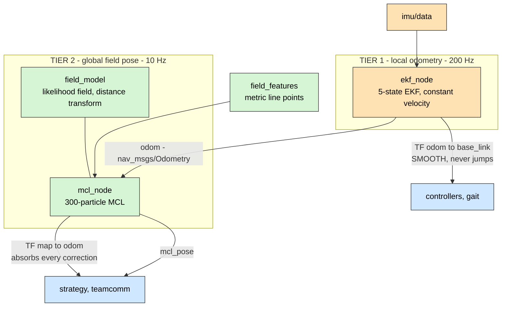
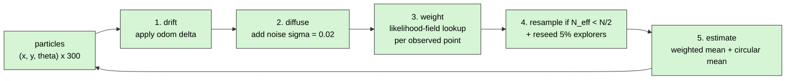
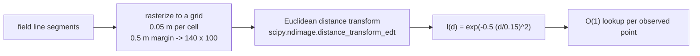

# 05 — Localization (L2 / L3)

Two filters, two frames, two jobs. They are not alternatives
([D-13](02-design-decisions.md#d-13)).

|              | Tier 1 — `ekf_node`       | Tier 2 — `mcl_node`                  |
| ------------ | ------------------------- | ------------------------------------ |
| Answers      | _How have I moved?_       | _Where am I on the field?_           |
| Rate         | 200 Hz                    | 10 Hz                                |
| Belief       | Unimodal Gaussian         | 300 weighted particles (multi-modal) |
| Output frame | `odom → base_link`        | `map → odom`                         |
| Property     | Smooth, drifts            | Anchored, jumps                      |
| Consumers    | Control, MCL motion model | Strategy, team comms                 |

---

## 1. Tier 1 — `ekf_node`

`ros2_ws/src/soccer_localization/soccer_localization/ekf_node.py`

|                   |                                                                |
| ----------------- | -------------------------------------------------------------- |
| Subscribes        | `imu/data` (sensor QoS)                                        |
| Publishes         | `odom` (`nav_msgs/Odometry`, depth 20) + TF `odom → base_link` |
| Prediction period | **0.005 s = 200 Hz**                                           |

### 1.1 State and model

State vector $\mathbf{x} = [p_x,\ p_y,\ \theta,\ v,\ \omega]^\top$, propagated with a
**constant-velocity** model:

$$
\begin{aligned}
p_x' &= p_x + v\cos\theta\,\Delta t \\
p_y' &= p_y + v\sin\theta\,\Delta t \\
\theta' &= \theta + \omega\,\Delta t \\
v' &= v,\qquad \omega' = \omega
\end{aligned}
$$

**Why constant velocity?** Because the placeholder robot has no drive train and no
leg odometry — there is no control input to feed forward. Constant velocity is the
correct minimal assumption when the only information available is "nothing told me
it changed." When leg odometry arrives, this becomes the input term of the same
filter; the structure does not change.

### 1.2 Noise parameters

| Matrix           | Value                                  | Reasoning                                                                                                                                                                                                                                                             |
| ---------------- | -------------------------------------- | --------------------------------------------------------------------------------------------------------------------------------------------------------------------------------------------------------------------------------------------------------------------- |
| $Q$              | `diag([1e-4, 1e-4, 1e-4, 1e-2, 1e-2])` | Position and heading evolve almost deterministically over 5 ms; _velocities_ are where the unmodelled dynamics enter, so their process noise is two orders of magnitude larger. This is what lets the filter respond quickly to a genuine turn instead of fighting it |
| $R_{\text{imu}}$ | `diag([1e-3, 1e-3])`                   | Consumer-grade MEMS attitude and rate noise                                                                                                                                                                                                                           |
| $P_0$            | `eye(5) * 0.01`                        | Small but non-zero: "I am confident I start at the origin, but not infinitely so." A zero $P_0$ makes the filter permanently ignore measurements                                                                                                                      |

### 1.3 Measurement update

The IMU contributes two observations — heading $\theta$ and yaw rate $\omega$:

1. Yaw is extracted from the quaternion with `atan2`.
2. **The first sample defines `theta_bias`**, which is subtracted from every
   subsequent sample. This makes the _startup_ pose the odometry origin, which is
   the definition of the `odom` frame — an absolute magnetometer heading would be
   both unavailable indoors and wrong for this purpose.
3. The innovation is **wrapped to (−π, π]** before the update. Without this, a
   robot crossing the ±π boundary produces a ~2π innovation and the filter diverges
   violently. This is the single most common EKF-on-a-robot bug.

$x$, $y$ and $v$ are **not** observed. The filter is honest about this: they are
pure dead-reckoning and their covariance grows without bound. Correcting them is
Tier 2's job.

### 1.4 Why not `robot_localization`?

|                    |                                                                                                                                                                                                                  |
| ------------------ | ---------------------------------------------------------------------------------------------------------------------------------------------------------------------------------------------------------------- |
| **Reason**         | `robot_localization`'s `ekf_node` is a general 15-state fusion engine configured through ~40 YAML booleans. For a five-state filter with one sensor, the configuration is harder to reason about than the filter |
| **What we gain**   | The wrap-around handling, the bias convention and the noise model are ~150 readable lines that can be unit-tested and explained                                                                                  |
| **When to switch** | The moment there are three or more odometry sources (leg odometry + IMU + ZED VIO). At that point `robot_localization`'s sensor-timeout and differential-mode handling is worth more than the transparency       |

⚠ **Currently `imu/data` has no publisher in simulation** — see
[G-04](14-status-and-roadmap.md#g-04). The filter therefore runs prediction-only in
sim and emits a static pose.

---

## 2. Tier 2 — `mcl_node`

`ros2_ws/src/soccer_localization/soccer_localization/mcl_node.py`

|            |                                                            |
| ---------- | ---------------------------------------------------------- |
| Subscribes | `field_features` (depth 5), `odom` (depth 20)              |
| Publishes  | `mcl_pose` (`PoseWithCovarianceStamped`) + TF `map → odom` |
| Period     | **0.1 s = 10 Hz**                                          |
| Parameters | `num_particles = 300`, `explorer_frac = 0.05`              |

### 2.1 The cycle

### 2.2 Numerical choices, and why each is needed

| Choice                          | Value                                      | Why                                                                                                                                                                                    |
| ------------------------------- | ------------------------------------------ | -------------------------------------------------------------------------------------------------------------------------------------------------------------------------------------- |
| Motion noise                    | $\sigma = (0.02, 0.02, 0.02)$              | Without diffusion, resampling collapses every particle onto identical copies and the filter can never recover diversity                                                                |
| **Log-likelihood accumulation** | `sum(log(l + eps))`                        | Multiplying 200 probabilities each ~0.1 underflows float64 in about 300 terms. Summing logs is the standard, and here necessary, fix                                                   |
| Epsilon                         | `1e-6`                                     | `log(0)` is `-inf`, which poisons the whole particle's weight. A floor makes one bad observation survivable                                                                            |
| **Max-shift before `exp`**      | subtract `max(logw)`                       | `exp(-800)` is 0 in float64; subtracting the maximum re-centres the exponentials into representable range without changing the normalised result                                       |
| Collapse guard                  | total weight < `1e-12` → uniform reset     | If _every_ particle is impossible (a kidnapping, or a burst of spurious features), normalising by ~0 produces NaN. Resetting to uniform means the filter re-converges instead of dying |
| Resample trigger                | $N_{\text{eff}} < N/2$                     | Resampling every step destroys diversity for no benefit. $N_{\text{eff}} = 1/\sum w_i^2$ measures how many particles are actually contributing                                         |
| **Systematic resampling**       | one random offset, $N$ evenly spaced draws | $O(N)$ instead of $O(N\log N)$, and lower variance than multinomial resampling — the standard choice                                                                                   |
| Explorer reseed                 | $\lceil 0.05N \rceil = 15$ particles       | Kidnapped-robot recovery ([D-16](02-design-decisions.md#d-16))                                                                                                                         |

### 2.3 Estimating a pose from particles

$x$ and $y$ are a weighted mean. $\theta$ **is not** — headings are circular, so a
naive mean of $+179°$ and $-179°$ gives $0°$, pointing the robot exactly backwards.
The circular mean is used:

$$
\bar\theta = \operatorname{atan2}\!\left(\sum_i w_i \sin\theta_i,\ \sum_i w_i \cos\theta_i\right)
$$

### 2.4 Publishing `map → odom`, not `map → base_link`

MCL estimates where `base_link` is in `map`. It publishes the **difference**
between that and what `ekf_node` already claims:

$$
T_{\text{map} \to \text{odom}} = T_{\text{map} \to \text{base}} \cdot T_{\text{odom} \to \text{base}}^{-1}
$$

This preserves the invariant that makes REP-105 work: `odom → base_link` stays
continuous for the controllers, and all discontinuity is confined to
`map → odom` ([03 §3](03-ros-2-interfaces.md#3-tf-tree)).

---

## 3. The field model

`ros2_ws/src/soccer_localization/soccer_localization/field_model.py`

### 3.1 Geometry — `SoccerbotField`

| Element              | Value                                            |
| -------------------- | ------------------------------------------------ |
| Field length (x)     | 6.0 m                                            |
| Field width (y)      | 4.0 m                                            |
| Centre circle radius | 0.75 m, approximated by a **24-segment polygon** |
| Goalposts            | (+3.0, ±1.0) and (−3.0, ±1.0)                    |

The circle is polygonised because the rasterizer draws line segments; 24 segments
give a maximum chord error of about 6 mm, well below the 50 mm grid resolution —
so a finer polygon would be discarded by the raster anyway.

### 3.2 The likelihood field

| Constant               | Value  | Why                                                                                                                                                                       |
| ---------------------- | ------ | ------------------------------------------------------------------------------------------------------------------------------------------------------------------------- |
| Resolution             | 0.05 m | Finer than the localization accuracy target (5–15 cm) so the grid is not the limiting error; coarse enough that the whole map is a 140 × 100 array                        |
| Margin                 | 0.5 m  | Robots and observations legitimately exist just outside the touchline; without margin those points fall off the grid                                                      |
| $\sigma$               | 0.15 m | Sets tolerance to line-detection error. Too small and a slightly-off particle scores zero (the filter becomes brittle); too large and the field is flat and uninformative |
| Out-of-grid likelihood | `1e-3` | Small but non-zero: an observation off the map is _evidence against_ a particle, not proof of impossibility                                                               |

**Fallback.** If SciPy is unavailable the module computes the distance field with a
slower pure-NumPy path, so the package imports and the tests run without SciPy.

### 3.3 Why a distance transform is the right measurement model

A camera looking at line paint does not measure range to a surface, so ray-casting
(the classic AMCL laser model) is meaningless here. What the observation actually
says is _"there is white paint at this metric point"_, and the natural likelihood
is a function of **how far that point is from the nearest modelled line**. The
distance transform computes exactly that quantity for every cell, once, at startup
— converting an $O(\text{points} \times \text{segments})$ search into an array
lookup ([D-15](02-design-decisions.md#d-15)).

---

## 4. Tests

`ros2_ws/src/soccer_localization/test/test_mcl.py`

| Test                                               | Asserts                                                            | What it protects                                                                           |
| -------------------------------------------------- | ------------------------------------------------------------------ | ------------------------------------------------------------------------------------------ |
| Likelihood on a line exceeds likelihood off a line | monotone in distance                                               | The measurement model has the right sign — the failure that makes MCL converge to nonsense |
| Convergence within 0.4 m                           | 400 particles, 8 iterations, `explorer_frac = 0` seeded near truth | End-to-end filter correctness; explorers disabled so the test is deterministic             |
| Explorers reseed on forced degeneracy              | new particles appear                                               | The kidnapped-robot recovery path actually runs                                            |

---

## 5. Accuracy expectations

Vision-based field localization on a walking humanoid is a **5–15 cm, few-degree**
class result. Anything claiming millimetres is measuring something else.

Strategy must be written to tolerate that: it is why the Behavior Trees act on
_relative_ ball bearing (measured directly by perception, and accurate) rather than
on absolute field coordinates derived from the pose estimate.

---

## 6. Roadmap for this subsystem

| Planned                                     | Why                                                                                                                     | Tracked                               |
| ------------------------------------------- | ----------------------------------------------------------------------------------------------------------------------- | ------------------------------------- |
| Feed goalposts (`object_features`) into MCL | Goalposts break the field's symmetry better than lines do                                                               | [G-06](14-status-and-roadmap.md#g-06) |
| Add L/T/X junctions as landmark types       | Already reserved in `FieldFeature`; sparse and highly informative                                                       | [G-08](14-status-and-roadmap.md#g-08) |
| Add ZED VIO as a Tier-1 input               | Better dead-reckoning than IMU alone — but Tier 1 only, never the field authority ([D-14](02-design-decisions.md#d-14)) | [G-09](14-status-and-roadmap.md#g-09) |
| Use ZED depth for line points               | Removes the flat-ground assumption from the MCL front-end                                                               | [G-07](14-status-and-roadmap.md#g-07) |
