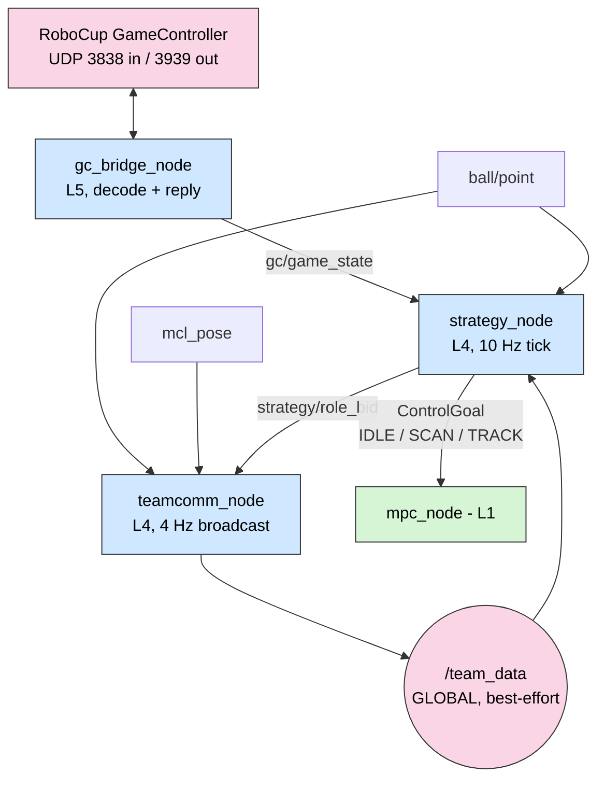
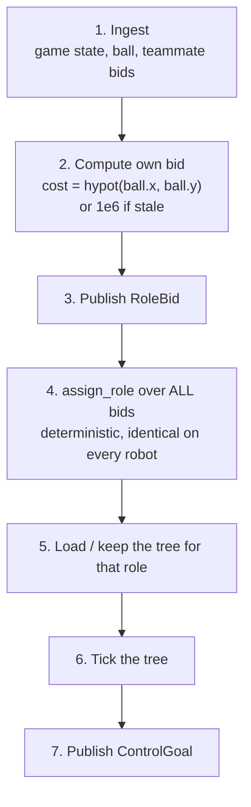
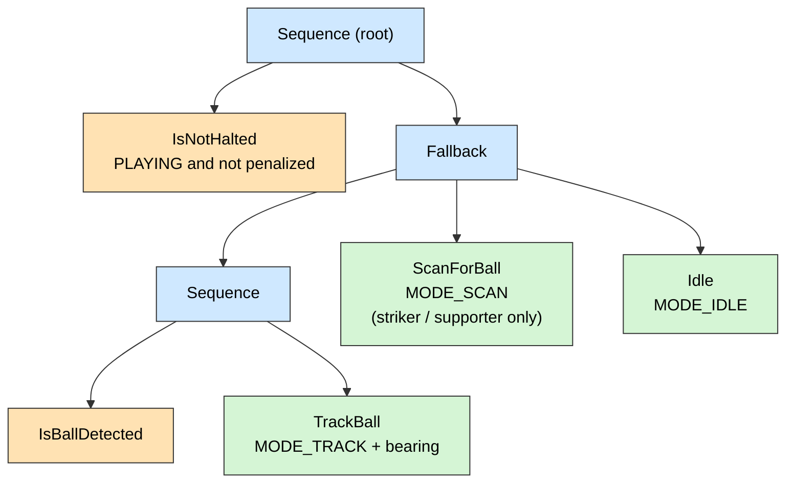

# 06 — Strategy & Coordination (L4 / L5)

Decides **what the robot should try to do**, and agrees with teammates about who
does it. Everything here is intent; nothing here computes a joint angle.



---

## 1. `gc_bridge_node` (L5)

`ros2_ws/src/game_controller_bridge/`

|            |                                                                              |
| ---------- | ---------------------------------------------------------------------------- |
| Input      | UDP **3838**, bound `0.0.0.0`, `SO_REUSEADDR` + `SO_BROADCAST`, non-blocking |
| Output     | UDP **3939** return packets, ~1 Hz                                           |
| Publishes  | `gc/game_state` (`soccer_msgs/GameState`), ~2 Hz                             |
| Timers     | 50 Hz drain, 1 Hz return                                                     |
| Parameters | `team_number = 1`, `player_id = 1`, `data_port = 3838`, `return_port = 3939` |

### 1.1 Wire format

`gc_protocol.py` mirrors the official GameController struct, **version 12**:

| Field          | Value                                                                                                                |
| -------------- | -------------------------------------------------------------------------------------------------------------------- |
| Control header | `b"RGme"`                                                                                                            |
| Return header  | `b"RGrt"`                                                                                                            |
| Control struct | `"<4sHBBBBBBB4sBhhh"` = 25 B, then 2 × `TeamInfo` `"<BBBBH"` (7 B) and 4 × `PlayerInfo` `"<BB"` (2 B) — 55 B minimum |
| Return struct  | `"<4sHBBB"` = 10 B                                                                                                   |
| Constants      | `MAX_NUM_PLAYERS = 4`, `PENALTY_NONE = 0`, `MSG_ALIVE = 1`, `MSG_GOAL = 2`                                           |

### 1.2 Design decisions

| Choice                                       | Why                                                                                                                                                                                                                            |
| -------------------------------------------- | ------------------------------------------------------------------------------------------------------------------------------------------------------------------------------------------------------------------------------ |
| **Poll at 50 Hz, publish at the GC's ~2 Hz** | The socket is non-blocking and drained on a timer, so a burst of datagrams cannot back up and the node never blocks. Republishing only on receipt keeps `gc/game_state` an honest reflection of what the referee actually sent |
| **Send the return packet even when idle**    | The GameController flags robots that stop replying, regardless of on-field behaviour. Compliance is not optional                                                                                                               |
| **`SO_REUSEADDR` + `SO_BROADCAST`**          | The GC broadcasts; multiple processes on one host (a robot plus a monitoring tool) must both be able to bind                                                                                                                   |
| **Decode once, publish a typed message**     | Nothing downstream ever parses UDP. The wire format is a competition-year detail; `GameState` is the stable internal contract ([D-20](02-design-decisions.md#d-20))                                                            |
| **Reject malformed packets silently**        | Port 3838 is a broadcast port on a shared venue network; anything can arrive on it. Unparseable input returns `None` and is dropped                                                                                            |

### 1.3 Tests

`test/test_gc_protocol.py` — three cases: a control packet round-trips preserving
game state and penalty; garbage returns `None`; the return packet header is
`b"RGrt"`. That covers encode, decode and the hostile-input path.

A `tools/mock_gamecontroller.py` script replays a synthetic GC so the whole L5/L4
chain can be exercised without the official Java application.

---

## 2. `strategy_node` (L4)

`ros2_ws/src/soccer_strategy/src/strategy_node.cpp`

|            |                                                                           |
| ---------- | ------------------------------------------------------------------------- |
| Subscribes | `gc/game_state`, `ball/point`, **`/team_data`** (global, `SensorDataQoS`) |
| Publishes  | `control/goal` (`ControlGoal`), `strategy/role_bid` (`RoleBid`)           |
| Tick       | **10 Hz**                                                                 |
| Parameters | `player_id = 1`, `goalie_id = 1`, `ball_timeout = 1.0` s                  |

### 2.1 Per-tick sequence



Ball geometry is computed once, in one place:

```cpp
ball_bearing  = std::atan2(point.y, point.x);
ball_distance = std::hypot(point.x, point.y);
```

### 2.2 The staleness rule

```cpp
const bool fresh   = (now() - last_ball_).seconds() < ball_timeout_;   // 1.0 s
const double my_cost = fresh ? ctx_->ball_distance : 1e6;
```

**Why `1e6` instead of "do not bid".** A robot that stops bidding is
indistinguishable from a robot that crashed, and it makes the auction input set
differ between robots (breaking [D-18](02-design-decisions.md#d-18)). Bidding a
sentinel cost keeps the robot present and comparable, while guaranteeing it loses
to anyone who can actually see the ball. It also degrades gracefully: if _nobody_
sees the ball, the auction still produces a striker — the lowest `player_id` —
who then scans for it.

**Why a 1.0 s timeout.** Long enough to survive a few dropped frames at 20 Hz;
short enough that a robot chasing a ball that rolled away gives up within one tick
of a human noticing.

---

## 3. Behavior Trees

`ros2_ws/src/soccer_strategy/trees/` and `src/bt_nodes.cpp`

### 3.1 The three trees



| Tree            | Behaviour when the ball is not visible | Why                                                                                                                                                      |
| --------------- | -------------------------------------- | -------------------------------------------------------------------------------------------------------------------------------------------------------- |
| `striker.xml`   | `ScanForBall`                          | Must find the ball to attack                                                                                                                             |
| `supporter.xml` | `ScanForBall`                          | Must maintain awareness to support                                                                                                                       |
| `goalie.xml`    | `Idle`                                 | **Holds position.** A goalie that sweeps its head chasing a lost ball has abandoned its post; staying still and covering the goal is the correct default |

### 3.2 Leaf nodes

| Node             | Kind      | Returns / emits                                          |
| ---------------- | --------- | -------------------------------------------------------- |
| `IsNotHalted`    | condition | `SUCCESS` iff `gamestate == PLAYING && !penalized`       |
| `IsBallDetected` | condition | `SUCCESS` iff a fresh ball observation exists            |
| `Idle`           | action    | `ControlGoal{MODE_IDLE}`                                 |
| `ScanForBall`    | action    | `ControlGoal{MODE_SCAN}`                                 |
| `TrackBall`      | action    | `ControlGoal{MODE_TRACK, target_bearing = ball_bearing}` |

### 3.3 Why the structure is what it is

- **`IsNotHalted` is the first child of a `Sequence` at the root of every tree.**
  A `Sequence` fails as soon as a child fails, so a halted or penalized robot never
  reaches any behaviour. Rules compliance is structural, not conventional
  ([D-20](02-design-decisions.md#d-20)).
- **`Fallback` encodes priority.** The tree reads exactly as the tactic is
  described: "track the ball if you can see it; otherwise scan; otherwise idle."
  Adding a behaviour is inserting a node, not rewiring transitions — the reason BTs
  were chosen over an FSM ([D-17](02-design-decisions.md#d-17)).
- **Leaves emit `ControlGoal`, never joint commands.** The L4/L1 interface is three
  modes and a bearing. That is what allows the MPC to be rewritten, or the robot to
  grow to 20 DOF, without touching a tree.
- **Trees are XML loaded at runtime**, so the role switch produced by the auction is
  a tree reload, not a rebuild.

---

## 4. Role auction

`ros2_ws/src/soccer_strategy/src/role_auction.cpp`

```cpp
Role assign_role(uint8_t my_id, const std::vector<Bid>& bids, uint8_t goalie_id);
```

### 4.1 Algorithm

1. If `my_id == goalie_id` → `ROLE_GOALIE`. Short-circuit; the goalie never bids
   ([D-19](02-design-decisions.md#d-19)).
2. Among bids that are `active` **and** not the goalie, find the lowest `cost`.
3. Ties break on the **lowest `player_id`**.
4. Winner → `ROLE_STRIKER`; everyone else → `ROLE_SUPPORTER`.

### 4.2 Why determinism replaces a protocol

Every robot runs this identical function over the bid set it has received. Given
the same bids, every robot **must** compute the same assignment — so there is no
negotiation, no acknowledgement, no leader and no protocol state to desynchronise.

The tie-break on `player_id` is not cosmetic: floating-point costs _do_ collide
(two robots equidistant from the ball, or two robots both bidding `1e6` because
nobody sees it). Without a total order, two robots could each believe they won.
`player_id` is unique by construction, so the order is total.

Dropout needs no code at all: a crashed or penalized robot's bid stops arriving or
arrives with `active = false`, it is excluded from step 2, and the next 10 Hz tick
promotes someone else.

### 4.3 Tests

`ros2_ws/src/soccer_strategy/test/test_role_auction.cpp` — four gtest cases:

| Test                                 | Protects                                            |
| ------------------------------------ | --------------------------------------------------- |
| `GoalieIsStaticallyAssigned`         | The goalie short-circuit                            |
| `ClosestOutfieldRobotBecomesStriker` | The core cost comparison                            |
| `DropoutTriggersReassignment`        | Fault tolerance without special-case code           |
| `DeterministicTieBreakByPlayerId`    | The property the entire no-protocol design rests on |

These run in CI on every commit and require no ROS graph — the auction is a pure
function, which is precisely why it is testable.

---

## 5. `teamcomm_node`

`ros2_ws/src/soccer_teamcomm/soccer_teamcomm/teamcomm_node.py`

|            |                                                                                   |
| ---------- | --------------------------------------------------------------------------------- |
| Subscribes | `mcl_pose`, `ball/point`, `strategy/role_bid` (depth 5 each)                      |
| Publishes  | **`/team_data`** — global, `QoSPresetProfiles.SENSOR_DATA` (best-effort, depth 5) |
| Rate       | **4 Hz** (`rate_hz`)                                                              |
| Parameters | `player_id = 1`, `rate_hz = 4.0`                                                  |

Heading is extracted with the small-angle-free yaw shortcut for a planar
quaternion:

```python
theta = 2.0 * atan2(q.z, q.w)
```

### 5.1 Design decisions

| Choice                                                        | Why                                                                                                                                                                                                                                                                                                                                                                |
| ------------------------------------------------------------- | ------------------------------------------------------------------------------------------------------------------------------------------------------------------------------------------------------------------------------------------------------------------------------------------------------------------------------------------------------------------ |
| **4 Hz, not 10 Hz**                                           | Wi-Fi at a competition is a shared, congested, hostile medium — every team is on it. A teammate's pose is useful at 4 Hz; the extra 6 Hz buys nothing and costs airtime. The _local_ strategy loop still runs at 10 Hz                                                                                                                                             |
| **Best-effort QoS**                                           | Models a lossy UDP team channel. A retransmitted 250 ms-old teammate pose is worth less than the next fresh one ([D-40](02-design-decisions.md#d-40))                                                                                                                                                                                                              |
| **`ball_detected` is reset to `False` after every broadcast** | Without this, a robot that saw the ball once would advertise `ball_detected = True` forever, and teammates would keep deferring to a robot that lost the ball long ago. Resetting means the flag is true only if a _new_ observation arrived within the last broadcast interval — freshness enforced by construction, with no timestamp arithmetic on the receiver |
| **Global topic, not namespaced**                              | `/team_data` is the one deliberate exception to [D-05](02-design-decisions.md#d-05): it is the only channel that must cross robot boundaries                                                                                                                                                                                                                       |
| **One flat message**                                          | Small, fixed-size, no nesting beyond `RoleBid`. Cheap to serialise, cheap to log, and it fits comfortably in a single UDP datagram                                                                                                                                                                                                                                 |

⚠ `ball_confidence` is currently hard-coded to `1.0` — the detector has no
calibrated score yet ([G-01](14-status-and-roadmap.md#g-01)). There are no tests
for this package ([G-10](14-status-and-roadmap.md#g-10)).

---

## 6. Failure behaviour

What each layer does when its input disappears — the property that makes the
frequency contract ([D-02](02-design-decisions.md#d-02)) meaningful.

| Failure               | Effect                                                                                                                                    |
| --------------------- | ----------------------------------------------------------------------------------------------------------------------------------------- |
| GameController silent | `gc/game_state` goes stale; `IsNotHalted` keeps the last state. The robot does **not** spontaneously start playing                        |
| Ball lost             | `ball_timeout` (1.0 s) expires → cost `1e6` → the robot loses the auction, becomes supporter, and its tree falls through to `ScanForBall` |
| Wi-Fi down            | No teammate bids arrive. Each robot bids alone, wins its own auction and plays as striker. Degraded, but every robot still plays          |
| A teammate crashes    | Its bid stops appearing; the next tick reassigns. No timeout logic required                                                               |
| Perception crashes    | No ball updates → same path as "ball lost". Control keeps running on the last `ControlGoal`                                               |

---

## 7. Design decisions referenced

| Decision                            | Summary                                                   |
| ----------------------------------- | --------------------------------------------------------- |
| [D-06](02-design-decisions.md#d-06) | Fully decentralized team; no master, no coach             |
| [D-17](02-design-decisions.md#d-17) | Behavior Trees with roles as loadable XML                 |
| [D-18](02-design-decisions.md#d-18) | Deterministic role assignment, not a negotiation protocol |
| [D-19](02-design-decisions.md#d-19) | Statically assigned goalie                                |
| [D-20](02-design-decisions.md#d-20) | GameController gating at the tree root                    |
| [D-40](02-design-decisions.md#d-40) | Best-effort QoS on the team channel                       |
