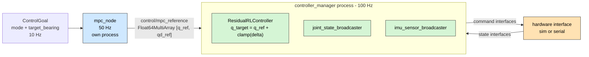
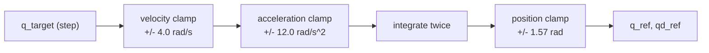

# 07 — Control (L1)

Converts strategic _intent_ (`ControlGoal`) into a joint command, in two stages:
a model-based reference generator and a bounded learned correction
([D-21](02-design-decisions.md#d-21)).



**Why two processes.** `mpc_node` is a normal ROS node; the controller is a plugin
inside the `controller_manager`'s real-time-ish loop. Splitting them means MPC
work — which will grow into a genuine optimisation problem — cannot lengthen the
controller's update cycle ([D-02](02-design-decisions.md#d-02)). The interface
between them is one small message, so a late or missing reference simply means the
controller re-uses the last one.

---

## 1. `mpc_node`

`ros2_ws/src/soccer_control/src/mpc_node.cpp`

|            |                                                                                        |
| ---------- | -------------------------------------------------------------------------------------- |
| Subscribes | `control/goal` (`soccer_msgs/ControlGoal`, depth 10)                                   |
| Publishes  | `control/mpc_reference` (`std_msgs/Float64MultiArray` = `[q_ref, qd_ref]`, depth 10)   |
| Period     | **20 ms = 50 Hz**                                                                      |
| Parameters | `pan_limit = 1.57`, `max_velocity = 4.0`, `max_acceleration = 12.0`, `scan_rate = 0.6` |

### 1.1 Mode → target angle

| Mode         | `q_target`                                                                  |
| ------------ | --------------------------------------------------------------------------- |
| `MODE_IDLE`  | hold the current reference                                                  |
| `MODE_SCAN`  | `0.9 * pan_limit * sin(scan_phase)`, with `scan_phase += 2*pi*scan_rate*dt` |
| `MODE_TRACK` | `clamp(target_bearing, -pan_limit, +pan_limit)`                             |

**Why `0.9 * pan_limit` for scanning.** Sweeping to the mechanical stop means
hitting it every cycle — audible, wearing, and it saturates the tracking error
signal. A 10 % margin keeps the sweep inside the joint's usable range.

**Why `scan_rate = 0.6 Hz`.** A full sweep takes ~1.7 s. Faster than that and the
camera's exposure smears the ball into the background; slower and a ball can cross
the field before the scan finds it.

**Why `MODE_IDLE` holds instead of homing to zero.** A robot that snaps its head to
centre every time the tree falls through to `Idle` is both distracting and a source
of unnecessary motion. Holding is the least-surprise behaviour.

### 1.2 The trajectory shaper

`q_target` is a **step**; joints cannot follow steps. Every cycle the reference is
re-derived through a two-stage limiter:

```cpp
v_des  = clamp((q_target - q_ref) / dt, -max_velocity,     +max_velocity);
a      = clamp((v_des    - qd_ref) / dt, -max_acceleration, +max_acceleration);
qd_ref += a * dt;
q_ref  += qd_ref * dt;
q_ref   = clamp(q_ref, -pan_limit, +pan_limit);
```



| Property                               | Consequence                                                                                                                  |
| -------------------------------------- | ---------------------------------------------------------------------------------------------------------------------------- |
| Velocity-limited                       | The command never demands more speed than the joint has (URDF limit: 6.0 rad/s; the MPC stays below it at 4.0)               |
| Acceleration-limited                   | The command never demands a torque impulse. This is what protects the gearbox and keeps the torque within the 3.0 N·m budget |
| Position-clamped **after** integration | Integration cannot wind past the joint limit even if the target is bad                                                       |
| Stateful (`q_ref`, `qd_ref` persist)   | The reference is continuous across mode changes — switching `SCAN → TRACK` produces a smooth transition, not a jump          |

**Why velocity and acceleration limits below the URDF's own limits.** The URDF
values are what the joint _can_ do; the MPC values are what the system _chooses_ to
do, leaving headroom for the residual policy and for tracking error.

### 1.3 Why this is called "MPC"

Today it is a rate-limited reference generator, not a receding-horizon optimiser —
for a single joint tracking a bearing, the optimal solution _is_ a rate-limited
ramp, so an optimiser would compute the same answer more slowly. The **name and the
interface** are the real content: `ControlGoal` in, `[q_ref, qd_ref]` out. When the
robot grows legs and the problem becomes a genuine constrained optimisation
(ZMP/centroidal), the solver replaces this node's internals and nothing else
changes.

---

## 2. `ResidualRLController`

`ros2_ws/src/soccer_control/src/residual_rl_controller.cpp`,
exported through `soccer_control_plugins.xml` as
`soccer_control/ResidualRLController`.

|                            |                                                                                              |
| -------------------------- | -------------------------------------------------------------------------------------------- |
| Kind                       | `controller_interface::ControllerInterface` plugin                                           |
| Rate                       | 100 Hz (the `controller_manager` `update_rate`)                                              |
| Subscribes                 | `control/mpc_reference`, into a `realtime_buffer`                                            |
| Command interfaces claimed | `neck_pan/position`, `neck_pan/effort`                                                       |
| State interfaces read      | `neck_pan/position`, `neck_pan/velocity`, `neck_pan/effort`                                  |
| Parameters                 | `joint`, `reference_topic`, `policy_path`, `residual_limit_rad = 0.20`, `effort_limit = 3.0` |

### 2.1 The update cycle

```cpp
q      = state_interfaces_[0].get_value();
qd     = state_interfaces_[1].get_value();
ref    = *mpc_ref_.readFromRT();            // lock-free
q_ref  = ref[0];  qd_ref = ref[1];

obs    = { q, qd, q_ref, qd_ref, state_interfaces_[2].get_value(), 0.0f };
delta  = std::clamp(policy_.residual(obs), -residual_limit_, +residual_limit_);

command_interfaces_[0].set_value(q_ref + delta);   // position
command_interfaces_[1].set_value(0.0);             // effort feed-forward, reserved
```

### 2.2 Why each element

| Element                                                 | Reason                                                                                                                                                                                                                                                                              |
| ------------------------------------------------------- | ----------------------------------------------------------------------------------------------------------------------------------------------------------------------------------------------------------------------------------------------------------------------------------- |
| **`realtime_buffer` for the reference**                 | The subscription callback runs on an executor thread; `update()` runs on the control loop. A mutex in `update()` would introduce unbounded priority inversion. `realtime_tools::RealtimeBuffer` is the lock-free single-producer/single-consumer exchange designed for exactly this |
| **Buffer seeded to `{0.0, 0.0}` in `on_configure`**     | `update()` may run before the first MPC message arrives. Seeded, the robot holds still; unseeded, it would read uninitialised memory                                                                                                                                                |
| **`std::clamp` after inference**                        | The safety property is enforced in C++ where no policy can influence it ([D-22](02-design-decisions.md#d-22))                                                                                                                                                                       |
| **Measured effort in the observation**                  | The policy must see the same quantities in sim and on hardware; torque is one of them ([D-23](02-design-decisions.md#d-23))                                                                                                                                                         |
| **`obs[5] = 0.0f`, reserved**                           | The slot for the commanded bearing, kept so the observation width matches the trained policy. Changing the width later would silently invalidate every exported model ([D-31](02-design-decisions.md#d-31))                                                                         |
| **Failure to load a policy is a warning, not an error** | Pure MPC is the safe default and a fully functional robot ([D-22](02-design-decisions.md#d-22))                                                                                                                                                                                     |

---

## 3. `PolicyRunner` — currently a stub

`ros2_ws/src/soccer_control/include/soccer_control/policy_runner.hpp`

Header-only. `load()` records the path and returns; `residual()` returns `0.0`.
**No ONNX Runtime or TensorRT is linked.** Two `TODO`s mark the insertion points.

|                        |                                                                                                                                                                                                                                                               |
| ---------------------- | ------------------------------------------------------------------------------------------------------------------------------------------------------------------------------------------------------------------------------------------------------------- |
| **Consequence today**  | The controller always runs pure MPC, regardless of `policy_path`                                                                                                                                                                                              |
| **Why ship it anyway** | The _interface_ is what the rest of the system depends on: the observation layout, the clamp, the plugin export, the parameter set and the failure path are all real and exercised. Filling in inference is a change confined to this header plus a link line |
| **Tracked as**         | [G-02](14-status-and-roadmap.md#g-02)                                                                                                                                                                                                                         |

---

## 4. Controller manager configuration

`ros2_ws/src/soccer_description/config/controllers.yaml`

```yaml
/**:
  controller_manager:
    ros__parameters:
      update_rate: 100 # Hz
      joint_state_broadcaster:
        { type: joint_state_broadcaster/JointStateBroadcaster }
      imu_sensor_broadcaster:
        { type: imu_sensor_broadcaster/IMUSensorBroadcaster }
      residual_rl_controller: { type: soccer_control/ResidualRLController }
```

### 4.1 The `/**` wildcard is load-bearing

`robot.launch.py` pushes everything under `/<robot_name>`, so the manager is
actually `/robot_1/controller_manager`. A bare `controller_manager:` key in the
YAML would target the **un-namespaced** `/controller_manager`, the parameters would
never reach the real node, and the spawners would fail with the opaque message:

```text
The 'type' param was not defined for '<controller>'
```

The `/**` wildcard makes the parameters match regardless of namespace. This is a
documented trap worth remembering — the error message does not point at the cause.

### 4.2 Why 100 Hz

The actuator closes its own impedance loop, so the manager only has to deliver
_setpoints_ ([D-24](02-design-decisions.md#d-24)). 100 Hz is the policy's natural
rate, gives the 50 Hz MPC a 2× oversample, and leaves ample CPU headroom on the
Orin. The sim hardware plugin advertises `update_rate = 500` in the URDF so its
internal integration is finer than the control period.

---

## 5. Open gaps in the control path

These are real and they matter. Full list in
[14 — Status & Roadmap](14-status-and-roadmap.md).

| Gap                                   | Detail                                                                                                                                                                                                                                                                                                                                                                                                                                                                                                                                                     |
| ------------------------------------- | ---------------------------------------------------------------------------------------------------------------------------------------------------------------------------------------------------------------------------------------------------------------------------------------------------------------------------------------------------------------------------------------------------------------------------------------------------------------------------------------------------------------------------------------------------------- |
| [G-02](14-status-and-roadmap.md#g-02) | `PolicyRunner` performs no inference — the residual is always exactly zero                                                                                                                                                                                                                                                                                                                                                                                                                                                                                 |
| [G-11](14-status-and-roadmap.md#g-11) | **No controller claims `kp`, `kd` or `velocity`.** The URDF and both hardware plugins implement the full MIT tuple, but `ResidualRLController` claims only `position` and `effort`. `SoccerbotSimHardware` papers over this by seeding `kp = 120, kd = 12` in `on_activate`; `SoccerbotSerialHardware` deliberately defaults them to **0.0** ("zero impedance until a controller commands gains"), so a real robot would be commanded **limp**. Closing [D-23](02-design-decisions.md#d-23) end to end requires the controller to claim and write all five |
| [G-12](14-status-and-roadmap.md#g-12) | The `update()` comment still refers to "the MCU's 1 kHz PD loop", which was superseded by onboard actuator impedance ([D-24](02-design-decisions.md#d-24))                                                                                                                                                                                                                                                                                                                                                                                                 |
| [G-13](14-status-and-roadmap.md#g-13) | `soccer_control` has no unit tests. The trajectory shaper is pure arithmetic and is straightforward to test                                                                                                                                                                                                                                                                                                                                                                                                                                                |

---

## 6. Design decisions referenced

| Decision                            | Summary                                                   |
| ----------------------------------- | --------------------------------------------------------- |
| [D-21](02-design-decisions.md#d-21) | Hierarchical MPC plus a bounded residual RL policy        |
| [D-22](02-design-decisions.md#d-22) | Hard residual clamp; no policy means pure MPC             |
| [D-23](02-design-decisions.md#d-23) | The joint command is the full MIT impedance tuple         |
| [D-24](02-design-decisions.md#d-24) | The fast loop lives on the actuator, not the Jetson       |
| [D-31](02-design-decisions.md#d-31) | The observation vector is identical in sim and controller |
