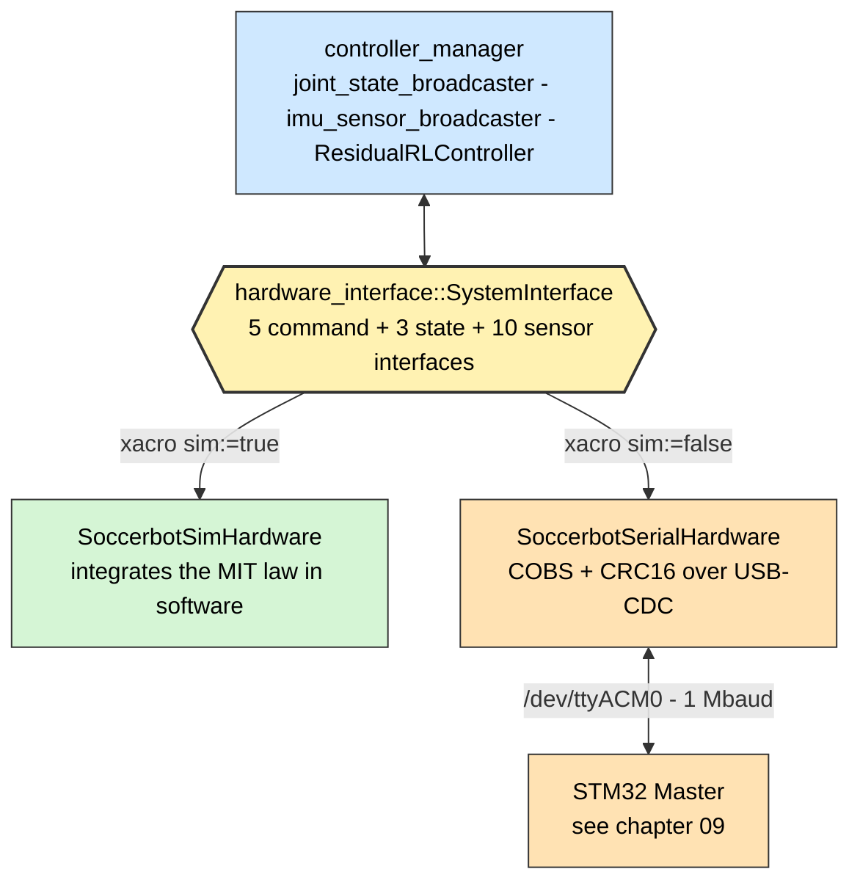
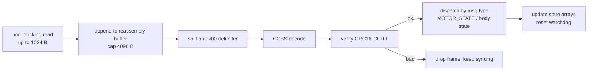

# 08 — Hardware Interface (L1 / L0 boundary)

The single point at which simulation and reality diverge
([D-03](02-design-decisions.md#d-03)). Everything above this line is identical in
both cases.



---

## 1. Robot description

`ros2_ws/src/soccer_description/urdf/soccerbot.urdf.xacro`

### 1.1 Links

| Link                   | Mass    | Geometry                      | Purpose                           |
| ---------------------- | ------- | ----------------------------- | --------------------------------- |
| `base_link`            | 0.80 kg | box 0.10 × 0.10 × 0.12 m      | Torso                             |
| `imu_link`             | 0.01 kg | box 0.02 × 0.02 × 0.005 m     | IMU mounting, `z = +0.02`         |
| `camera_mount`         | 0.10 kg | cylinder r = 0.02, l = 0.04 m | Driven by `neck_pan`              |
| `camera_link`          | 0.05 kg | box 0.03 × 0.05 × 0.03 m      | Camera body, at `[0.03, 0, 0.02]` |
| `camera_optical_frame` | —       | —                             | REP-103 optical convention        |

### 1.2 Joints

| Joint                  | Type         | Parent → Child                       | Detail                                                                                                                  |
| ---------------------- | ------------ | ------------------------------------ | ----------------------------------------------------------------------------------------------------------------------- |
| `imu_joint`            | fixed        | `base_link → imu_link`               | `z = +0.02`                                                                                                             |
| **`neck_pan`**         | **revolute** | `base_link → camera_mount`           | axis `z`, origin `z = +0.08`, limits ±1.57 rad, effort 3.0 N·m, velocity 6.0 rad/s, `damping = 0.05`, `friction = 0.02` |
| `camera_joint`         | fixed        | `camera_mount → camera_link`         | `[0.03, 0, 0.02]`                                                                                                       |
| `camera_optical_joint` | fixed        | `camera_link → camera_optical_frame` | `rpy = (-pi/2, 0, -pi/2)`                                                                                               |

**Why `camera_optical_frame` is a separate link.** ROS body frames are x-forward,
y-left, z-up (REP-103); camera optical frames are z-forward, x-right, y-down. Mixing
them is a classic source of silently transposed axes. A dedicated frame with an
explicit rotation makes the convention change visible in the TF tree and lets
`projection_node` work in optical coordinates without ambiguity.

**Why non-zero `damping` and `friction`.** They are what
`SoccerbotSimHardware` integrates against, and they are the parameters the domain
randomizer perturbs ([10 §3](10-simulation-and-learning.md#3-domain-randomization)).
Zero would make the simulated plant frictionless and unrealistically easy.

> ⚠ **xacro gotcha.** XML comments may not contain `--`. Decorative banners such as
> `<!-- SECTION ----- -->` crash `expat` inside xacro with a non-obvious error. This
> bit the project once (fixed in commit `24a80ad`). Validate a description with
> `python -c "import xml.dom.minidom as m; m.parse('file.xacro')"`.

---

## 2. The `ros2_control` tag

`ros2_ws/src/soccer_description/urdf/soccerbot.ros2_control.xacro`

```xml
<xacro:arg name="sim" default="true"/>
```

| `sim`   | Plugin                                    | Extra parameters                                                  |
| ------- | ----------------------------------------- | ----------------------------------------------------------------- |
| `true`  | `soccer_hardware/SoccerbotSimHardware`    | `update_rate = 500`                                               |
| `false` | `soccer_hardware/SoccerbotSerialHardware` | `serial_port`, `baud_rate = 1000000`, `watchdog_timeout_ms = 100` |

Interface ranges declared for `neck_pan`:

| Interface        | Min   | Max   |
| ---------------- | ----- | ----- |
| `position` (cmd) | −1.57 | +1.57 |
| `velocity` (cmd) | −6.0  | +6.0  |
| `kp` (cmd)       | 0     | 500   |
| `kd` (cmd)       | 0     | 50    |
| `effort` (cmd)   | −3.0  | +3.0  |

The `kp` upper bound of 500 mirrors the Robostride CAN encoding range
([09 §5](09-firmware-and-actuators.md#6-robostride-can-protocol)); `kd`'s range is
the practical damping band for a QDD actuator at this scale.

---

## 3. `SoccerbotSimHardware`

`ros2_ws/src/soccer_hardware/src/soccerbot_sim_hardware.cpp`

|                         |                                                  |
| ----------------------- | ------------------------------------------------ |
| Parameters              | `sim_inertia = 0.01` kg·m², `sim_damping = 0.05` |
| Default position limits | ±π (overridden by the URDF ranges)               |
| `on_activate`           | seeds `kp = 120`, `kd = 12`                      |

### 3.1 The plant

`read()` integrates the same impedance law the real actuator runs:

$$
\tau = k_p (q^* - q) + k_d (\dot q^* - \dot q) + \tau_{ff} - b\,\dot q
$$

$$
\ddot q = \tau / J, \qquad
\dot q \mathrel{+}= \ddot q\,\Delta t, \qquad
q \mathrel{+}= \dot q\,\Delta t
$$

| Detail                | Value                                                                 | Why                                                                                                                                                                                                    |
| --------------------- | --------------------------------------------------------------------- | ------------------------------------------------------------------------------------------------------------------------------------------------------------------------------------------------------ |
| Integrator            | explicit Euler                                                        | At 500 Hz with this inertia it is stable, and it is trivially inspectable. Physical fidelity is Isaac Lab's job ([10](10-simulation-and-learning.md)); this plugin exists to make the _graph_ runnable |
| `dt`                  | `max(period, 1e-4)`                                                   | A zero or negative period (first cycle, or a clock jump under `use_sim_time`) would divide by zero                                                                                                     |
| Soft limits           | inelastic clamp: position clamped **and** velocity zeroed at the stop | A position-only clamp leaves a non-zero velocity pressing into the limit, and the joint buzzes at the stop forever                                                                                     |
| `state_tau_ = torque` | —                                                                     | Publishes the computed torque as measured effort, so the residual-RL observation has the same fifth element in sim as on hardware ([D-31](02-design-decisions.md#d-31))                                |
| `write()`             | no-op                                                                 | All dynamics happen in `read()`; commands are already in the shared arrays                                                                                                                             |

### 3.2 Why `on_activate` seeds gains

Nothing currently claims the `kp`/`kd` command interfaces
([G-11](14-status-and-roadmap.md#g-11)), so without a seed the sim plant would have
zero impedance and the joint would never move. The seed is explicitly marked
**sim-only** in the source: it makes the simulation usable today without hiding the
gap on hardware, where the serial plugin deliberately defaults the gains to `0.0`.

### 3.3 ⚠ The IMU is a stub

`SoccerbotSimHardware` reports a constant identity quaternion, zero angular
velocity and `9.81 m/s²` on z. It is **not** derived from any simulated body motion.

Consequence: `imu_sensor_broadcaster` publishes a constant, and Tier-1 state
estimation is not meaningfully exercised in simulation. Tracked as
[G-14](14-status-and-roadmap.md#g-14).

---

## 4. `SoccerbotSerialHardware`

`ros2_ws/src/soccer_hardware/src/soccerbot_serial_hardware.cpp`

|            |                                                                                  |
| ---------- | -------------------------------------------------------------------------------- |
| Parameters | `serial_port = /dev/ttyACM0`, `baud_rate = 1000000`, `watchdog_timeout_ms = 100` |
| Port flags | `O_NOCTTY` + `O_NONBLOCK`, raw mode (`cfmakeraw`), no RTS/CTS                    |
| Buffers    | 1024 B read chunk, 4096 B reassembly cap                                         |

### 4.1 Port setup, and why each flag

| Flag         | Reason                                                                                                                                                                   |
| ------------ | ------------------------------------------------------------------------------------------------------------------------------------------------------------------------ |
| `O_NOCTTY`   | Prevents the serial device becoming the process's controlling terminal — otherwise a `Ctrl-C` or a modem-control transition on the port could signal the control process |
| `O_NONBLOCK` | `read()` runs inside the control loop; a blocking read would stall it whenever the MCU is quiet                                                                          |
| Raw mode     | Disables canonical line editing and every character translation. Binary framing must pass through byte-for-byte; `ONLCR` alone would corrupt `0x0A` bytes                |
| No RTS/CTS   | USB-CDC has no real modem lines; enabling flow control on a virtual port deadlocks                                                                                       |

### 4.2 `read()`



| Detail                                 | Why                                                                                                                                                                                                                                      |
| -------------------------------------- | ---------------------------------------------------------------------------------------------------------------------------------------------------------------------------------------------------------------------------------------- |
| **Reassembly cap 4096 B**              | Without a cap, a stuck link with no delimiter grows the buffer without bound — a slow memory-exhaustion failure on an embedded box                                                                                                       |
| **Drop-and-resync on bad CRC**         | COBS guarantees `0x00` appears only as a delimiter, so a corrupt frame costs exactly one frame; the next delimiter re-synchronises ([D-25](02-design-decisions.md#d-25))                                                                 |
| **Quaternion reorder**                 | The wire carries `(w, x, y, z)`; `ros2_control`'s IMU sensor expects `(x, y, z, w)`. Getting this wrong produces an attitude that looks plausible and is wrong — exactly the class of bug that is cheap to prevent and expensive to find |
| **Watchdog > 100 ms → `return ERROR`** | Halts the controller manager rather than continuing to command a link that is not answering ([D-26](02-design-decisions.md#d-26))                                                                                                        |

### 4.3 `write()`

Packs the full MIT tuple for **all** joints into one frame:

```cpp
JointMitCmd{ q_des, qd_des, kp, kd, tau_ff }   // 5 x float32 = 20 B per joint
```

then COBS-encodes with a CRC16 header and writes it. One frame per cycle, all
joints — one heartbeat, one watchdog, fixed size, no allocation
([D-25](02-design-decisions.md#d-25)).

> ⚠ `cmd_kp_` and `cmd_kd_` are initialised to **`0.0`** — "safe default: zero
> impedance until a controller commands gains". Because no controller currently
> claims those interfaces, a real robot would be commanded limp. See
> [G-11](14-status-and-roadmap.md#g-11).

### 4.4 No-MCU degraded mode

`on_activate()` returns `SUCCESS` **even if the port cannot be opened**, and
`read()`/`write()` become no-ops.

This looks wrong and is deliberate ([D-27](02-design-decisions.md#d-27)): it works
around a `ros2_control` 4.x crash-on-`ERROR` during activation, and it lets the full
perception/localization/strategy stack run on a machine with no MCU attached. With
no port there is nothing to command, so it is not a safety hole; once a port _is_
open the 100 ms watchdog applies normally.

---

## 5. Interface summary

Both plugins implement exactly the same surface — that is the entire point.

| Interface                                | Type    | Sim source            | Hardware source                 |
| ---------------------------------------- | ------- | --------------------- | ------------------------------- |
| `neck_pan/position`                      | command | integrated plant      | `JointMitCmd.q_des`             |
| `neck_pan/velocity`                      | command | integrated plant      | `JointMitCmd.qd_des`            |
| `neck_pan/kp`                            | command | seeded 120            | `JointMitCmd.kp` (defaults 0.0) |
| `neck_pan/kd`                            | command | seeded 12             | `JointMitCmd.kd` (defaults 0.0) |
| `neck_pan/effort`                        | command | `tau_ff` term         | `JointMitCmd.tau_ff`            |
| `neck_pan/position`                      | state   | integrated            | `JointState.q`                  |
| `neck_pan/velocity`                      | state   | integrated            | `JointState.qd`                 |
| `neck_pan/effort`                        | state   | computed torque       | `JointState.tau`                |
| `imu_sensor/orientation.{x,y,z,w}`       | state   | **stub** identity     | `BodyState.quat` (reordered)    |
| `imu_sensor/angular_velocity.{x,y,z}`    | state   | **stub** zero         | `BodyState.gyro`                |
| `imu_sensor/linear_acceleration.{x,y,z}` | state   | **stub** `(0,0,9.81)` | `BodyState.accel`               |

---

## 6. Testing

`soccer_hardware` and `soccer_description` currently have **no tests**
([G-13](14-status-and-roadmap.md#g-13)). The highest-value additions, in order:

| Test                                                               | Why it matters                                                                                                    |
| ------------------------------------------------------------------ | ----------------------------------------------------------------------------------------------------------------- |
| COBS + CRC16 round trip against the firmware's Python mirror       | Directly targets the divergence described in [09 §4.4](09-firmware-and-actuators.md#44-known-contract-divergence) |
| `static_assert`-style size checks across host and firmware headers | The mismatch is a struct-layout bug; sizes catch it at build time                                                 |
| Sim plant step response                                            | Pure arithmetic, no ROS graph needed                                                                              |
| xacro parse test for both `sim:=true` and `sim:=false`             | Catches the `--`-in-comment class of failure in CI                                                                |

---

## 7. Design decisions referenced

| Decision                            | Summary                                           |
| ----------------------------------- | ------------------------------------------------- |
| [D-03](02-design-decisions.md#d-03) | `ros2_control` is the single sim/real boundary    |
| [D-23](02-design-decisions.md#d-23) | The joint command is the full MIT impedance tuple |
| [D-25](02-design-decisions.md#d-25) | COBS + CRC16 framing, all joints per frame        |
| [D-26](02-design-decisions.md#d-26) | Three independent watchdogs                       |
| [D-27](02-design-decisions.md#d-27) | No-MCU degraded mode                              |
