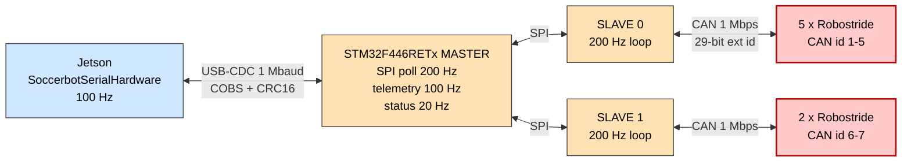
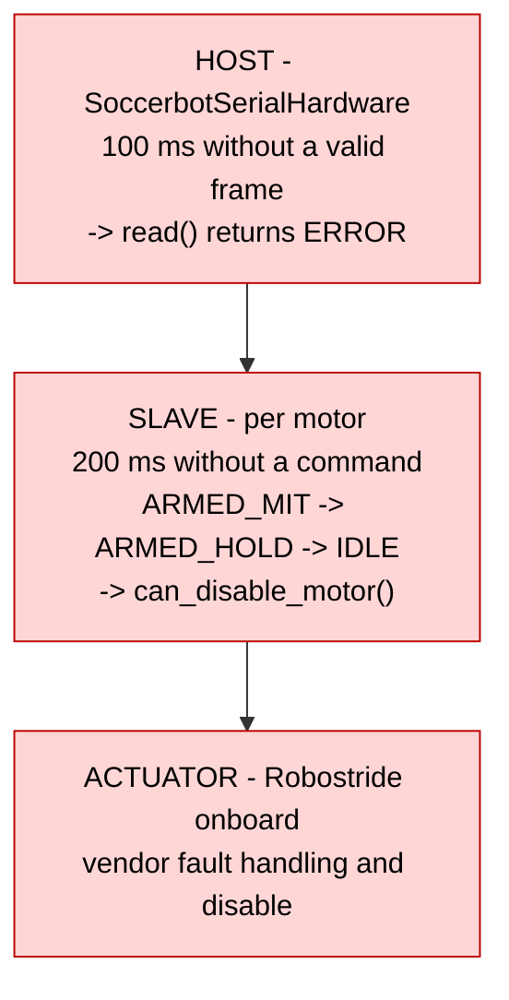

# 09 — Firmware & Actuators (L0)

The hard real-time layer. Nothing here runs on Linux, and that is the invariant the
whole architecture is built to preserve
([D-24](02-design-decisions.md#d-24)).

> `soccer-firmware/` is a **git submodule**
> (`https://github.com/utra-robosoccer/soccer-firmware.git`). Clone with
> `--recursive`, or run `git submodule update --init --recursive`
> ([D-07](02-design-decisions.md#d-07)).

---

## 1. Topology



### Why this topology

| Choice                                 | Reason                                                                                                                                                                                            |
| -------------------------------------- | ------------------------------------------------------------------------------------------------------------------------------------------------------------------------------------------------- |
| **A Master between Jetson and Slaves** | One USB endpoint, one framing protocol, one watchdog, one aggregation point — instead of _N_ serial links the host must fan out to. The host contract does not change when a slave board is added |
| **Slaves fan out to CAN**              | CAN bus load and the 200 Hz per-motor cycle scale with motors per bus. Splitting motors across slaves keeps each bus inside its budget                                                            |
| **SPI between Master and Slaves**      | Deterministic, master-driven, no arbitration, no bus contention — the Master polls on a fixed schedule and knows exactly when data arrives                                                        |
| **CAN to the motors**                  | It is what Robostride actuators speak; not a choice                                                                                                                                               |

---

## 2. Repository layout

```text
soccer-firmware/
├── common/                       shared definitions
├── firmware/
│   ├── common/include/
│   │   ├── protocol.h            USB-CDC wire protocol (C)
│   │   ├── motor_config.h        GENERATED - do not edit
│   │   └── system_config.h       GENERATED - do not edit
│   ├── master/                   STM32CubeIDE project, MotorMaster_ProcessLoop
│   └── slave/slave_general/      STM32CubeIDE project, motor_runtime
├── host/jetson/
│   ├── protocol.py               hand-maintained Python mirror of protocol.h
│   └── tests/test_protocol.py
├── tools/
│   ├── read_motor_angle.py  arm_hold.py  dashboard.py  test_client.py
│   ├── motor_config_gen.py
│   ├── robostride_usb_can/       rs02_can.py, rs02_motor.py, cli.py, sniff.py
│   └── stm_usb_cdc/
├── configs/                      slave0.yaml, slave1.yaml
├── scripts/                      build.sh, flash.sh, gen_motor_config.py
└── docs/                         incl. robostride-motor-reference.md
```

---

## 3. Master and Slave firmware

### 3.1 Master — STM32F446RETx

`MotorMaster_ProcessLoop()` runs continuously with three scheduled activities:

| Activity              | Constant                  | Period | Rate   |
| --------------------- | ------------------------- | ------ | ------ |
| SPI poll of slaves    | `MASTER_POLL_PERIOD_MS`   | 5 ms   | 200 Hz |
| Telemetry to the host | `MASTER_TELE_PERIOD_MS`   | 10 ms  | 100 Hz |
| Status to the host    | `MASTER_STATUS_PERIOD_MS` | 50 ms  | 20 Hz  |

**Why three different rates.** They carry different information at different value
densities. Motor state is what the controller consumes, so it goes at the control
rate (100 Hz). SPI polls faster (200 Hz) so telemetry is never more than one slave
cycle stale. Board status — temperatures, fault counters, link health — changes
slowly, and sending it at 100 Hz would waste bandwidth on unchanging bytes.

⚠ There is **no Master-level watchdog**. Timeout enforcement lives on the Slaves
(§5) and on the host. Adding one is [G-15](14-status-and-roadmap.md#g-15).

### 3.2 Slave — `slave_general`, STM32F446RETx

| Property           | Value                                    | Reason                                                                                                                                                 |
| ------------------ | ---------------------------------------- | ------------------------------------------------------------------------------------------------------------------------------------------------------ |
| Control loop       | `MOTOR_LOOP_PERIOD_MS = 5` → **200 Hz**  | 2× the host's 100 Hz command rate, so a command is acted on within one host cycle                                                                      |
| Startup delay      | **2.5 s**                                | Robostride actuators need time to boot their own CAN stack. Probing earlier gets no reply and the motor is wrongly declared missing                    |
| Motor discovery    | CAN Type 0 (`get id`), ~300 ms per motor | Enumerates what is actually on the bus instead of trusting a static config, so a mis-wired or dead motor is detected at start-up rather than mid-match |
| Per-motor watchdog | `MOTOR_WATCHDOG_MS = 200`                | §5                                                                                                                                                     |

---

## 4. USB-CDC wire protocol

Defined twice — `firmware/common/include/protocol.h` (C) and
`ros2_ws/src/soccer_hardware/include/soccer_hardware/wire_protocol.hpp` (C++) —
plus a Python mirror in `host/jetson/protocol.py`.

### 4.1 Frame structure

```text
+---------------------------+
| COBS-encoded payload      |   0x00 never appears inside
+---------------------------+
| 0x00 delimiter            |   unambiguous frame boundary
+---------------------------+

decoded payload:
+--------- 16-byte header ---------+---- payload ----+
| type(2) seq(2) src(1) dst(1)     |                 |
| ts_ms(4) len(2) flags(2) crc(2)  |                 |
+----------------------------------+-----------------+
```

`static_assert(sizeof(Header) == 16)` at both ends. CRC16-CCITT, polynomial
`0x1021`, init `0xFFFF`, computed over the header **with `crc` zeroed** plus the
payload. `PROTO_VERSION = 1`.

Rationale for each element is in [D-25](02-design-decisions.md#d-25).

### 4.2 Message types and node ids

| Type                | Value  | Direction      | Purpose                                |
| ------------------- | ------ | -------------- | -------------------------------------- |
| `MSG_PING`          | `0x01` | both           | Liveness                               |
| `MSG_MASTER_STATUS` | `0x02` | Master → host  | Board health                           |
| `MSG_SLAVE_STATUS`  | `0x03` | Slave → Master | Board health                           |
| `MSG_MOTOR_STATE`   | `0x04` | Master → host  | Joint telemetry                        |
| `MSG_CONTROL_REQ`   | `0x05` | host → Master  | Enable / disable / zero                |
| `MSG_CONTROL_RESP`  | `0x06` | Master → host  | Acknowledgement                        |
| **`MSG_MOTOR_CMD`** | `0x07` | host → Master  | **MIT setpoints — ⚠ stub in firmware** |

| Node           | Id  |
| -------------- | --- |
| `NODE_JETSON`  | 1   |
| `NODE_MASTER`  | 2   |
| `NODE_SLAVE_0` | 3   |

### 4.3 Payload structures (host view)

```cpp
struct JointMitCmd {   // 20 B
  float q_des, qd_des, kp, kd, tau_ff;
};

struct JointState {    // 18 B
  float  q, qd, tau;
  int8_t temp_c;  uint8_t state;
  uint16_t fault_flags, last_cmd_seq;
};

struct BodyState {     // 32 B
  float quat[4];  float gyro[3];  float accel[3];
  uint16_t contact_bits;
};
```

`BodyState` is the intended path for body IMU and foot-contact data. It exists in
the host header; the firmware does not populate it yet
([G-16](14-status-and-roadmap.md#g-16)).

### 4.4 Known contract divergence

⚠ **This is a real, unresolved defect. Do not assume the serial path works
end to end until it is fixed.**

| Aspect                              | Firmware `protocol.h`                                     | Host `wire_protocol.hpp`                                                    | Status                 |
| ----------------------------------- | --------------------------------------------------------- | --------------------------------------------------------------------------- | ---------------------- |
| 16-byte header layout               | `MsgHeader`                                               | `Header`                                                                    | ✅ match               |
| CRC16-CCITT `0x1021` / `0xFFFF`     | same                                                      | same                                                                        | ✅ match               |
| COBS + `0x00` delimiter             | same                                                      | same                                                                        | ✅ match               |
| **Motor state size**                | **22 B** (`float temp`, `uint32 fault`, `uint16 seq`)     | **18 B** (`int8 temp_c`, `uint8 state`, `uint16 fault_flags`, `uint16 seq`) | ❌ **mismatch**        |
| **Motor command size**              | **22 B** (`uint8 slave_id`, `uint8 motor_idx` + 5 floats) | **20 B** (5 floats only)                                                    | ❌ **mismatch**        |
| Lifecycle `state` byte in telemetry | absent (internal only)                                    | present                                                                     | ❌ missing in firmware |
| `MSG_MOTOR_CMD` (`0x07`)            | **stub — "not wired"**                                    | defined and transmitted                                                     | ⚠ firmware incomplete  |
| `CTRL_SET_ZERO` (`0x03`)            | **stub**                                                  | —                                                                           | ⚠ firmware incomplete  |

Additional divergences already flagged in the archived protocol report:

- The C and Python `MsgType` enumerations have drifted.
- The SPI `SpiMitCmd` struct **drops `kp`, `kd` and `tau_ff`**, so even a correct
  USB frame would lose the impedance terms between Master and Slave.
- There is no protocol version handshake, so a mismatch fails silently rather than
  at connect time.

**Recommended fix.** Generate the C, C++ and Python definitions from a **single
specification** so drift is impossible by construction, and add a
`PROTO_VERSION` exchange in `MSG_PING` so a mismatch is detected at link-up.
Tracked as [G-03](14-status-and-roadmap.md#g-03).

Until then, this is why the sim path is the supported path and the serial path is
bring-up-only.

---

## 5. Safety: three watchdogs



| Level                   | Detects                                        | Why it must exist independently                                                                                      |
| ----------------------- | ---------------------------------------------- | -------------------------------------------------------------------------------------------------------------------- |
| Host, 100 ms            | A dead or unresponsive MCU                     | The only level that can stop the controller manager cleanly                                                          |
| Slave, 200 ms per motor | **A dead Jetson**                              | A crashed host cannot detect its own crash. Without this, a kernel panic leaves the last torque applied indefinitely |
| Actuator                | Over-temperature, over-current, encoder faults | Vendor-level protection the higher layers cannot see                                                                 |

**The ordering 100 ms < 200 ms is deliberate.** The host notices first and can
degrade gracefully; the Slave's force-disable is the backstop for the case where
the host is not running at all.

The Slave's state ladder — `ARMED_MIT → ARMED_HOLD → IDLE → disable` — is a
graceful _decay_ rather than an instant cut. An abrupt torque removal on a standing
robot is itself a fall; holding position first gives the system a chance to recover
if the link returns.

---

## 6. Robostride CAN protocol

`soccer-firmware/docs/robostride-motor-reference.md`

| Property      | Value                                               |
| ------------- | --------------------------------------------------- |
| Bit rate      | 1 Mbps                                              |
| Identifier    | 29-bit extended: `{ id:8, data:16, mode:5, res:3 }` |
| Master CAN id | `0xFD`                                              |

### 6.1 Frame types

| Type    | Function                           |
| ------- | ---------------------------------- |
| 0       | Get device id (used for discovery) |
| 1       | **MIT control**                    |
| 2       | Feedback                           |
| 3       | Enable                             |
| 4       | Disable                            |
| 6       | Set mechanical zero                |
| 7       | Set CAN id                         |
| 17 / 18 | Read / write parameter             |

### 6.2 MIT control encoding

The 8-byte payload carries four big-endian `uint16` values:

| Slot | Quantity | Range                               |
| ---- | -------- | ----------------------------------- |
| 0–1  | position | ±12.57 rad (all models)             |
| 2–3  | velocity | ±33 rad/s (RS00) · ±44 rad/s (RS02) |
| 4–5  | `kp`     | 0 – 500                             |
| 6–7  | `kd`     | 0 – 5                               |

**Torque is carried in the CAN identifier's `data` field**, not in the payload —
the 8 bytes are already full. Range ±14 N·m (RS00) / ±17 N·m (RS02).

This 16-bit packing is exactly why the USB link uses float32 engineering units
instead: the host contract stays independent of the actuator vendor's quantisation,
and the Master performs the conversion at the edge
([D-25](02-design-decisions.md#d-25)).

### 6.3 Feedback

| Bits     | Meaning                      |
| -------- | ---------------------------- |
| fault 0  | Undervoltage                 |
| fault 1  | Driver fault                 |
| fault 2  | Over-temperature             |
| fault 3  | Encoder fault                |
| fault 4  | Stall / overload             |
| fault 5  | Uncalibrated                 |
| status 2 | Reset / calibrating / normal |

Temperature is transmitted as `raw / 10` °C.

---

## 7. Robostride actuator family

| Model    | Rated / peak torque | Max speed  | Ratio    | Power | Mass  |
| -------- | ------------------- | ---------- | -------- | ----- | ----- |
| **RS00** | 5 / 14 N·m          | 33.0 rad/s | 10 : 1   | 50 W  | 310 g |
| **RS02** | 6 / 17 N·m          | 42.9 rad/s | 7.75 : 1 | 60 W  | 380 g |
| **RS03** | 20 / 60 N·m         | 20.4 rad/s | 9 : 1    | 210 W | 900 g |
| **RS05** | 1.6 / 5.5 N·m       | 50.3 rad/s | 7.75 : 1 | 17 W  | 191 g |
| **RS06** | 11 / 36 N·m         | 50.3 rad/s | 9 : 1    | 115 W | 621 g |

All run at 48 V.

**Overload is time-limited, and this constrains gait design.** For the RS02:

| Torque  | Sustainable for |
| ------- | --------------- |
| 6.5 N·m | 3000 s          |
| 11 N·m  | 100 s           |
| 15 N·m  | 18 s            |
| 17 N·m  | 10 s            |

Peak torque is a _burst_ budget, not an operating point. A gait that sits near peak
torque will thermally fault mid-match — which is why the residual policy's effort
output is clamped ([D-22](02-design-decisions.md#d-22)) and why measured torque is
part of the observation vector ([D-23](02-design-decisions.md#d-23)).

---

## 8. Configuration generation

Motor topology is **declared in YAML and generated into headers** — never
hand-edited.

```bash
python3 scripts/gen_motor_config.py --system configs/slave0.yaml configs/slave1.yaml
# -> firmware/common/include/motor_config.h
# -> firmware/common/include/system_config.h   (NUM_SLAVES=2, TOTAL_MOTORS=7)
```

| File                  | Contents              |
| --------------------- | --------------------- |
| `configs/slave0.yaml` | 5 motors, CAN ids 1–5 |
| `configs/slave1.yaml` | 2 motors, CAN ids 6–7 |

**Why generate.** The motor count, CAN ids and per-motor limits appear in several
translation units on two different boards. Hand-editing guarantees eventual
inconsistency; a single YAML source with generated headers makes a mismatch a
build-time impossibility. This is the same principle recommended for the wire
protocol in §4.4 — and the fact that it is already applied here is the argument for
applying it there too.

---

## 9. Build and flash

```bash
# From the soccer-firmware submodule root
./scripts/build.sh --list                      # available projects
./scripts/build.sh master Release
./scripts/build.sh --config slave0 slave_general Release
./scripts/build.sh --clean master

./scripts/flash.sh master                      # OpenOCD, or st-flash fallback
```

`build.sh` drives **STM32CubeIDE headless**
(`org.eclipse.cdt.core.headlessbuild`). Linker script:
`STM32F446RETX_FLASH.ld`.

**Why headless CubeIDE rather than a plain CMake toolchain.** The projects carry
CubeMX-generated HAL configuration and `.ioc` files; regenerating peripheral setup
from the IDE and building from the command line keeps one source of truth for pin
multiplexing and clock trees. `deploy/toolchains/arm-none-eabi.cmake` exists for
components that do not need CubeMX.

---

## 10. Host-side tools

| Tool                                          | Purpose                                                                              |
| --------------------------------------------- | ------------------------------------------------------------------------------------ |
| `tools/read_motor_angle.py`                   | Read a single joint angle — the first thing to run on a new bus                      |
| `tools/arm_hold.py`                           | Arm one motor and hold position; validates the MIT path in isolation                 |
| `tools/dashboard.py`                          | Live telemetry view                                                                  |
| `tools/test_client.py`                        | Protocol exerciser                                                                   |
| `tools/robostride_usb_can/cli.py`, `sniff.py` | Talk to / sniff motors directly over a USB-CAN adapter, bypassing the STM32 entirely |
| `tools/stm_usb_cdc/`                          | USB-CDC link testing                                                                 |

`sniff.py` is the tool that settles "is the Slave sending the wrong frame, or is the
motor rejecting it?" — it removes the firmware from the question.

### Tests

| Test                                        | Covers                                                          |
| ------------------------------------------- | --------------------------------------------------------------- |
| `host/jetson/tests/test_protocol.py`        | Round trip, CRC, `MOTOR_CMD_SIZE = 20`, `MOTOR_STATE_SIZE = 22` |
| `tools/robostride_usb_can/test_rs02_can.py` | CAN identifier packing and MIT encoding                         |

> The size constants in that test file are themselves evidence of §4.4: the Python
> mirror expects a 20-byte command and a **22**-byte state, while the C++ host
> header defines an 18-byte state.

---

## 11. Design decisions referenced

| Decision                            | Summary                                            |
| ----------------------------------- | -------------------------------------------------- |
| [D-07](02-design-decisions.md#d-07) | Firmware as a submodule                            |
| [D-24](02-design-decisions.md#d-24) | The fast loop lives on the actuator                |
| [D-25](02-design-decisions.md#d-25) | COBS + CRC16, all joints per frame, float32 on USB |
| [D-26](02-design-decisions.md#d-26) | Three independent watchdogs                        |
