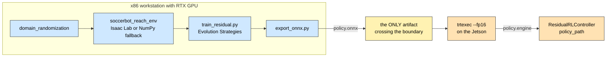

# 10 — Simulation & Learning

Trains the residual policy that [chapter 07](07-control.md) consumes. The interface
between this chapter and the robot is a **single ONNX file**
([D-28](02-design-decisions.md#d-28)).



**Why the boundary is a file.** Isaac Lab drags in Isaac Sim, a large PyTorch/CUDA
tree and an NVIDIA-specific runtime. None of that belongs in a robot image. A
serialised model means the training stack can be upgraded, downgraded or replaced
entirely without touching the robot ([D-28](02-design-decisions.md#d-28)).

---

## 1. The task

`sim/tasks/soccerbot_reach_env.py`

| Property       | Value                                                     |
| -------------- | --------------------------------------------------------- |
| `OBS_DIM`      | **6** — `[q, qd, q_ref, qd_ref, gyro_z, command_bearing]` |
| `ACT_DIM`      | **1** — the residual, in radians                          |
| Reward         | `-abs(q - q_cmd) - 0.01*abs(delta_q) - 0.001*abs(qd)`     |
| Episode length | 4.0 s                                                     |
| Decimation     | 4                                                         |

### 1.1 Why the reward has three terms

| Term                   | Weight | What it prevents                                                                                                                                                                |
| ---------------------- | ------ | ------------------------------------------------------------------------------------------------------------------------------------------------------------------------------- |
| `-abs(q - q_cmd)`      | 1.0    | Nothing — this **is** the task: track the commanded angle                                                                                                                       |
| `-0.01 * abs(delta_q)` | 0.01   | An unnecessarily large residual. Without it the policy learns to use its full ±0.20 rad budget even when the MPC was already correct, and the "residual" stops being a residual |
| `-0.001 * abs(qd)`     | 0.001  | High-frequency chatter. Without it a policy can score well on position while oscillating — which destroys gearboxes and looks nothing like the smooth motion the MPC intends    |

The weights are deliberately an order of magnitude apart. Tracking must dominate;
the regularisers shape _how_ the tracking is achieved without competing with it.

### 1.2 Why `decimation = 4`

Physics steps at 200 Hz; the policy acts at 50 Hz. This matches the real system's
structure, where the actuator's loop runs far faster than the policy that commands
it ([D-24](02-design-decisions.md#d-24)). A policy trained at physics rate would
learn to rely on a control frequency it will never have.

### 1.3 Two implementations

|          | `SoccerbotReachEnvCfg`                      | `NumpyReachEnv`                  |
| -------- | ------------------------------------------- | -------------------------------- |
| Backend  | Isaac Lab (GPU, thousands of parallel envs) | Pure NumPy, single env           |
| Requires | NVIDIA GPU + Isaac Sim                      | nothing beyond NumPy             |
| Purpose  | Real training                               | Pipeline validation, CI, laptops |

`NumpyReachEnv` details:

| Detail                | Value                                     | Why                                                                                                                                                                                                                                                                                     |
| --------------------- | ----------------------------------------- | --------------------------------------------------------------------------------------------------------------------------------------------------------------------------------------------------------------------------------------------------------------------------------------- |
| Plant                 | PD with `kp = 120`, `kd = 8`              | Approximates the Robostride impedance loop                                                                                                                                                                                                                                              |
| Integration           | 20 substeps of 1 ms per 50 Hz policy step | Stable explicit integration at a realistic policy rate                                                                                                                                                                                                                                  |
| **Unmodelled offset** | randomly 0.08 – 0.14 rad                  | **The reason a residual is needed at all.** Without a deliberate model error the MPC is already optimal and the policy has nothing to learn. This injects exactly the kind of constant bias — gearbox backlash, calibration error, gravity load — that a residual is supposed to absorb |

The shared `OBS_DIM`, `ACT_DIM` and `RESIDUAL_LIMIT` constants live in one module so
the two environments and the C++ controller cannot silently disagree
([D-31](02-design-decisions.md#d-31)).

---

## 2. Why residual RL is the learning formulation

Restating [D-21](02-design-decisions.md#d-21) in learning terms:

| Formulation   | Sample efficiency                       | Failure mode                                     |
| ------------- | --------------------------------------- | ------------------------------------------------ |
| End-to-end RL | Poor — must learn the whole task        | Unbounded; a bad policy can destroy hardware     |
| Residual RL   | Good — starts from a working controller | Bounded by the clamp; worst case is degraded MPC |
| MPC-only      | N/A                                     | Cannot absorb unmodelled dynamics                |

The residual policy begins from a baseline that already _mostly works_, so the
search space is the model error rather than the task. And because the output is
clamped in C++, "the policy is broken" is a performance regression rather than a
safety event ([D-22](02-design-decisions.md#d-22)).

---

## 3. Domain randomization

`sim/tasks/domain_randomization.py`

| Parameter           | Range               | What real-world uncertainty it covers                                                                                                                                                                      |
| ------------------- | ------------------- | ---------------------------------------------------------------------------------------------------------------------------------------------------------------------------------------------------------- |
| `inertia`           | 0.006 – 0.016 kg·m² | CAD mass properties are never exact; payload changes                                                                                                                                                       |
| `damping`           | 0.02 – 0.10         | Bearing friction varies with temperature, wear and assembly                                                                                                                                                |
| `friction`          | 0.0 – 0.05          | Static friction and cable drag                                                                                                                                                                             |
| `torque_scale`      | 0.85 – 1.15         | Motor constant tolerance, drive-voltage variation, thermal derating                                                                                                                                        |
| **`latency_steps`** | **0 – 3**           | **The most important one.** Real command latency spans USB-CDC, SPI and CAN, and it is _variable_. A policy trained with zero latency learns aggressive gains that oscillate the moment real delay appears |
| `encoder_noise_std` | 0.005 rad           | Quantisation and electrical noise on position feedback                                                                                                                                                     |
| `gyro_noise_std`    | 0.01 rad/s          | MEMS gyro noise                                                                                                                                                                                            |

**Why randomize rather than identify.** System identification produces one accurate
model of one robot on one day. Randomization produces a policy that is _robust
across_ the range — which is what survives a robot being rebuilt between matches,
and what survives the model being slightly wrong in a direction nobody measured.

The centre of each range is the nominal URDF value; the width is the plausible
manufacturing and operating spread.

---

## 4. Training

`sim/train_residual.py`

| Setting       | Value                                                                       |
| ------------- | --------------------------------------------------------------------------- |
| Algorithm     | **Evolution Strategies**                                                    |
| Population    | 32                                                                          |
| `sigma`       | 0.08                                                                        |
| Learning rate | 0.03                                                                        |
| Iterations    | 200                                                                         |
| Network       | MLP `6 → 16 → 1`, `tanh` activations                                        |
| Output        | `tanh(y) * 0.20` — bounded in the architecture as well as in the controller |
| Artifact      | `.npz` weights                                                              |

### 4.1 Why Evolution Strategies here

|                  |                                                                                                                                                                        |
| ---------------- | ---------------------------------------------------------------------------------------------------------------------------------------------------------------------- |
| **Problem size** | 1 action, 6 observations, ~130 parameters                                                                                                                              |
| **ES cost**      | ~100 lines, no autodiff, no GPU, no RL framework, three hyperparameters                                                                                                |
| **PPO cost**     | A full RL library, rollout buffers, advantage estimation, and a dozen hyperparameters                                                                                  |
| **Verdict**      | For this problem ES converges in a few thousand rollouts. Reaching for PPO would add a large dependency to solve a small problem ([D-30](02-design-decisions.md#d-30)) |

ES also parallelises trivially (the population is embarrassingly parallel) and is
insensitive to reward discontinuities — useful when clamps and limits make the
reward landscape non-smooth.

**This does not scale.** A 20-DOF whole-body policy needs PPO or SAC. The Isaac Lab
configuration is where that will land; `train_residual.py` is explicitly
transitional.

### 4.2 Why the network output is bounded twice

`tanh(y) * 0.20` in the architecture, **and** `std::clamp(delta, ±0.20)` in the
controller. The architectural bound means the policy never _explores_ outside the
usable range, so no training time is wasted on actions that would be clipped
anyway. The controller clamp is the safety property, and it must not depend on the
model being the one that was trained ([D-22](02-design-decisions.md#d-22)).

---

## 5. Export

`sim/export/export_onnx.py`

| Setting            | Value        | Reason                                                                                        |
| ------------------ | ------------ | --------------------------------------------------------------------------------------------- |
| Input tensor name  | `"obs"`      | Fixed contract; the C++ runner binds by name                                                  |
| Output tensor name | `"residual"` | Same                                                                                          |
| Opset              | **17**       | Broadly supported by both ONNX Runtime and TensorRT 10.x; new enough for standard activations |
| Batch axis         | dynamic      | Lets the same file serve batched offline evaluation and batch-1 inference on the robot        |

Then, **on the Jetson**:

```bash
trtexec --onnx=policy.onnx --saveEngine=policy.engine --fp16
```

**Why build the engine on the device.** A TensorRT engine is specialised to the GPU
architecture (`sm_87`), the TensorRT version and the driver. An engine built on a
workstation RTX card will not load on an Orin. ONNX is the portable artifact; the
engine is a device-local build product ([11 §4](11-compute-platform.md#4-tensorrt-and-the-zed-sdk)).

**Why FP16.** Roughly 2× throughput on Orin tensor cores at negligible accuracy cost
for a 130-parameter network whose output is clamped to ±0.20 rad anyway.

---

## 6. Dependencies

`sim/requirements.txt`

| Package       | Constraint | Role                                                   |
| ------------- | ---------- | ------------------------------------------------------ |
| `isaaclab`    | `>= 2.0`   | GPU training environment                               |
| `torch`       | `>= 2.3`   | Network definition and ONNX export                     |
| `numpy`       | `>= 1.26`  | The fallback environment and ES                        |
| `onnx`        | `>= 1.16`  | Export format                                          |
| `onnxruntime` | `>= 1.18`  | Verifying the exported model before it reaches a robot |

None of these appear in the robot image. That separation is the whole point
([D-28](02-design-decisions.md#d-28)).

---

## 7. End-to-end workflow

```bash
# 1. Train (workstation)
python sim/train_residual.py                      # -> policy.npz

# 2. Export
python sim/export/export_onnx.py                  # -> policy.onnx

# 3. Verify off-robot
python -c "import onnxruntime as ort; s=ort.InferenceSession('policy.onnx'); \
           print(s.get_inputs()[0].shape, s.get_outputs()[0].name)"

# 4. Build the engine (on the Jetson)
trtexec --onnx=policy.onnx --saveEngine=policy.engine --fp16

# 5. Point the controller at it
#    residual_rl_controller.ros__parameters.policy_path: /path/policy.engine
```

Step 3 is not optional: it is the cheapest place to catch a wrong tensor name, a
wrong observation width or an unsupported operator — all of which would otherwise
surface as a silent zero residual on the robot.

---

## 8. Current status

| Item                            | State                                                                               |
| ------------------------------- | ----------------------------------------------------------------------------------- |
| Task, both environments         | Implemented                                                                         |
| Domain randomization            | Implemented                                                                         |
| ES training                     | Implemented                                                                         |
| ONNX export                     | Implemented                                                                         |
| **Inference in the controller** | ⚠ **Stub** — [G-02](14-status-and-roadmap.md#g-02)                                  |
| Observation element 4 naming    | ⚠ `gyro_z` in sim vs measured effort in C++ — [G-05](14-status-and-roadmap.md#g-05) |

The pipeline produces a valid artifact end to end today. The robot cannot yet
consume it, because `PolicyRunner` performs no inference
([07 §3](07-control.md#3-policyrunner--currently-a-stub)).

---

## 9. Design decisions referenced

| Decision                            | Summary                                            |
| ----------------------------------- | -------------------------------------------------- |
| [D-21](02-design-decisions.md#d-21) | Hierarchical MPC plus a bounded residual policy    |
| [D-22](02-design-decisions.md#d-22) | Hard clamp; zero residual is the safe default      |
| [D-28](02-design-decisions.md#d-28) | Train on the workstation, ship ONNX                |
| [D-29](02-design-decisions.md#d-29) | A dependency-free NumPy mirror of the task         |
| [D-30](02-design-decisions.md#d-30) | Evolution Strategies for the placeholder policy    |
| [D-31](02-design-decisions.md#d-31) | Identical observation vector in sim and controller |
