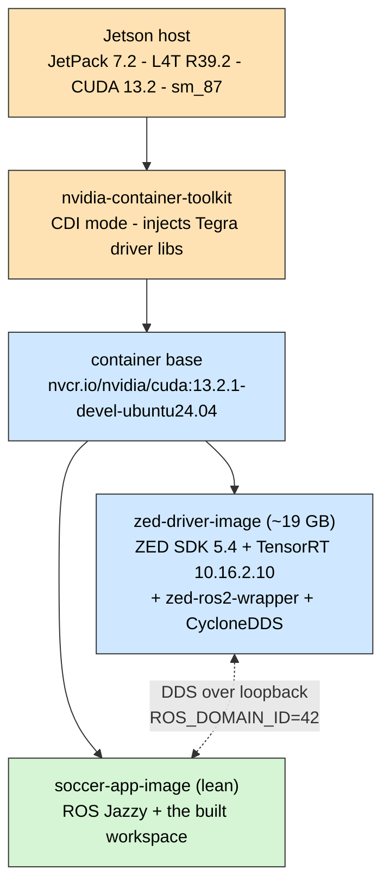

# 11 — Compute Platform

The Jetson, the ZED camera, and the version pins and kernel settings that make them
work together. Everything in this chapter was **verified on hardware in June 2026**;
the measured numbers are measurements, not estimates.

---

## 1. Hardware

| Component | Validated                                | Production target | Note                                                 |
| --------- | ---------------------------------------- | ----------------- | ---------------------------------------------------- |
| Compute   | **Jetson Orin Nano Super 8 GB**, `sm_87` | Orin NX 16 GB     | ~67 INT8 TOPS, ~25 W in Super mode (`nvpmodel -m 1`) |
| Camera    | **ZED Mini**, USB 3.0                    | same              | Stereo RGB + depth + IMU                             |
| Storage   | NVMe strongly recommended                | —                 | The ZED driver image alone is ~19 GB                 |

**Why the Orin Nano is validated but not the production target.** It proved the
software stack end to end within a KidSize power budget. Its **8 GB of shared
CPU/GPU memory** is the binding constraint: the ZED SDK's depth engine plus a
transformer detector plus the full ROS graph does not fit. The 16 GB NX is the same
architecture (`sm_87`, same JetPack), so moving to it changes nothing in this
documentation except the RAM headroom ([D-32](02-design-decisions.md#d-32)).

---

## 2. Software stack

| Layer    | Version               | Constraint it imposes                                                                |
| -------- | --------------------- | ------------------------------------------------------------------------------------ |
| JetPack  | **7.2**               | Ships an Ubuntu 24.04 userspace                                                      |
| L4T      | **R39.2**             | The ZED SDK build must match this                                                    |
| CUDA     | **13.2**              | Determines the usable container base image                                           |
| ROS      | **Jazzy Jalisco**     | Native on 24.04 — this is why Jazzy was chosen ([D-04](02-design-decisions.md#d-04)) |
| ZED SDK  | **5.4** for `l4t39.2` | Pulled from `download.stereolabs.com/zedsdk/5.4/l4t39.2/jetsons`                     |
| TensorRT | **10.16.2.10**        | Pinned from the L4T repo ([D-35](02-design-decisions.md#d-35))                       |



---

## 3. The container base and its two adaptations

`deploy/docker/Dockerfile.jetson`, stage `jetson-base`

```dockerfile
FROM nvcr.io/nvidia/cuda:13.2.1-devel-ubuntu24.04
RUN rm -rf /usr/local/cuda/compat            # 1
RUN echo "...R39.2..." > /etc/nv_tegra_release # 2
ENV ROS_DOMAIN_ID=42
ENTRYPOINT ["/entrypoint.sh"]
```

| #   | Adaptation                                    | Why it is required                                                                                                                                                                        |
| --- | --------------------------------------------- | ----------------------------------------------------------------------------------------------------------------------------------------------------------------------------------------- |
| 1   | **Delete `/usr/local/cuda/compat`**           | That directory holds _discrete-GPU_ forward-compatibility driver libraries. On a Tegra SoC they shadow the driver libraries the container toolkit injects, and CUDA calls fail at runtime |
| 2   | **Write a synthetic `/etc/nv_tegra_release`** | The ZED SDK installer reads this file to decide it is running on a Jetson. Inside a container the file does not exist, so the installer refuses to proceed                                |

There is **no `l4t-jetpack` image for r39** — it does not exist. JetPack 7.2 is
essentially stock Ubuntu 24.04 with a CUDA 13 userspace, so a generic CUDA base is
the correct base, not a workaround ([D-33](02-design-decisions.md#d-33)).

`entrypoint.sh` sources `/opt/ros/jazzy/setup.bash`, then `/ws/install` and
`/ros2_ws/install` if they exist, then `exec "$@"` — so every container, whether it
runs a launch file or an interactive shell, has an identical environment.

---

## 4. TensorRT and the ZED SDK

The most fragile part of the platform. Three coordinated measures, each fixing a
failure that was actually observed ([D-35](02-design-decisions.md#d-35)).

### 4.1 Version pin

```dockerfile
# L4T repo at apt priority 700, above the NGC sbsa repo
# https://repo.download.nvidia.com/jetson/common r39.2
libnvinfer10  libnvinfer-plugin10  libnvonnxparsers10  libcudnn9-cuda-13
libnvinfer-lean10
```

|                        |                                                                                                                    |
| ---------------------- | ------------------------------------------------------------------------------------------------------------------ |
| **Symptom without it** | `neural_depth_light_5` engine serialization fails with _API usage error 6_                                         |
| **Cause**              | NGC's sbsa repository ships TensorRT **10.16.1.11**; JetPack 7.2 is validated against the L4T build **10.16.2.10** |
| **Fix**                | apt pin priority 700 on the L4T repo                                                                               |

### 4.2 Unversioned symlinks

```dockerfile
libnvinfer.so         -> libnvinfer.so.10
libnvinfer_lean.so    -> libnvinfer_lean.so.10
libnvinfer_plugin.so  -> libnvinfer_plugin.so.10
libnvonnxparsers.so   -> libnvonnxparsers.so.10
```

|                        |                                                                                                                                                                                                       |
| ---------------------- | ----------------------------------------------------------------------------------------------------------------------------------------------------------------------------------------------------- |
| **Symptom without it** | `CORRUPTED SDK INSTALLATION` at exactly 90.1 % of TensorRT optimization                                                                                                                               |
| **Cause**              | The ZED SDK `dlopen`s **unversioned** SONAMEs; the runtime `.deb` packages ship only versioned files. `libnvinfer_lean` is a separate package (`libnvinfer-lean10`) and was missing entirely at first |
| **Fix**                | Install `libnvinfer-lean10` and create the four symlinks                                                                                                                                              |

### 4.3 Compatibility mode

```dockerfile
ENV ZED_SDK_TENSORRT_VERSION_COMPATIBILITY_MODE=1
```

Makes the SDK's version check degrade gracefully instead of hard-failing on a minor
version drift.

### 4.4 First-run engine optimization

On its **first** start the ZED SDK compiles its depth network into a TensorRT engine
for this exact GPU. That takes **6–7 minutes** and saturates the GPU.

This produced a memorable false alarm: `ros2_control_node` aborted with
_"Failed to acquire lock in 20 seconds"_ and a `SIGABRT`. It was not a bug in the
control stack — the GPU was fully occupied by the ZED's engine build. The engine is
cached in the `zed_resources` Docker volume, so it happens once per SDK/GPU
combination.

**Operational consequence:** do not diagnose a first boot. Wait for the engine build
to finish, then evaluate.

---

## 5. GPU access from containers

| Rule       | Detail                               |
| ---------- | ------------------------------------ |
| **Always** | `--gpus all` (CDI path)              |
| **Never**  | `--runtime nvidia` (legacy CSV path) |

`nvidia-container-toolkit` 1.19.1 emits a CDI spec containing a broken
`enable-cuda-compat` hook that panics on Jetson with
`slice bounds out of range [:73]`, aborting **every** GPU container start.

`deploy/ansible/provision.yml` applies both halves of the fix:

```ini
# /etc/nvidia-container-toolkit/nvidia-cdi-refresh.env
NVIDIA_CTK_CDI_GENERATE_DISABLED_HOOKS=enable-cuda-compat
```

```toml
# /etc/nvidia-container-runtime/config.toml
mode = "cdi"
```

then restarts `nvidia-cdi-refresh.service` and **asserts**:

```bash
grep -c enable-cuda-compat /var/run/cdi/nvidia.yaml   # must print 0
```

Both changes are required. Disabling the hook without forcing CDI mode leaves
`--runtime nvidia` able to fall back to the legacy path and re-introduce it
([D-36](02-design-decisions.md#d-36)).

---

## 6. DDS tuning

### 6.1 The bug this solves

**Symptom.** `camera_info` and `imu/data` flowed at full rate. `camera/image_raw`
and `camera/depth` collapsed to **~1.3 Hz**.

That fingerprint — small topics fine, large topics dead — points at a transport
size limit, not at QoS, not at node health, and not at CPU.

**Root cause.** FastDDS's default shared-memory segment is **512 KB**. An HD1080 RGB
frame is ~6 MB and a depth map ~8 MB. Neither fits, so FastDDS **silently** fell
back to fragmented UDP: 40–100 fragments per frame at 30 fps, overwhelming loopback
reassembly.

### 6.2 The three measures

| Measure            | Where                                   | Value                                                                                                               |
| ------------------ | --------------------------------------- | ------------------------------------------------------------------------------------------------------------------- |
| Smaller frames     | `zed_params_override.yaml`              | `grab_resolution: HD720` ([D-37](02-design-decisions.md#d-37))                                                      |
| Larger SHM segment | `deploy/compose/fastdds_profile.xml`    | 16 MB segment, 8 MB max message, `port_queue_capacity 512`, UDPv4 send/recv 16 MB, `useBuiltinTransports=false`     |
| Kernel buffers     | `/etc/sysctl.d/60-zed-dds-buffers.conf` | `rmem_max = wmem_max = 16777216`, `netdev_max_backlog = 10000`, `ipfrag_time = 3`, `ipfrag_high_thresh = 134217728` |

The CycloneDDS profile (`cyclonedds_profile.xml`) sets `MaxMessageSize 65500 B`,
`SocketReceiveBufferSize` minimum 10 MB, `WhcHigh 500 kB`.

> The profile files must be mounted in **both** containers. A publisher with a large
> segment and a subscriber with the default one still negotiates down.

### 6.3 Measured results

| Configuration                    | `image_raw` | `depth`     |
| -------------------------------- | ----------- | ----------- |
| HD1080, default 512 KB SHM       | 1.3 Hz      | 2.7 Hz      |
| HD1080, kernel tuning only       | 1.5 Hz      | 3.0 Hz      |
| HD720 + 16 MB SHM (FastDDS)      | 18.3 Hz     | 17.5 Hz     |
| **HD720 + CycloneDDS (default)** | **19.8 Hz** | **19.2 Hz** |

Kernel tuning **alone was not sufficient** (1.3 → 1.5 Hz). It is retained as
hardening for the UDP path and for team communication over Wi-Fi, but the segment
size was the actual fix ([D-38](02-design-decisions.md#d-38)).

### 6.4 Middleware selection

```bash
RMW_IMPLEMENTATION=rmw_cyclonedds_cpp   # default
RMW_IMPLEMENTATION=rmw_fastrtps_cpp     # fallback, no rebuild
```

Both profiles are mounted in both containers via `CYCLONEDDS_URI` and
`FASTRTPS_DEFAULT_PROFILES_FILE`, so switching is one environment variable
([D-39](02-design-decisions.md#d-39)).

CycloneDDS shared memory (Iceoryx) is **not** enabled: it requires an external
`iox-roudi` daemon, and loopback with a 10 MB receive buffer already reaches full
frame rate. The added complexity is not currently justified.

### 6.5 QoS

Every large-payload topic is best-effort at both ends
([D-40](02-design-decisions.md#d-40)). `zed_params_override.yaml` sets
`best_effort / keep_last / depth 5` overrides on `/robot_1/camera/image_raw`,
`/robot_1/camera/depth`, `/robot_1/camera_info` and `/robot_1/imu/data`.

On a fragmented stream, `RELIABLE` is worse than useless: one lost fragment
triggers NACK-driven retransmission and head-of-line blocking on a stream whose
_next_ frame is already better than the retransmitted one.

---

## 7. Host provisioning

`deploy/ansible/provision.yml`, in order:

| Step | Action                                                                  | Rationale                                                                            |
| ---- | ----------------------------------------------------------------------- | ------------------------------------------------------------------------------------ |
| 1    | Disable the `enable-cuda-compat` CDI hook, restart `nvidia-cdi-refresh` | [D-36](02-design-decisions.md#d-36)                                                  |
| 2    | Set `mode = "cdi"`                                                      | [D-36](02-design-decisions.md#d-36)                                                  |
| 3    | **Assert** the hook is absent from the generated spec                   | Catches a toolkit upgrade silently reverting the fix                                 |
| 4    | Create an **8 GB swapfile** (skipped when `pull_images=true`)           | `zed_components` compilation exhausts 8 GB RAM ([D-43](02-design-decisions.md#d-43)) |
| 5    | Install `60-zed-dds-buffers.conf`                                       | §6.2                                                                                 |
| 6    | Verify the Docker default runtime                                       | Consistency check                                                                    |

Step 3 exists because steps 1 and 2 are _inputs_; step 3 verifies the _output_.
Configuration that is set but not verified is configuration that silently regresses.

---

## 8. Measured baselines

Reference values for a healthy system. Deviations are the first diagnostic signal.

| Quantity                                          | Value                |
| ------------------------------------------------- | -------------------- |
| ZED RGB, raw grab                                 | ~30 Hz               |
| `camera/image_raw` delivered to the app container | **~19–20 Hz**        |
| `camera/depth` delivered                          | ~19 Hz               |
| `imu/data`                                        | ~99 Hz               |
| Depth encoding                                    | 32-bit float, metres |
| First TensorRT engine build                       | 6–7 min              |
| On-device build: `zed-driver-image`               | ~1 h (first time)    |
| On-device build: `soccer-app-image`               | ~10 min              |
| `/dev/shm` usage, ~20 DDS participants            | ~320 MB              |
| Orin Nano power, Super mode                       | ~25 W                |

---

## 9. Known fragilities

Honest list of what is most likely to break, and why.

| Fragility                         | Risk                                                                                 | Mitigation                                                      |
| --------------------------------- | ------------------------------------------------------------------------------------ | --------------------------------------------------------------- |
| Deleting `/usr/local/cuda/compat` | Undocumented by NVIDIA; a base-image change could relocate it                        | Pinned base image tag; re-validate on any bump                  |
| Synthetic `/etc/nv_tegra_release` | The ZED installer's check could change                                               | Pinned SDK version                                              |
| TensorRT triple fix (§4)          | Version-locked to JetPack 7.2                                                        | All three must be re-validated together on a JetPack bump       |
| CDI hook workaround               | Fixed in a future toolkit release; the workaround may then be unnecessary or harmful | `provision.yml` asserts the outcome, so a regression is visible |
| HD720 + 16 MB SHM                 | Tuned for the current frame size                                                     | If resolution changes, re-tune the segment                      |

**Rule for upgrades:** JetPack, ZED SDK and TensorRT are a **coupled set**. Bump them
together, on one robot, and re-run the §8 baselines before touching the fleet.

---

## 10. Design decisions referenced

| Decision                            | Summary                                    |
| ----------------------------------- | ------------------------------------------ |
| [D-32](02-design-decisions.md#d-32) | Jetson Orin, JetPack 7.2, Jazzy native     |
| [D-33](02-design-decisions.md#d-33) | Generic CUDA base image, not `l4t-jetpack` |
| [D-34](02-design-decisions.md#d-34) | Two containers: fat driver, lean app       |
| [D-35](02-design-decisions.md#d-35) | TensorRT pin, symlinks, compatibility mode |
| [D-36](02-design-decisions.md#d-36) | CDI mode; never `--runtime nvidia`         |
| [D-37](02-design-decisions.md#d-37) | HD720 grab resolution                      |
| [D-38](02-design-decisions.md#d-38) | 16 MB SHM segment + kernel buffers         |
| [D-39](02-design-decisions.md#d-39) | CycloneDDS default, FastDDS fallback       |
| [D-40](02-design-decisions.md#d-40) | Best-effort sensor QoS end to end          |
| [D-43](02-design-decisions.md#d-43) | 8 GB swap for on-device builds only        |
