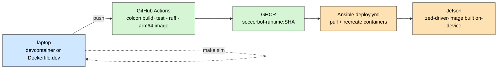

# 12 — Build, Test & Deploy

From a clean clone to a running robot.



---

## 1. Clone and first build

```bash
git clone --recursive https://github.com/<org>/soccer-bot.git
cd soccer-bot

make build            # colcon build --symlink-install in ros2_ws
make build-pkg pkg=soccer_control
make clean
make sim              # docker compose -f deploy/compose/sim.compose.yaml up
make robot            # docker compose -f deploy/compose/robot.compose.yaml up
make help
```

`--recursive` matters: `soccer-firmware` is a submodule
([D-07](02-design-decisions.md#d-07)). If you forgot,
`git submodule update --init --recursive`.

### `ros2_ws/colcon.meta`

| Setting                            | Value                                                  | Why                                                                                                                                                                                          |
| ---------------------------------- | ------------------------------------------------------ | -------------------------------------------------------------------------------------------------------------------------------------------------------------------------------------------- |
| `CMAKE_BUILD_TYPE`                 | `RelWithDebInfo`                                       | Optimised **and** debuggable. A `Release` build gives useless stack traces on a robot; a `Debug` build is too slow for a 100 Hz control loop. This is the only sensible default for robotics |
| `CMAKE_EXPORT_COMPILE_COMMANDS=ON` | `soccer_control`, `soccer_hardware`, `soccer_strategy` | Produces `compile_commands.json` so clangd/IntelliSense work on the C++ packages                                                                                                             |

`--symlink-install` is used everywhere: Python nodes, launch files and YAML are
symlinked into `install/`, so editing them takes effect without a rebuild.

---

## 2. Development environment

### 2.1 Dev container

`.devcontainer/devcontainer.json` → `deploy/docker/Dockerfile.dev`

|                     |                                |
| ------------------- | ------------------------------ |
| Base                | `ros:jazzy-ros-base`           |
| Adds                | `soccer-app-deps.apt` + `ruff` |
| Workspace           | `/ws`                          |
| Environment         | `ROS_DOMAIN_ID=42`             |
| `postCreateCommand` | `colcon build`                 |

**Why a dev container.** The whole stack depends on an exact ROS distro and a fixed
apt dependency set. "Works on my machine" is the failure this eliminates: the
container **is** the machine, and it is the same one CI uses.

### 2.2 Dependencies

`deploy/docker/soccer-app-deps.apt` — the single list consumed by the dev, CI and
Jetson images:

```text
ros-jazzy-ros-base                 python3-colcon-common-extensions
python3-rosdep                     python3-pip
python3-scipy                      python3-opencv
ros-jazzy-cv-bridge                ros-jazzy-ros2-control
ros-jazzy-ros2-controllers         ros-jazzy-behaviortree-cpp
ros-jazzy-robot-state-publisher    ros-jazzy-xacro
```

One list, three images. A dependency added for development is automatically present
in CI and on the robot — the drift that causes "it built in CI and failed on the
robot" cannot occur.

---

## 3. Docker images

| File                | Target             | Base                                           | Size   | Built where                     |
| ------------------- | ------------------ | ---------------------------------------------- | ------ | ------------------------------- |
| `Dockerfile.dev`    | —                  | `ros:jazzy-ros-base`                           | small  | laptop                          |
| `Dockerfile.ci`     | `build`, `runtime` | `ros:jazzy-ros-base`                           | small  | GitHub Actions (arm64 via QEMU) |
| `Dockerfile.jetson` | `zed-driver-image` | `nvcr.io/nvidia/cuda:13.2.1-devel-ubuntu24.04` | ~19 GB | **on the Jetson**               |
| `Dockerfile.jetson` | `soccer-app-image` | same base                                      | lean   | on the Jetson                   |

The two Jetson targets share `jetson-base`, so the CUDA version, the Tegra
adaptations and `ROS_DOMAIN_ID` are defined once
([D-34](02-design-decisions.md#d-34)). Platform details are in
[11](11-compute-platform.md).

### 3.1 Build constraints on-device

```dockerfile
MAKEFLAGS="-j4" colcon build --symlink-install \
    --packages-ignore zed_debug --parallel-workers 2
```

Unconstrained parallelism is what makes colcon OOM on an 8 GB board. Combined with
the 8 GB swapfile ([D-43](02-design-decisions.md#d-43)), this is what allows
`zed_components` to compile at all.

### 3.2 `entrypoint.sh`

```bash
source /opt/ros/jazzy/setup.bash
[ -f /ws/install/setup.bash ]      && source /ws/install/setup.bash
[ -f /ros2_ws/install/setup.bash ] && source /ros2_ws/install/setup.bash
exec "$@"
```

`exec` replaces the shell, so the container's PID 1 is the actual process and
`docker stop` delivers `SIGTERM` to it rather than to a wrapper — the difference
between a clean shutdown and a 10-second kill timeout.

---

## 4. Compose stacks

### 4.1 Robot — `deploy/compose/robot.compose.yaml`

| Service  | Image              | Container       | Key settings                                                                                                                            |
| -------- | ------------------ | --------------- | --------------------------------------------------------------------------------------------------------------------------------------- |
| `camera` | `soccer-zed:jazzy` | `soccer-camera` | `privileged`, `network_mode: host`, GPU reservation, mounts `/dev` + `zed_resources` volume + 3 config files, `restart: unless-stopped` |
| `robot`  | `soccer-app:jazzy` | `soccer-app`    | `depends_on: camera`                                                                                                                    |

Shared environment:

```yaml
ROS_DOMAIN_ID: 42
RMW_IMPLEMENTATION: ${RMW_IMPLEMENTATION:-rmw_cyclonedds_cpp}
CYCLONEDDS_URI: /config/cyclonedds_profile.xml
FASTRTPS_DEFAULT_PROFILES_FILE: /config/fastdds_profile.xml
```

| Setting                                   | Why                                                                                                                                                                     |
| ----------------------------------------- | ----------------------------------------------------------------------------------------------------------------------------------------------------------------------- |
| `network_mode: host`                      | DDS discovery uses multicast; Docker's bridge network breaks it, and NAT would defeat shared-memory transport                                                           |
| `privileged` + `/dev`                     | The ZED is a USB device that enumerates and re-enumerates                                                                                                               |
| `zed_resources` **named volume**          | Caches the TensorRT depth engine. Without it, every container recreation costs another 6–7 minutes ([11 §4.4](11-compute-platform.md#44-first-run-engine-optimization)) |
| Both profile files in **both** containers | A large segment on one side only still negotiates down ([D-38](02-design-decisions.md#d-38))                                                                            |
| `restart: unless-stopped` on the camera   | The camera should survive an app crash; the cached engine stays warm ([D-34](02-design-decisions.md#d-34))                                                              |

### 4.2 Simulation — `deploy/compose/sim.compose.yaml`

| Service          | Command                                                                                 |
| ---------------- | --------------------------------------------------------------------------------------- |
| `team`           | `colcon build` then `ros2 launch soccer_bringup team.launch.py num_robots:=2 sim:=true` |
| `gamecontroller` | `sleep 15 && python3 tools/mock_gamecontroller.py --state playing --rate 2`             |
| `dev`            | interactive `bash`                                                                      |

The `sleep 15` is not a hack for its own sake — the GameController must not start
broadcasting `PLAYING` before the robots have a graph to receive it, or the first
state transition is missed and the robots sit in `INITIAL`.

---

## 5. Continuous integration

`.github/workflows/ci.yml`

| Job               | Runs                           | Does                                                                                                                                                   |
| ----------------- | ------------------------------ | ------------------------------------------------------------------------------------------------------------------------------------------------------ |
| `ros2-build-test` | container `ros:jazzy-ros-base` | `rosdep install`, `colcon build --symlink-install`, `colcon test`                                                                                      |
| `python-lint`     | ubuntu runner                  | `ruff check ros2_ws/src sim tools`                                                                                                                     |
| `docker-image`    | main branch only               | QEMU + buildx, `Dockerfile.ci --target runtime --platform linux/arm64`, push to `ghcr.io/${{ github.repository }}/soccerbot-runtime:${{ github.sha }}` |

### 5.1 Design decisions

| Choice                                     | Why                                                                                                                                   |
| ------------------------------------------ | ------------------------------------------------------------------------------------------------------------------------------------- |
| **Build in the official ROS container**    | The runner does not have ROS. Using the same base as the dev container means CI failures are reproducible locally                     |
| **`colcon test` on every commit**          | The tests that exist (role auction, projection, MCL, GC protocol) are pure functions with no graph. A suite nobody runs rots silently |
| **Tag images by commit SHA, not `latest`** | A deployment is then a precise, reversible reference. `latest` makes "which code is on robot 3?" unanswerable                         |
| **arm64 only**                             | The robot is arm64; an amd64 image would never be deployed                                                                            |
| **No GPU image in CI**                     | Impractical under QEMU and licensing-constrained ([D-41](02-design-decisions.md#d-41))                                                |

### 5.2 What CI does **not** cover

Being explicit about this matters more than the coverage itself:

| Gap                                         | Consequence                                                                                      |
| ------------------------------------------- | ------------------------------------------------------------------------------------------------ |
| No GPU / TensorRT job                       | The ZED path can only break on hardware                                                          |
| No integration test that launches the graph | A launch-file or QoS regression is not caught                                                    |
| No firmware build                           | The submodule's toolchain is not exercised                                                       |
| No cross-language protocol test             | Exactly the class of bug in [09 §4.4](09-firmware-and-actuators.md#44-known-contract-divergence) |

Tracked in [14](14-status-and-roadmap.md).

---

## 6. Deployment

`deploy/ansible/`

### 6.1 `provision.yml` — once per robot

Host-level state: CDI fixes, swap, sysctl. See
[11 §7](11-compute-platform.md#7-host-provisioning).

### 6.2 `deploy.yml` — every release

| Variable      | Default           | Purpose                                             |
| ------------- | ----------------- | --------------------------------------------------- |
| `registry`    | `ghcr.io/robocup` | Image registry                                      |
| `image_tag`   | —                 | **Commit SHA**, not `latest`                        |
| `pull_images` | —                 | Pull from the registry, or use locally built images |

Sequence: log into GHCR → pull the tagged images → recreate `soccer-camera` and
`soccer-app` with `network_mode: host`, `privileged`, GPU `device_requests` and
`restart_policy: unless-stopped`.

```bash
ansible-playbook -i inventory.ini deploy/ansible/provision.yml     # once
ansible-playbook -i inventory.ini deploy/ansible/deploy.yml \
    -e image_tag=$(git rev-parse HEAD)                            # each release
```

**Why two playbooks.** Different frequency, different risk. Provisioning touches
`/etc`, creates swap and restarts system services. Deployment must be boring and
repeatable. Merging them would put host-level risk into every routine deploy
([D-42](02-design-decisions.md#d-42)).

Both are idempotent, which is what makes "is this robot configured correctly?"
answerable by re-running the playbook.

---

## 7. Running

### Simulation, on a laptop

```bash
make build
source ros2_ws/install/setup.bash
export ROS_DOMAIN_ID=42
ros2 launch soccer_bringup robot.launch.py sim:=true camera:=sim
# or a full team:
ros2 launch soccer_bringup team.launch.py num_robots:=2 sim:=true
```

### Hardware, on the Jetson

```bash
docker compose -f deploy/compose/robot.compose.yaml up -d
docker compose -f deploy/compose/robot.compose.yaml logs -f soccer-app
```

The app container's default command is:

```bash
ros2 launch soccer_bringup robot.launch.py sim:=false camera:=zed
```

Bring-up procedure and verification steps: [13](13-operations-runbook.md).

---

## 8. Design decisions referenced

| Decision                            | Summary                                    |
| ----------------------------------- | ------------------------------------------ |
| [D-07](02-design-decisions.md#d-07) | Monorepo with firmware as a submodule      |
| [D-34](02-design-decisions.md#d-34) | Two containers: fat driver, lean app       |
| [D-41](02-design-decisions.md#d-41) | GPU image on-device, CPU image in cloud CI |
| [D-42](02-design-decisions.md#d-42) | Provisioning separate from deployment      |
| [D-43](02-design-decisions.md#d-43) | Swap for builds only                       |
| [D-44](02-design-decisions.md#d-44) | `ROS_DOMAIN_ID=42`                         |
