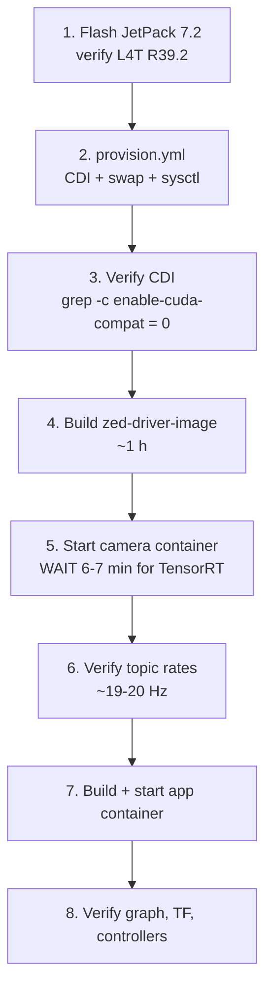

# 13 — Operations Runbook

Practical procedures: first bring-up, verification, and a symptom → cause → fix
table for every failure that has actually been observed.

---

## 1. First bring-up of a new Jetson

Do these in order. Each step's verification must pass before moving on — most of
the hard-to-diagnose failures later are a skipped check here.



### Step-by-step

| #   | Command                                                                                           | Expected                             |
| --- | ------------------------------------------------------------------------------------------------- | ------------------------------------ |
| 1   | `cat /etc/nv_tegra_release`                                                                       | `R39` , revision `2`                 |
| 1   | `nvidia-smi` or `tegrastats`                                                                      | GPU present                          |
| 1   | `sudo nvpmodel -m 1`                                                                              | Super mode, ~25 W                    |
| 2   | `ansible-playbook -i inventory.ini deploy/ansible/provision.yml`                                  | no failed tasks                      |
| 3   | `grep -c enable-cuda-compat /var/run/cdi/nvidia.yaml`                                             | **`0`**                              |
| 3   | `docker run --rm --gpus all nvcr.io/nvidia/cuda:13.2.1-devel-ubuntu24.04 nvidia-smi`              | no panic                             |
| 4   | `docker build -f deploy/docker/Dockerfile.jetson --target zed-driver-image -t soccer-zed:jazzy .` | ~1 h                                 |
| 5   | `docker compose -f deploy/compose/robot.compose.yaml up -d camera`                                | container up                         |
| 5   | `docker logs -f soccer-camera`                                                                    | wait for optimization to reach 100 % |
| 6   | `ros2 topic hz /robot_1/camera/image_raw`                                                         | **~19–20 Hz**                        |
| 7   | `docker build -f deploy/docker/Dockerfile.jetson --target soccer-app-image -t soccer-app:jazzy .` | ~10 min                              |
| 7   | `docker compose -f deploy/compose/robot.compose.yaml up -d`                                       | both up                              |
| 8   | §3 below                                                                                          | all baselines met                    |

> **Do not diagnose a first boot.** The ZED's initial TensorRT engine build takes
> 6–7 minutes and saturates the GPU. Everything looks broken during that window,
> including the control stack ([11 §4.4](11-compute-platform.md#44-first-run-engine-optimization)).

---

## 2. Daily bring-up

```bash
export ROS_DOMAIN_ID=42                                   # ALWAYS first

docker compose -f deploy/compose/robot.compose.yaml up -d
docker compose -f deploy/compose/robot.compose.yaml logs -f soccer-app

# Sanity, in another shell
ros2 node list
ros2 topic hz /robot_1/camera/image_raw
ros2 control list_controllers
```

Simulation, on a laptop:

```bash
export ROS_DOMAIN_ID=42
source ros2_ws/install/setup.bash
ros2 launch soccer_bringup robot.launch.py sim:=true camera:=sim
```

---

## 3. Verification baselines

A healthy system matches these. Deviation is the first diagnostic signal.

### 3.1 Topic rates

| Topic                   | Hardware       | Simulation                                                |
| ----------------------- | -------------- | --------------------------------------------------------- |
| `camera/image_raw`      | **19–20 Hz**   | 30 Hz                                                     |
| `camera/depth`          | ~19 Hz         | _(not published)_                                         |
| `camera_info`           | ~19 Hz         | _(not published)_                                         |
| `imu/data`              | ~99 Hz         | _(not published — [G-04](14-status-and-roadmap.md#g-04))_ |
| `detections`            | camera rate    | camera rate                                               |
| `field_features`        | camera rate    | camera rate                                               |
| `odom`                  | 200 Hz         | 200 Hz                                                    |
| `mcl_pose`              | 10 Hz          | 10 Hz                                                     |
| `control/goal`          | 10 Hz          | 10 Hz                                                     |
| `control/mpc_reference` | 50 Hz          | 50 Hz                                                     |
| `joint_states`          | 100 Hz         | 100 Hz                                                    |
| `/team_data`            | 4 Hz per robot | 4 Hz per robot                                            |

### 3.2 Graph checks

```bash
ros2 node list                                 # ~14 nodes under /robot_1
ros2 control list_hardware_interfaces          # 11 interfaces, claimed
ros2 control list_controllers                  # 3 controllers, all "active"
ros2 run tf2_tools view_frames                 # map -> odom -> base_link -> ...
ros2 topic info -v /robot_1/camera/image_raw   # QoS must match on both ends
```

### 3.3 Platform checks

```bash
grep -c enable-cuda-compat /var/run/cdi/nvidia.yaml   # 0
sysctl net.core.rmem_max                              # 16777216
df -h /dev/shm                                        # ~320 MB used is normal
tegrastats                                            # GPU + RAM headroom
docker exec soccer-app printenv RMW_IMPLEMENTATION    # rmw_cyclonedds_cpp
```

---

## 4. Functional smoke test (simulation)

Proves the full loop, not just that processes started.

```bash
ros2 launch soccer_bringup robot.launch.py sim:=true camera:=sim

# 1. The synthetic ball is detected
ros2 topic echo /robot_1/detections --once        # class_id: "ball"

# 2. It is projected into metres
ros2 topic echo /robot_1/ball/point --once        # plausible x, y; z = 0

# 3. Strategy is halted until the GameController says PLAYING
ros2 topic echo /robot_1/control/goal --once      # mode: 0 (IDLE)

# 4. Start the mock referee
python3 tools/mock_gamecontroller.py --state playing --rate 2

# 5. The robot now tracks
ros2 topic echo /robot_1/control/goal --once      # mode: 2 (TRACK)

# 6. The joint actually moves
ros2 topic echo /robot_1/joint_states --once      # neck_pan position non-zero
```

Step 3 is the important one: a robot that acts before the referee says `PLAYING` has
a rules-compliance defect ([D-20](02-design-decisions.md#d-20)).

---

## 5. Troubleshooting

### 5.1 Nothing works

| Symptom                     | Cause                                                     | Fix                                                                                               |
| --------------------------- | --------------------------------------------------------- | ------------------------------------------------------------------------------------------------- |
| `ros2 topic list` is empty  | `ROS_DOMAIN_ID` not exported in this shell                | `export ROS_DOMAIN_ID=42`. **Check this first, every time** ([D-44](02-design-decisions.md#d-44)) |
| Nodes visible, no data      | QoS mismatch — best-effort publisher, reliable subscriber | `ros2 topic info -v <topic>`; both ends must agree ([D-40](02-design-decisions.md#d-40))          |
| Only some robots discovered | Container not on host network                             | `network_mode: host` is required for multicast discovery                                          |

### 5.2 Camera and GPU

| Symptom                                              | Cause                                                                 | Fix                                                                                                                             |
| ---------------------------------------------------- | --------------------------------------------------------------------- | ------------------------------------------------------------------------------------------------------------------------------- |
| `slice bounds out of range [:73]` on container start | Broken `enable-cuda-compat` CDI hook (toolkit 1.19.1)                 | Run `provision.yml`; verify `grep -c ... = 0`; use `--gpus all`, never `--runtime nvidia` ([D-36](02-design-decisions.md#d-36)) |
| `CORRUPTED SDK INSTALLATION` at ~90 %                | Missing `libnvinfer_lean.so.10` / unversioned symlinks                | Rebuild the driver image; `libnvinfer-lean10` + four symlinks ([D-35](02-design-decisions.md#d-35))                             |
| `API usage error 6` during depth engine build        | TensorRT 10.16.1.11 (NGC) instead of 10.16.2.10 (L4T)                 | Verify the apt pin priority 700 ([D-35](02-design-decisions.md#d-35))                                                           |
| **`image_raw` at ~1.3 Hz**, small topics fine        | FastDDS 512 KB SHM segment cannot hold the frame; silent UDP fallback | HD720 + mount `fastdds_profile.xml` in **both** containers + sysctl ([D-38](02-design-decisions.md#d-38))                       |
| Camera container busy for ~6 min on first start      | TensorRT depth-engine optimization                                    | Expected. Wait. Cached in the `zed_resources` volume                                                                            |
| Engine rebuilt on every start                        | `zed_resources` volume not mounted or recreated                       | Check the volume in `robot.compose.yaml`                                                                                        |
| No `/dev/video*` / camera not found                  | USB enumeration                                                       | Container needs `privileged` + `/dev` mount; try a different USB 3.0 port                                                       |

### 5.3 Control stack

| Symptom                                                               | Cause                                                                      | Fix                                                                                                                      |
| --------------------------------------------------------------------- | -------------------------------------------------------------------------- | ------------------------------------------------------------------------------------------------------------------------ |
| `ros2_control_node` `SIGABRT`, "Failed to acquire lock in 20 seconds" | GPU saturated by the ZED's first-run engine build                          | Not a control bug. Wait for optimization, then restart the app container                                                 |
| `The 'type' param was not defined for '<controller>'`                 | `controllers.yaml` uses a bare `controller_manager:` key instead of `/**:` | The `/**` wildcard is required under a namespace ([07 §4.1](07-control.md#41-the--wildcard-is-load-bearing))             |
| Spawners hang                                                         | `controller_manager` not up, or a namespace mismatch                       | `ros2 node list` for `/robot_1/controller_manager`                                                                       |
| Joint does not move on hardware                                       | `kp = kd = 0` — no controller claims those interfaces                      | Known gap [G-11](14-status-and-roadmap.md#g-11)                                                                          |
| "No RL policy — running PURE MPC"                                     | `policy_path` empty, or `PolicyRunner` is a stub                           | Expected today ([G-02](14-status-and-roadmap.md#g-02))                                                                   |
| Serial hardware activates with no MCU                                 | Deliberate no-MCU degraded mode                                            | Check the log for the open failure ([D-27](02-design-decisions.md#d-27))                                                 |
| Actuator goes limp after ~200 ms                                      | Slave per-motor watchdog fired — no commands arriving                      | Check the USB link and the wire-protocol mismatch ([09 §4.4](09-firmware-and-actuators.md#44-known-contract-divergence)) |

### 5.4 Build

| Symptom                                | Cause                                                               | Fix                                                                                |
| -------------------------------------- | ------------------------------------------------------------------- | ---------------------------------------------------------------------------------- |
| OOM building `zed_components`          | 8 GB RAM without swap                                               | `provision.yml` swap step; `MAKEFLAGS="-j4" --parallel-workers 2`                  |
| xacro fails with an expat error        | An XML comment contains `--`                                        | Remove it. Validate: `python -c "import xml.dom.minidom as m; m.parse('f.xacro')"` |
| `soccer-firmware/` is empty            | Cloned without `--recursive`                                        | `git submodule update --init --recursive`                                          |
| Package not found after editing Python | Not a rebuild issue with `--symlink-install`; usually a stale shell | Re-`source ros2_ws/install/setup.bash`                                             |

### 5.5 Strategy and team

| Symptom                                    | Cause                                                   | Fix                                                                           |
| ------------------------------------------ | ------------------------------------------------------- | ----------------------------------------------------------------------------- |
| Robot never leaves `IDLE`                  | No `PLAYING` from the GameController, or `penalized`    | `ros2 topic echo /robot_1/gc/game_state`; run `tools/mock_gamecontroller.py`  |
| Every robot thinks it is striker           | No `/team_data` between robots                          | Check host networking, `ROS_DOMAIN_ID` and that `/team_data` is un-namespaced |
| Robot keeps scanning with the ball visible | `ball/point` stale for more than `ball_timeout` (1.0 s) | Check `ros2 topic hz /robot_1/ball/point` and the detector                    |
| Two robots claim striker                   | Transient — different bid sets under packet loss        | Self-corrects within one 10 Hz tick ([D-18](02-design-decisions.md#d-18))     |

---

## 6. Useful commands

```bash
# Introspection
ros2 topic hz /robot_1/<topic>
ros2 topic bw /robot_1/<topic>
ros2 topic info -v /robot_1/<topic>
ros2 param dump /robot_1/<node>
ros2 control list_hardware_interfaces
ros2 run rqt_graph rqt_graph

# Recording the camera contract for off-robot development (D-08)
ros2 bag record /robot_1/camera/image_raw /robot_1/camera/depth \
                /robot_1/camera_info /robot_1/imu/data

# Platform
tegrastats
sudo nvpmodel -q
docker stats
journalctl -u nvidia-cdi-refresh.service

# Firmware (from the submodule)
python3 tools/read_motor_angle.py
python3 tools/dashboard.py
python3 tools/robostride_usb_can/sniff.py
```

---

## 7. Safety checklist before powering a real robot

| #   | Check                                                                                     |
| --- | ----------------------------------------------------------------------------------------- |
| 1   | E-stop reachable and tested                                                               |
| 2   | Robot on a stand, feet off the ground                                                     |
| 3   | `soccer-firmware` commit matches the ROS commit being deployed                            |
| 4   | Wire-protocol mismatch resolved ([G-03](14-status-and-roadmap.md#g-03)) — **do not skip** |
| 5   | Slave watchdog verified: unplug USB, confirm motors disable within ~200 ms                |
| 6   | Host watchdog verified: kill the app container, confirm a clean halt                      |
| 7   | `residual_limit_rad` and `effort_limit` at their intended values                          |
| 8   | Joint limits in the URDF match the physical mechanism                                     |
| 9   | Battery voltage above the actuators' undervoltage threshold (48 V nominal)                |
| 10  | First motion commanded at reduced gains                                                   |

Items 5 and 6 are behavioural tests, not code reviews. A watchdog that has never
been observed firing is a watchdog that might not work
([D-26](02-design-decisions.md#d-26)).
