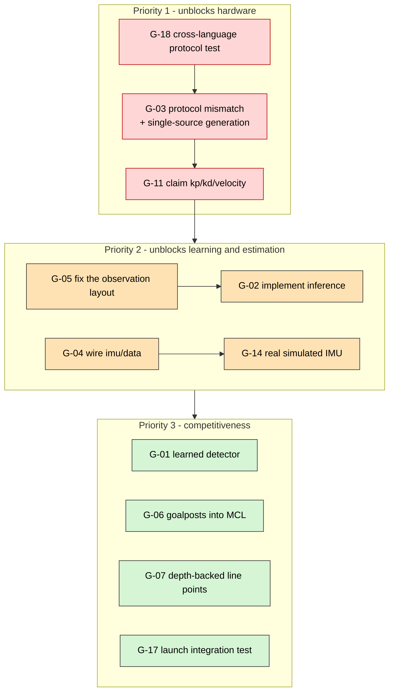

# 14 — Status & Roadmap

The honest ledger. Everything the code does not yet do, why it matters, and what
closing it requires.

> This chapter is the counterweight to the rest of the documentation. Chapters 01–13
> describe a coherent architecture; this one states precisely where the
> implementation has not caught up with it.

---

## 1. What works today

| Capability                                                                             | State             | Evidence                                                             |
| -------------------------------------------------------------------------------------- | ----------------- | -------------------------------------------------------------------- |
| Full ROS 2 graph, ~14 nodes, namespaced per robot                                      | ✅                | [03](03-ros-2-interfaces.md)                                         |
| Multi-robot team launch and decentralized role assignment                              | ✅                | 4 gtest cases                                                        |
| Ball detection → metric projection → strategy → MPC → joint motion, closed loop in sim | ✅                | [13 §4](13-operations-runbook.md#4-functional-smoke-test-simulation) |
| MCL over field lines with kidnapped-robot recovery                                     | ✅                | 3 pytest cases                                                       |
| GameController protocol, both directions                                               | ✅                | 3 pytest cases                                                       |
| `ros2_control` sim/real boundary with two plugins                                      | ✅                | [08](08-hardware-interface.md)                                       |
| ZED Mini on Jetson at ~19–20 Hz                                                        | ✅ verified on HW | [11 §6.3](11-compute-platform.md#63-measured-results)                |
| Training pipeline: task → randomization → ES → ONNX                                    | ✅                | [10](10-simulation-and-learning.md)                                  |
| CI: build, test, lint, arm64 image push                                                | ✅                | [12 §5](12-build-test-deploy.md#5-continuous-integration)            |
| Reproducible deployment via Ansible                                                    | ✅                | [12 §6](12-build-test-deploy.md#6-deployment)                        |

---

## 2. Gap register

Severity: **Blocker** = prevents a documented capability from working ·
**Major** = a designed capability is absent · **Minor** = quality or hygiene.

| Id            | Gap                                                                     | Severity          | Area         |
| ------------- | ----------------------------------------------------------------------- | ----------------- | ------------ |
| [G-01](#g-01) | Detector is HSV, not a learned model                                    | Major             | Perception   |
| [G-02](#g-02) | `PolicyRunner` performs no inference                                    | Major             | Control      |
| [G-03](#g-03) | Firmware ↔ host wire-protocol mismatch                                  | **Blocker**       | Firmware     |
| [G-04](#g-04) | `imu/data` has no publisher outside the ZED path                        | **Blocker** (sim) | Localization |
| [G-05](#g-05) | Observation element 4 disagrees between sim and controller              | Major             | Learning     |
| [G-06](#g-06) | `object_features` (goalposts) has no subscriber                         | Major             | Localization |
| [G-07](#g-07) | `fieldline_node` ignores stereo depth                                   | Major             | Perception   |
| [G-08](#g-08) | L/T/X junctions are defined but never produced                          | Minor             | Perception   |
| [G-09](#g-09) | ZED VIO is not fused into Tier 1                                        | Minor             | Localization |
| [G-10](#g-10) | `soccer_teamcomm` has no tests                                          | Minor             | Testing      |
| [G-11](#g-11) | No controller claims `kp` / `kd` / `velocity`                           | **Blocker** (HW)  | Control      |
| [G-12](#g-12) | Stale comment describing an MCU PD loop                                 | Minor             | Docs-in-code |
| [G-13](#g-13) | `soccer_control`, `soccer_hardware`, `soccer_description` have no tests | Major             | Testing      |
| [G-14](#g-14) | Simulated IMU is a constant stub                                        | Major             | Simulation   |
| [G-15](#g-15) | No Master-level watchdog                                                | Major             | Firmware     |
| [G-16](#g-16) | `BodyState` (IMU / foot contact) not populated by firmware              | Major             | Firmware     |
| [G-17](#g-17) | CI runs no integration test of the launched graph                       | Major             | CI           |
| [G-18](#g-18) | CI does not build the firmware submodule                                | Minor             | CI           |
| [G-19](#g-19) | No GPU/TensorRT job in CI                                               | Minor             | CI           |

---

## 3. Details

<a id="g-01"></a>

### G-01 — Detector is HSV, not a learned model

**What.** `detector_node` thresholds orange in HSV. `engine_path` is declared and
unused. `fieldline_node` likewise uses colour thresholds.
`teamcomm_node` hard-codes `ball_confidence = 1.0` because there is no real score.

**Why it matters.** HSV thresholds do not survive a change of venue lighting. This
is the difference between a system that demonstrates and a system that competes.

**Closing it.** Train RF-DETR (Apache-2.0, chosen over AGPL YOLO for licensing and
small-data domain transfer), export ONNX → TensorRT, load in `detector_node`,
publish the real score. **Benchmark on the actual Orin** — published RF-DETR
latencies are NVIDIA T4 numbers, and DETR-family models trail CNNs on very small
objects, which is exactly what a distant ball is. Keep YOLO26 as a fallback if the
latency target is missed.

**Blast radius.** One node. The message contract does not change
([D-11](02-design-decisions.md#d-11)).

---

<a id="g-02"></a>

### G-02 — `PolicyRunner` performs no inference

**What.** `policy_runner.hpp` is a header-only stub: `load()` records a path,
`residual()` returns `0.0`. No ONNX Runtime or TensorRT is linked. Two `TODO`s mark
the insertion points.

**Why it matters.** The entire training pipeline in [10](10-simulation-and-learning.md)
produces an artifact the robot cannot consume. The controller always runs pure MPC.

**Closing it.** Link TensorRT (already present in the driver image) or ONNX Runtime,
implement `load()` and `residual()`, bind the `"obs"` / `"residual"` tensors. Verify
against `onnxruntime` output off-robot first.

**Risk.** Low, by construction: the clamp and the zero-residual default mean a
broken policy degrades to today's behaviour
([D-22](02-design-decisions.md#d-22)).

---

<a id="g-03"></a>

### G-03 — Firmware ↔ host wire-protocol mismatch · **Blocker**

**What.** Full table in
[09 §4.4](09-firmware-and-actuators.md#44-known-contract-divergence). Summary:

- Motor state: firmware **22 B** vs host **18 B**, with different field types.
- Motor command: firmware **22 B** vs host **20 B**.
- `MSG_MOTOR_CMD` (`0x07`) is a **stub** in firmware — "not wired".
- `CTRL_SET_ZERO` is a stub.
- The SPI `SpiMitCmd` struct **drops `kp`, `kd`, `tau_ff`**, so the impedance terms
  are lost between Master and Slave even if USB were correct.
- C and Python `MsgType` enumerations have drifted.
- No protocol version handshake, so a mismatch fails silently.

**Why it matters.** The real-hardware actuation path does not work end to end. The
framing (header, COBS, CRC) matches; the _payloads_ do not.

**Closing it.**

1. Define the protocol **once** and generate C, C++ and Python — the same technique
   already used successfully for `motor_config.h`
   ([09 §8](09-firmware-and-actuators.md#8-configuration-generation)).
2. Exchange `PROTO_VERSION` in `MSG_PING` and refuse to arm on a mismatch.
3. Wire `MSG_MOTOR_CMD` through the Master and extend `SpiMitCmd` to carry the full
   tuple.
4. Add a cross-language round-trip test to CI ([G-18](#g-18)).

**Until then.** The simulation path is the supported path; the serial path is
bring-up only. This is item 4 on the
[safety checklist](13-operations-runbook.md#7-safety-checklist-before-powering-a-real-robot).

---

<a id="g-04"></a>

### G-04 — `imu/data` has no publisher outside the ZED path · **Blocker in sim**

**What.** `ekf_node` subscribes to `imu/data`. On hardware that topic is filled by
the ZED remap ([D-09](02-design-decisions.md#d-09)). In simulation nothing publishes
it: `sim_camera_node` publishes only images, and `imu_sensor_broadcaster` publishes
on its own **`~/imu`** — which resolves to `/robot_1/imu_sensor_broadcaster/imu`,
not `/robot_1/imu/data`. There is no remapping in `robot.launch.py`.

The comment in `controllers.yaml` claiming the broadcaster "publishes `/imu/data`"
is therefore incorrect.

**Why it matters.** Tier-1 state estimation is never exercised in simulation. The
EKF runs prediction-only and publishes a static pose, which also means MCL's motion
model receives no motion.

**Closing it.** Remap the broadcaster's output to the contract topic in
`robot.launch.py`:

```python
remappings=[("~/imu", "imu/data")]
```

and fix the `controllers.yaml` comment. Note this makes the broadcaster and the ZED
two publishers on one topic when `camera:=zed`, so decide explicitly which source
owns `imu/data` on hardware — the body IMU should, once
[G-16](#g-16) is closed.

---

<a id="g-05"></a>

### G-05 — Observation element 4 disagrees between sim and controller

**What.** `sim/tasks/soccerbot_reach_env.py` documents element 4 as `gyro_z`.
`residual_rl_controller.cpp` fills it from `state_interfaces_[2]` — **measured
effort**.

**Why it matters.** [D-31](02-design-decisions.md#d-31) exists because a silently
mismatched observation is the classic sim-to-real failure: the model loads, runs and
behaves wrongly, with nothing to catch it. This is that failure, present today.

**Closing it.** Decide which quantity belongs in the observation (measured torque is
the better choice for a residual policy — see
[D-23](02-design-decisions.md#d-23)), make both sides agree, and record the layout in
a single shared definition. Must be fixed **before** [G-02](#g-02), or the first
policy deployed will be trained on the wrong input.

---

<a id="g-06"></a>

### G-06 — `object_features` has no subscriber

**What.** `projection_node` publishes goalpost landmarks on `object_features`.
`mcl_node` subscribes only to `field_features` and `odom`.

**Why it matters.** Goalposts are the landmark that best resolves the field's
symmetry — which is the _reason_ Tier 2 is a particle filter
([D-14](02-design-decisions.md#d-14)). Lines alone are highly ambiguous on a
symmetric pitch.

**Closing it.** Subscribe to `object_features` in `mcl_node`, add a goalpost
likelihood term (a second distance transform over the four goalpost positions), and
weight it above line points — a goalpost observation is far more informative than a
line pixel.

---

<a id="g-07"></a>

### G-07 — `fieldline_node` ignores stereo depth

**What.** Line pixels are projected with the flat-ground homography even when the
ZED depth image is available.

**Why it matters.** [D-12](02-design-decisions.md#d-12) identifies flat-ground
projection as the largest error source in the predecessor pipeline. Every line point
fed to MCL currently carries that error, and it grows sharply toward the horizon.

**Closing it.** Subscribe to `camera/depth` in `fieldline_node` and reuse
`camera_model.project_with_depth`, keeping the flat-ground path as the automatic
fallback — the same structure `projection_node` already uses.

---

<a id="g-08"></a>

### G-08 — L/T/X junctions are defined but never produced

**What.** `FieldFeature` reserves `TYPE_L_JUNCTION`, `TYPE_T_JUNCTION`,
`TYPE_X_JUNCTION` and `TYPE_CENTER_CIRCLE`. Only `TYPE_LINE_POINT` and
`TYPE_GOALPOST` are ever emitted.

**Why it matters.** Junctions are sparse and highly informative — a T-junction is a
much stronger constraint on pose than a line point. They are what the leading teams
weight most heavily.

**Closing it.** Either a keypoint head on the detector ([G-01](#g-01)) or classical
junction detection on the line mask. The message type and the MCL interface already
support them.

---

<a id="g-09"></a>

### G-09 — ZED VIO is not fused into Tier 1

**What.** The ZED SDK provides visual-inertial odometry. `ekf_node` uses only the
IMU.

**Why it matters.** IMU-only dead reckoning drifts quickly. VIO would substantially
improve `odom → base_link` — as a **Tier-1 input only**; it must never become the
field authority ([D-14](02-design-decisions.md#d-14)).

**Closing it.** Enable positional tracking in the ZED params, subscribe to the pose
in `ekf_node`, add a measurement update. Expect degraded VIO when the head looks at
uniform grass — the filter must tolerate that, which is an argument for adopting
`robot_localization` at this point ([05 §1.4](05-localization.md#14-why-not-robot_localization)).

---

<a id="g-10"></a>

### G-10 — `soccer_teamcomm` has no tests

**What.** No test directory. The `ball_detected` reset-after-broadcast behaviour —
the mechanism that prevents advertising a stale ball forever
([06 §5](06-strategy-and-coordination.md#5-teamcomm_node)) — is untested.

**Closing it.** Unit-test the message construction and the reset behaviour. No ROS
graph is required.

---

<a id="g-11"></a>

### G-11 — No controller claims `kp` / `kd` / `velocity` · **Blocker on hardware**

**What.** The URDF declares five command interfaces and both hardware plugins
implement them, but `ResidualRLController::command_interface_configuration()` claims
only `position` and `effort`.

Consequences differ by plugin:

| Plugin                    | Behaviour                                                                                                                                                 |
| ------------------------- | --------------------------------------------------------------------------------------------------------------------------------------------------------- |
| `SoccerbotSimHardware`    | `on_activate` seeds `kp = 120`, `kd = 12` (explicitly sim-only), so simulation works                                                                      |
| `SoccerbotSerialHardware` | `cmd_kp_` and `cmd_kd_` default to **`0.0`** — "safe default: zero impedance until a controller commands gains". A real robot would be commanded **limp** |

**Why it matters.** [D-23](02-design-decisions.md#d-23) — variable impedance — is the
entire reason for choosing QDD actuators. It is currently designed and plumbed but
not commanded.

**Closing it.** Claim all five interfaces in the controller and write them. Gains
can initially be constants from a parameter; the longer-term design has the policy
or a gait scheduler modulate them per phase.

---

<a id="g-12"></a>

### G-12 — Stale comment describing an MCU PD loop

**What.** `residual_rl_controller.cpp`'s `update()` says _"the position command is
what the MCU's 1 kHz PD loop tracks"_. That design was superseded: the Robostride
actuator closes the impedance loop onboard
([D-24](02-design-decisions.md#d-24)).

**Why it matters.** Comments are read as documentation. This one describes an
architecture that no longer exists, and would mislead anyone reasoning about
latency or command rate.

---

<a id="g-13"></a>

### G-13 — Three packages have no tests

**What.** `soccer_control`, `soccer_hardware` and `soccer_description` have no test
directories.

**Why it matters.** These are exactly the packages where a silent regression is most
expensive: a trajectory-shaper bug is a hardware event, and a framing bug is
undiagnosable from the outside.

**Highest-value additions, in order:**

| Test                                                               | Rationale                                     |
| ------------------------------------------------------------------ | --------------------------------------------- |
| COBS + CRC16 round trip against `host/jetson/protocol.py`          | Directly targets [G-03](#g-03)                |
| Struct-size assertions across host and firmware headers            | Turns a runtime mismatch into a build failure |
| MPC shaper step response (velocity, acceleration, position clamps) | Pure arithmetic, no graph                     |
| xacro parse for `sim:=true` and `sim:=false`                       | Catches the `--`-in-comment class of failure  |
| Sim plant step response                                            | Pure arithmetic                               |

---

<a id="g-14"></a>

### G-14 — Simulated IMU is a constant stub

**What.** `SoccerbotSimHardware` reports identity orientation, zero angular velocity
and `(0, 0, 9.81)` acceleration, independent of any simulated motion.

**Why it matters.** Combined with [G-04](#g-04), Tier-1 estimation is completely
un-exercised in simulation. A regression in `ekf_node` would not be caught by
anything.

**Closing it.** Derive orientation and rates from the integrated joint state, or —
better — attach the sim boundary to Isaac Lab so the IMU comes from a real
simulated body.

---

<a id="g-15"></a>

### G-15 — No Master-level watchdog

**What.** The Master runs `MotorMaster_ProcessLoop()` with no timeout of its own.
Enforcement is at the host (100 ms) and the Slaves (200 ms per motor).

**Why it matters.** The two existing watchdogs cover a dead MCU and a dead host. A
Master that is _alive but wedged_ — stuck in a loop, or with a hung SPI transaction —
is covered only indirectly, by the Slaves ceasing to receive commands. That works,
but it is implicit rather than designed.

**Closing it.** Add an explicit host-link timeout on the Master that commands all
Slaves to a safe state, sitting between the host's 100 ms and the Slaves' 200 ms.

---

<a id="g-16"></a>

### G-16 — `BodyState` is not populated by firmware

**What.** The host wire protocol defines `BodyState` (quaternion, gyro, accel,
`contact_bits`). Firmware does not send it. There is no body IMU or foot-contact
data anywhere in the firmware path.

**Why it matters.** For the placeholder robot the ZED IMU suffices. For a walking
humanoid, body attitude and foot contact are **required** inputs to balance control,
and they must arrive on the fast path, not through a USB camera.

**Closing it.** Add an IMU to the Master or a Slave, populate `BodyState`, and make
it the authoritative `imu/data` source — which also settles the ownership question
raised in [G-04](#g-04).

---

<a id="g-17"></a>

### G-17 — CI runs no integration test of the launched graph

**What.** CI builds and runs unit tests. Nothing launches `robot.launch.py`.

**Why it matters.** Every failure in [13 §5](13-operations-runbook.md#5-troubleshooting)
that involves a launch file, a namespace or a QoS setting is invisible to CI. The
`/**` wildcard trap ([07 §4.1](07-control.md#41-the--wildcard-is-load-bearing)) is
precisely this class of bug.

**Closing it.** Add a `launch_testing` job that starts `sim:=true camera:=sim`,
waits for the expected node and topic set, asserts a non-zero `joint_states`
response to a synthetic ball, and shuts down.

---

<a id="g-18"></a>

### G-18 — CI does not build the firmware submodule

**What.** No job invokes `soccer-firmware/scripts/build.sh`, and no job compares the
C, C++ and Python protocol definitions.

**Why it matters.** [G-03](#g-03) is exactly the bug a cross-language contract test
would have caught immediately.

**Closing it.** Add (a) an `arm-none-eabi` compile job and (b) a test that
round-trips every message type through all three implementations.

---

<a id="g-19"></a>

### G-19 — No GPU / TensorRT job in CI

**What.** Cloud CI has no GPU, so the ZED path and TensorRT engine builds are only
exercised on the robot ([D-41](02-design-decisions.md#d-41)).

**Closing it.** A self-hosted Jetson runner, once fleet size justifies the
maintenance cost. Until then, the [13 §3](13-operations-runbook.md#3-verification-baselines)
baselines are the manual substitute.

---

## 4. Priority order

Dependencies matter more than severity here.



**G-05 strictly precedes G-02.** Implementing inference against a wrong observation
layout produces a policy that is confidently incorrect, which is worse than no
policy at all.

---

## 5. Beyond the placeholder

The path from this repository to a competing humanoid. None of it requires
re-architecting — that is the return on [D-01](02-design-decisions.md#d-01).

| Step                    | Changes                                                       | Unchanged                                                                                                         |
| ----------------------- | ------------------------------------------------------------- | ----------------------------------------------------------------------------------------------------------------- |
| **Full kinematic tree** | URDF gains ~20 joints; `controllers.yaml` gains controllers   | Both hardware plugins are already generic over _N_ joints; the wire protocol already carries all joints per frame |
| **Real MPC**            | `mpc_node` internals become a ZMP/centroidal solver           | `ControlGoal` in, `[q_ref, qd_ref]` out — the interface is unchanged                                              |
| **Whole-body RL**       | ES → PPO/SAC in Isaac Lab; observation and action widths grow | The residual formulation, the clamp, the ONNX boundary, the export path                                           |
| **Walking behaviours**  | New BT nodes and trees; `ControlGoal` gains modes             | The tree structure, the auction, the GameController gate                                                          |
| **Multi-camera**        | More contract topic sets                                      | The camera contract itself ([D-08](02-design-decisions.md#d-08))                                                  |
| **Orin NX 16 GB**       | RAM headroom for a transformer detector                       | Same `sm_87`, same JetPack, same images, same deployment                                                          |

The architecture was chosen so that each row above is an _addition_, not a rewrite.
Whether that holds is the real test of [D-01](02-design-decisions.md#d-01) — and it
is the reason the frequency contract, the `ros2_control` boundary and the message
contracts were fixed early and defended.
