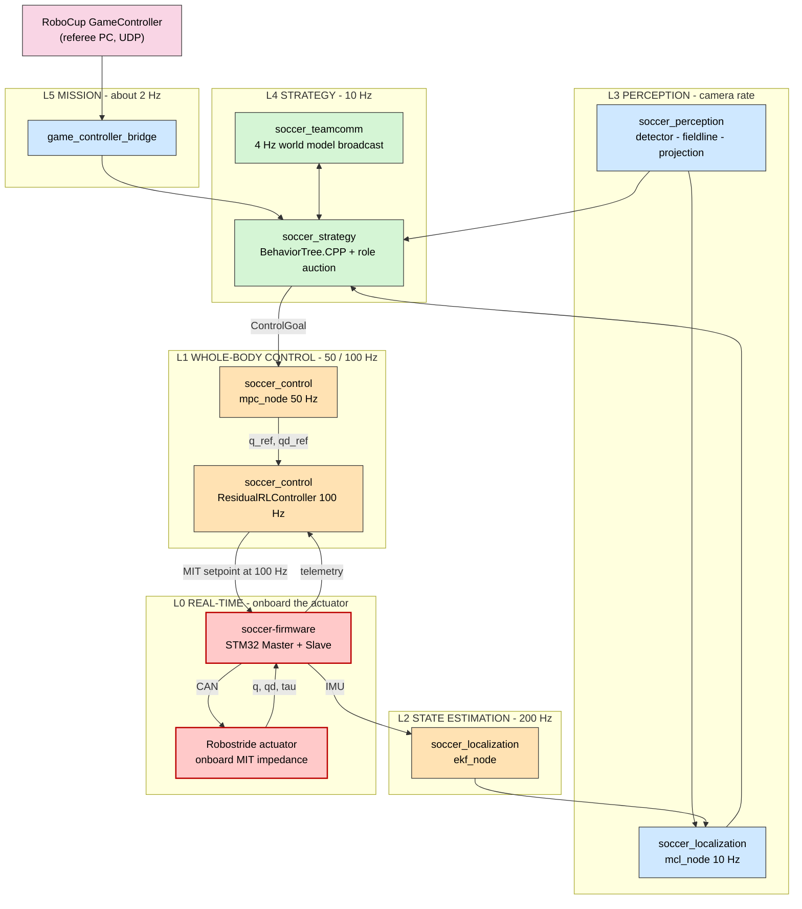

# soccer-bot — Technical Documentation

Authoritative documentation for the **soccer-bot** RoboCup Humanoid League software
stack. Everything here describes **what is in the repository today** at commit
`63c80be`, and — just as importantly — **why it is built that way**.

> **Reading contract.** Every chapter ends with a _Design decisions_ table stating
> the choice, the reason, and the alternatives that were rejected. Where the code
> does not yet match the intended design, it is marked
> **⚠ Gap** and listed in [14 — Status & Roadmap](14-status-and-roadmap.md).
> Nothing in these documents is aspirational unless explicitly labelled _Planned_.

---

## Start here

| If you are…                            | Read                                                |
| -------------------------------------- | --------------------------------------------------- |
| New to the project                     | [01 — System Overview](01-system-overview.md)       |
| Asking "why is it like this?"          | [02 — Design Decisions](02-design-decisions.md)     |
| Wiring a new node into the graph       | [03 — ROS 2 Interfaces](03-ros-2-interfaces.md)     |
| Bringing a robot up for the first time | [13 — Operations Runbook](13-operations-runbook.md) |
| Looking for what is unfinished         | [14 — Status & Roadmap](14-status-and-roadmap.md)   |

---

## Table of contents

### Foundations

| #                            | Chapter              | Covers                                                                           |
| ---------------------------- | -------------------- | -------------------------------------------------------------------------------- |
| [01](01-system-overview.md)  | **System Overview**  | The robot, the layered architecture, frequency domains, repository map           |
| [02](02-design-decisions.md) | **Design Decisions** | The complete decision register (D-01 … D-32) with rationale and rejected options |
| [03](03-ros-2-interfaces.md) | **ROS 2 Interfaces** | Every node, topic, message, QoS profile, TF frame and parameter                  |

### The stack, sensor to actuator

| #                                     | Chapter                     | Layer | Covers                                                               |
| ------------------------------------- | --------------------------- | ----- | -------------------------------------------------------------------- |
| [04](04-perception.md)                | **Perception**              | L3    | Camera contract, ball detector, field-line extraction, 3D projection |
| [05](05-localization.md)              | **Localization**            | L2/L3 | Tier-1 EKF odometry, Tier-2 MCL particle filter, field model         |
| [06](06-strategy-and-coordination.md) | **Strategy & Coordination** | L4/L5 | Behavior Trees, role auction, team comms, GameController bridge      |
| [07](07-control.md)                   | **Control**                 | L1    | MPC reference generator, bounded residual-RL controller              |
| [08](08-hardware-interface.md)        | **Hardware Interface**      | L1/L0 | URDF, the `ros2_control` boundary, sim and serial plugins            |
| [09](09-firmware-and-actuators.md)    | **Firmware & Actuators**    | L0    | STM32 Master/Slave, USB-CDC wire protocol, Robostride CAN            |

### Around the stack

| #                                   | Chapter                   | Covers                                                                     |
| ----------------------------------- | ------------------------- | -------------------------------------------------------------------------- |
| [10](10-simulation-and-learning.md) | **Simulation & Learning** | Isaac Lab task, domain randomization, training, ONNX → TensorRT export     |
| [11](11-compute-platform.md)        | **Compute Platform**      | Jetson + JetPack, ZED SDK, CUDA/TensorRT pins, DDS tuning for large frames |
| [12](12-build-test-deploy.md)       | **Build, Test & Deploy**  | colcon, Docker images, Compose, Ansible, CI                                |
| [13](13-operations-runbook.md)      | **Operations Runbook**    | First bring-up, verification commands, troubleshooting matrix              |
| [14](14-status-and-roadmap.md)      | **Status & Roadmap**      | What works, what is a stub, what is next — the honest ledger               |

---

## Architecture at a glance

Read the frequency bands as a **contract**: a fault in a slow layer must never
stall a fast one. See [01 — System Overview](01-system-overview.md#2-frequency-domains).

---

## Archived documents

[`docs/archive/`](archive/README.md) holds the original design blueprints, research
reports and hardware bring-up records. They are **historical** — retained because
they contain the primary research and the measured evidence behind many decisions
— but where they disagree with the chapters above, **the chapters above win**.
The archive index lists exactly which parts of each document are superseded.

---

## Conventions used throughout

| Marker         | Meaning                                                                  |
| -------------- | ------------------------------------------------------------------------ |
| **⚠ Gap**      | The code does not yet do this; tracked in chapter 14                     |
| _Planned_      | Designed and agreed, not implemented                                     |
| `code/path.py` | Path relative to the repository root                                     |
| **D-nn**       | A decision record in [02 — Design Decisions](02-design-decisions.md)     |
| L0 … L5        | Architectural layer (L0 = hardest real-time, L5 = slowest mission logic) |

Units are SI throughout: metres, radians, seconds, newton-metres, kilograms.
Angles are radians unless a symbol says otherwise.
