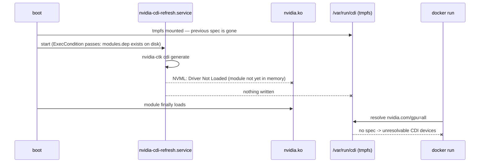

# Troubleshooting, Performance Profile & Detector Roadmap

> **What this is.** A living reference for the failure modes that are hard to
> diagnose from the symptom alone — the ones where the stack reports success,
> logs nothing alarming, and simply does not work. Each entry records the
> **symptom**, the **root cause**, the **fix**, and the **command that proves
> it**. It also records the measured performance envelope of the robot and the
> plan that follows from it.
>
> **Provenance.** Findings from a live diagnostic session on `robot1` (Jetson
> Orin Nano Super, JetPack 7.2 / L4T R39.2) on **2026-09-02**. Every number
> below was measured on that hardware, not estimated. Where this document
> disagrees with an earlier one, this one is newer — the earlier docs carry
> dated pointers back here.
>
> **Related.** [`zed_jetson_integration.md`](zed_jetson_integration.md) is the
> as-built integration record;
> [`architecture/middleware_evaluation.md`](architecture/middleware_evaluation.md)
> is the RMW decision record. §10 maps each failure below to the check that now
> catches it automatically.

---

## 0. TL;DR — what was broken

| #  | Symptom the operator sees                         | Real cause                                                   | Status  |
| -- | ------------------------------------------------- | ------------------------------------------------------------ | ------- |
| §1 | Every `docker run` fails after a reboot           | CDI spec written to tmpfs, generated before the driver loads  | Fixed, reboot-verified |
| §1.6 | Same symptom, different error text              | The iGPU failed ACR firmware bootstrap; the device nodes never appeared | Transient; power-cycle |
| §2 | ZED advertises all topics, publishes zero frames   | `camera.launch.py` was missing `robot_state_publisher`        | Fixed   |
| §3 | App container exits instantly, `ros2: not found`   | Dockerfile stage 4 inherited a base with no ROS runtime       | Fixed   |
| §4 | `colcon build` warns on every controller cycle     | `ros2_control` Jazzy deprecated the `get_value` / `set_value` API | Fixed |
| §5 | Camera drops 30 Hz → 20 Hz when the stack runs     | CPU saturation, **not** DDS loss or GPU load                  | Open    |
| §11 | Localizer reports a pose, confidently, that is meaningless | Filters published all-zero covariance for states nothing observes | Fixed |

The three "Fixed" platform bugs (§1–§3) shared one property: **nothing logged an
error**. The CDI failure surfaced as a Docker message that named the wrong
subsystem, the ZED node stalled on an `INFO` line, and the app container failed
before any ROS logging existed to record it. Assume silence is not success.

That property is why §10 exists: every one of these is now checked
mechanically, either before bring-up or in CI.

---

## 1. Containers fail to start after a reboot

> **Severity: critical.** Blocks *every* container on the robot, not just GPU
> ones, because `/etc/docker/daemon.json` sets `"default-runtime": "nvidia"`.
>
> There are **two** independent causes with near-identical symptoms. §1.1–§1.5
> cover the CDI spec vanishing; §1.6 covers the GPU itself failing to come up.
> Tell them apart by the exact Docker error text — see §1.6.

### 1.1 Symptom

```
docker: Error response from daemon: failed to inject CDI devices:
unresolvable CDI devices nvidia.com/gpu=all
```

This appears for **any** image, including ones with no GPU code, because
`/etc/docker/daemon.json` sets `"default-runtime": "nvidia"` and the images carry
`NVIDIA_VISIBLE_DEVICES=all`. Every container therefore requests
`nvidia.com/gpu=all` and every container fails.

### 1.2 Root cause

Two independent problems compound:

| Problem                                                         | Consequence                                                    |
| --------------------------------------------------------------- | -------------------------------------------------------------- |
| The vendor unit sets `NVIDIA_CTK_CDI_OUTPUT_FILE_PATH=/var/run/cdi/nvidia.yaml` | `/var/run` is **tmpfs** — the spec is destroyed on every boot |
| `nvidia-cdi-refresh.service` runs **before** the NVIDIA kernel module is loaded | Regeneration fails, so the destroyed spec is never rebuilt      |

The boot ordering failure is not obvious because the unit *looks* guarded:

```ini
ExecCondition=/bin/sh -c '/usr/bin/grep -qE "/(nvidia|nvidia-current)[.]ko" \
    /lib/modules/%v/modules.dep || [ -e /dev/dxg ]'
```

That condition greps `modules.dep` — a **file on disk**. It passes whether or not
the module is actually loaded into memory. `nvidia-ctk cdi generate` then runs,
fails to reach the driver, and exits:

```
failed to initialize NVML: Driver Not Loaded
```

> **The diagnostic tell.** The failed run is journalled with a timestamp of
> `Dec 31 19:00:30 1969` — the service runs before the RTC is synced, which is
> itself the proof that it ran too early in boot.



### 1.3 Fix

Redirect the output to persistent storage. The unit reads `EnvironmentFile`
**after** `Environment=`, so a single line in the config file overrides the
vendor default without editing the unit:

```bash
# /etc/nvidia-container-toolkit/nvidia-cdi-refresh.env
NVIDIA_CTK_CDI_GENERATE_DISABLED_HOOKS=enable-cuda-compat
NVIDIA_CTK_CDI_OUTPUT_FILE_PATH=/etc/cdi/nvidia.yaml
```

Then drop the stale tmpfs copy and regenerate:

```bash
sudo rm -f /var/run/cdi/nvidia.yaml   # two specs of the same kind conflict
sudo systemctl restart nvidia-cdi-refresh.service
```

**Why this is sufficient.** With the spec on disk, a failed boot-time
regeneration becomes harmless — `nvidia-ctk` writes only on success, so the last
good spec survives. The race still happens; it just no longer matters.

Codified as **Fix 0** in [`deploy/ansible/provision.yml`](../deploy/ansible/provision.yml),
which also removes the tmpfs copy. Note that `provision.yml` already declared
`cdi_spec: /etc/cdi/nvidia.yaml` and read that path to verify the result — the
playbook had always *assumed* this layout; the environment did not match it.

> **Update (2026-09-02) — verified across a reboot.** The fix holds.
>
> | Check | Result |
> | ----- | ------ |
> | Spec present after reboot | `/etc/cdi/nvidia.yaml`, 95673 B, mtime `04:24:18` — **older than the boot at `04:32:26`**, so it is the surviving copy, not a regenerated one |
> | tmpfs copy | `/var/run/cdi/` does not exist |
> | The race | Still fires. `nvidia-cdi-refresh.service` was `failed` / `exit-code` / status 1 this boot |
> | Why that was harmless | `nvidia-ctk` logged `Generated CDI spec with version 0.3.0`, then `failed to write spec: invalid CDI Spec: failed add device "all": invalid device, empty device edits`. Its own validation refused to write the empty spec |
>
> **Residual risk.** The fix converts a fatal failure into a last-known-good
> fallback. It does not make the spec *correct* — on a host where the race
> always loses, the spec is never regenerated and will go **stale after a
> driver or toolkit upgrade**. Addressed below.

### 1.4 Root-cause fix: stop racing the driver

Surviving the race is not the same as winning it. The unit's own
`ExecCondition` greps `/lib/modules/$(uname -r)/modules.dep` — a file on
**disk** — so it passes long before the module is live in memory. Gating on the
device nodes instead is the actual precondition:

```ini
# /etc/systemd/system/nvidia-cdi-refresh.service.d/10-wait-for-gpu.conf
[Service]
ExecStartPre=/bin/sh -c 'for i in $(seq 1 60); do [ -e /dev/nvgpu/igpu0/as ] && exit 0; sleep 1; done; echo "GPU device nodes absent after 60s" >&2; exit 1'
```

A non-zero `ExecStartPre` aborts the unit **before** `nvidia-ctk cdi generate`
runs, which is the behaviour we want: on a boot where the GPU never comes up at
all (§1.5), the last good spec is preserved rather than overwritten.

> **Why a wait loop and not `Restart=on-failure`.** `Restart=` is not valid on
> `Type=oneshot` units. systemd will not retry this service, so the wait has to
> happen inside it.

Codified as **Fix 0b** in [`deploy/ansible/provision.yml`](../deploy/ansible/provision.yml).

### 1.5 Verify

```bash
ls -la /etc/cdi/nvidia.yaml                       # ~95 kB, CDI spec version 0.7.0
systemctl show -p Result --value nvidia-cdi-refresh.service   # success
docker run --rm nvcr.io/nvidia/cuda:13.2.1-runtime-ubuntu24.04 nvidia-smi -L
# GPU 0: Orin (nvgpu) (UUID: ...)
```

Or simply `./tools/preflight.sh`, which runs all of the above and §1.6 (§10).

### 1.6 The other cause: the GPU itself failed to initialise

> **Severity: critical, and easily misattributed to §1.2.** Discovered
> 2026-09-02 on the very reboot that was meant to validate the CDI fix.

**Symptom.** Containers fail again, but with a **different** message:

```
failed to inject CDI devices: failed to inject devices:
failed to stat CDI host device "/dev/nvhost-as-gpu": no such file or directory
```

> **Read the message carefully — it is good news about §1.** The old failure was
> `unresolvable CDI devices nvidia.com/gpu=all`: the spec could not be found.
> This one means the spec was found, parsed, and resolved; only the *hardware*
> is missing. The change in wording is itself proof that the persistence fix
> works.

On the host:

```console
$ nvidia-smi -L
libnvrm_gpu.so: NvRmGpuLibOpen failed, error=4
No devices found.

$ ls /dev/nvgpu/igpu0/
power                       # should also contain as, ctrl, dbg, prof, tsg, ...
```

#### Root cause

The iGPU firmware failed to load, so the driver never finished power-on:
```
gk20a 17000000.gpu: Direct firmware load for ga10b/acr-gsp.data.encrypt.bin.prod failed with error -40
nvgpu: ga10b_load_riscv_acr_ucodes:454  [ERR]  acr-gsp.data.encrypt.bin.prod ucode get fail for ga10b
nvgpu: nvgpu_acr_bootstrap_hs_ucode_riscv:481  [ERR]  RISCV ucode loading failed
nvgpu: ga10b_bootstrap_hs_acr:53   [ERR]  ACR bootstrap failed
nvgpu: nvgpu_finalize_poweron:1287 [ERR]  Failed initialization for: g->ops.acr.acr_construct_execute
```

Without `nvgpu_finalize_poweron()`, none of the GPU-backed device nodes are
created — which is exactly the set the CDI spec enumerates.

**This was transient, not a regression.** Everything that could have caused it
was ruled out:

| Check | Result |
| ----- | ------ |
| ACR failures in the two previous boots | **0** and **0**; this boot: 28 |
| Package changes | None since 2026-06-21 (a Docker reinstall) |
| Kernel / firmware versions | Identical to the two good boots |
| Running kernel vs `/lib/modules` | Both `6.8.12-1021-tegra` |
| Previous shutdown | Clean (`last -x`) |
| The firmware file | Present, 9472 B, mode 0644, readable, owned by `nvidia-l4t-firmware` |
| Symlink loop? | No — `namei -l` is clean; `/lib/firmware/updates` does not exist |
| Other firmware affected? | No — exactly **one** file, across 8 search paths |

> **The errno is a red herring.** `-40` is `ELOOP`, "too many levels of symbolic
> links". There is no symlink loop. The kernel firmware loader returns `ELOOP`
> from its `kernel_read_file_from_path_initns()` path for unrelated reasons.
> Chasing the literal meaning wastes time.

#### A second, correlated failure on the same boot
The ZED Mini also came up degraded:

| Expected | Observed |
| -------- | -------- |
| `2b03:f681` (HID) **and** `2b03:f682` (UVC video) | Only `f681` |
| SuperSpeed link (5000M) | 12M, on the USB 2.0 root hub |
| `/dev/video0`, `/dev/video1` | No `/dev/video*` at all |

No USB errors were logged. A GPU rail failing ACR bootstrap **and** a USB 3
SuperSpeed link failing to train, together, on one boot, with no software change
and no errors in between, is the signature of a **marginal or brown-out power
condition during boot** — not two independent faults.

#### Fix

1. **Full power cycle**, not `reboot`. Remove power, wait, restore. A warm
   reboot does not reset the USB PHY or the GPU rail.
2. Check the supply. The Orin Nano Super in MAXN draws up to ~25 W; a marginal
   PSU or barrel jack shows up first as exactly these two symptoms.
3. Reseat the ZED cable and confirm it is on a USB 3.0 port.
4. Re-run `./tools/preflight.sh` — checks 1 and 6 cover both failures.

> **Do not attempt a module reload.** `nvgpu` has refcount 1 with
> `nvidia`/`nvidia_modeset`/`nvidia_drm` stacked on top and `nvmap` used by four
> modules. Unloading that stack on a live system is far riskier than a reboot.

#### Lesson

"The CDI spec exists" is an **insufficient** health check. A spec can be present,
valid, and correctly persisted while every device it names is absent. The
pre-flight check therefore validates the spec **against the host**: every
`/dev/...` path the spec references must actually exist (§10).

---

## 2. ZED node advertises every topic and publishes nothing

> **Severity: critical.** The camera appears healthy in `ros2 topic list` and in
> the node's own startup banner.

### 2.1 Symptom

Every contract topic exists and reports `Publisher count: 1`, but no data flows:

- `ros2 topic hz /robot_1/camera/image_raw` — prints nothing, ever
- `ros2 topic bw` — subscribes successfully, receives zero messages
- The node log ends on an **`INFO`** line and never advances:

```
[zed_node]: === Starting Positional Tracking ===
[zed_node]:  * Waiting for valid static transformations...
```

There is no error, no warning, and no timeout. The grab loop simply never starts.

### 2.2 Root cause

`camera.launch.py` loaded the `stereolabs::ZedCamera` component and nothing else.
The ZED SDK blocks startup until the camera's own TF chain
(`<camera_name>_left_camera_frame` → `<camera_name>_camera_link`) is resolvable.
That chain is published by a `robot_state_publisher` running the ZED's URDF —
which the stock `zed_camera.launch.py` starts, and ours did not:

```bash
ros2 topic info /tf_static
# Publisher count: 0        <-- the entire diagnosis
```

The trap is structural: adopting the component **without** adopting the rest of
the vendor launch file silently removes a hard dependency. The component does not
declare it, and does not complain when it is absent.

### 2.3 Fix

[`camera.launch.py`](../ros2_ws/src/soccer_bringup/launch/camera.launch.py) now
returns `[rsp_node, container]`. `robot_description` is remapped to
`<camera_name>_description` so it cannot collide with the robot's own description
published by `robot.launch.py`:

```python
rsp_node = Node(
    package="robot_state_publisher",
    executable="robot_state_publisher",
    name="zed_state_publisher",
    namespace=robot_name,
    parameters=[{
        "robot_description": Command(
            ["xacro ", zed_descr,
             " camera_name:=", camera_name,
             " camera_model:=", camera_model]
        ),
    }],
    remappings=[("robot_description", f"{camera_name}_description")],
)
```

All three dependencies were already present in `zed-driver-image`
(`/opt/ros/jazzy/bin/xacro`, `robot_state_publisher`, and
`zed_description/urdf/zed_descr.urdf.xacro`) — only the node was missing.

### 2.4 Verify

A healthy start logs the publisher, then resolves the transforms and proceeds:

```
[robot_1.zed_state_publisher]: Robot initialized
[robot_1.zed_node]:  Static transform ref. CMOS Sensor to Base
                     [zed_left_camera_frame -> zed_camera_link]
```

Measured immediately afterwards on a fresh container, HD720, MAXN_SUPER:

| Topic                        | Rate       | Notes                                    |
| ---------------------------- | ---------- | ---------------------------------------- |
| `/robot_1/camera/image_raw`  | 30.45 Hz   | 1280×720 BGRA, 3.69 MB/frame, 107 MB/s   |
| `/robot_1/camera/depth`      | 29.3 Hz    | `NEURAL_LIGHT`                           |
| `/robot_1/imu/data`          | 99–102 Hz  |                                          |
| `/robot_1/zed_node/odom`     | 29.8 Hz    | VIO                                      |

---

## 3. App image contains no ROS runtime

> **Severity: critical.** `soccer-app:jazzy` could not execute its own `CMD`.

### 3.1 Symptom

```
$ docker run --rm --entrypoint bash soccer-app:jazzy -c 'ros2 --help'
bash: ros2: command not found
```

Missing: `ros-jazzy-ros-base`, `ros-jazzy-rclpy`, `ros-jazzy-ros2-control`,
`ros-jazzy-ros2-controllers`, `ros-jazzy-cv-bridge`,
`ros-jazzy-robot-state-publisher`. The image still weighed 11.4 GB, which is why
this went unnoticed — the bulk is the CUDA base.

### 3.2 Root cause

`Dockerfile.jetson` stage 4 was:

```dockerfile
FROM jetson-base AS soccer-app-image
WORKDIR /ws
COPY --from=soccer-app-build /ws/install ./install
RUN apt-get install -y ros-jazzy-rmw-cyclonedds-cpp
```

`jetson-base` adds the **ROS apt repository**, not ROS. Every runtime dependency
was installed only in stage 3 (`soccer-app-build`), which is discarded. Stage 4
copied the compiled workspace but none of the libraries it links against, leaving
`install/lib/libresidual_rl_controller.so` with no `libcontroller_interface.so`
to load against and no `ros2_control_node` to load it.

The only reason `/opt/ros/jazzy` existed at all was that
`ros-jazzy-rmw-cyclonedds-cpp` drags in a slice of ROS core as dependencies —
enough to look plausible, not enough to run.

> **What hid the bug.** The header of
> [`soccer-app-deps.apt`](../deploy/docker/soccer-app-deps.apt) claimed it was
> used by "the `soccer-app-image` stage". It was only ever applied to the build
> stage. The comment described the intended design, so reading it confirmed a
> behaviour that did not exist.

### 3.3 Fix

Apply the same dependency file in stage 4, **before** the `install/` copy so the
multi-GB apt layer stays cache-stable when only sources change:

```dockerfile
COPY deploy/docker/soccer-app-deps.apt /tmp/deps.apt
RUN apt-get update \
    && grep -v '^\s*#' /tmp/deps.apt | tr -d '\r' | xargs apt-get install -y --no-install-recommends \
    && rm -rf /var/lib/apt/lists/* /tmp/deps.apt

COPY --from=soccer-app-build /ws/install ./install
```

Using the one shared file keeps the runtime image byte-identical in package set
to what the workspace was compiled against. The deps file header was corrected to
match reality.

### 3.4 Verify

```bash
docker run --rm --entrypoint bash soccer-app:jazzy -c '
  source /opt/ros/jazzy/setup.bash && source /ws/install/setup.bash
  ldd /ws/install/lib/libresidual_rl_controller.so | grep -c "not found"
  ros2 launch soccer_bringup robot.launch.py --show-args | head'
```

Expect `0` unresolved libraries. A full bring-up now reaches:

```
[controller_manager]: Activating controllers: [ residual_rl_controller ]
[controller_manager]: Successfully switched controllers!
```

> **Generalise this.** A multi-stage image should be tested by running its own
> `CMD`, not by inspecting that the artefacts were copied.

---

## 4. `ros2_control` Jazzy API migration

### 4.1 What changed

Jazzy deprecated the direct-value accessors on loaned interfaces. Both are
scheduled for removal in **Kilted Kaiju**:

| Old (deprecated)                        | New                                                        |
| --------------------------------------- | ---------------------------------------------------------- |
| `double LoanedStateInterface::get_value()` | `std::optional<T> get_optional(unsigned int max_tries = 10)` |
| `LoanedCommandInterface::set_value(v)` (return ignored) | `[[nodiscard]] bool set_value(const T&, unsigned int max_tries = 10)` |

Both new forms are `[[nodiscard]]`. The change exists because the interfaces are
now mutex-guarded: a read can fail if the handle stays contended for all retries,
and a write can fail for the same reason. The old API had no way to say so.

### 4.2 Fix applied

[`residual_rl_controller.cpp`](../ros2_ws/src/soccer_control/src/residual_rl_controller.cpp)
now treats both outcomes as real control-loop events rather than discarding them:

- **Unreadable state** → hold the previous command and return `OK`. Commanding on
  a garbage reading is worse than repeating a known-good one for one cycle.
- **Failed write** → throttled warning. The cycle is already lost; do not also
  flood the log at 100 Hz.

`RCLCPP_WARN_THROTTLE` at 1000 ms is used for both, because this code runs at
100 Hz and an unthrottled warning would be its own failure mode.

A repo-wide search confirmed this was the only file using either deprecated call.

### 4.3 Verify

```bash
# The host has no ROS; build in the dev container (see §7.2)
colcon build --packages-select soccer_control
wc -c ros2_ws/log/latest_build/soccer_control/stderr.log   # 0
```

An empty `stderr.log` is the pass condition.

---

## 5. Performance profile — the bottleneck is CPU

> **This is the single most important operational fact about the robot.**

### 5.1 The measurement

Camera frame rate, measured on the publisher side, fresh containers in both
cases, 55 °C, `MAXN_SUPER`:

| Configuration                    | `image_raw` rate | Delta       |
| -------------------------------- | ---------------- | ----------- |
| Camera container alone           | **30.45 Hz**     | baseline    |
| Camera + full app stack          | **19.84 Hz**     | **−35 %**   |

The drop is on the **publisher** side. This rules out DDS loss, QoS mismatch and
subscriber slowness — `zed_node` itself is being starved of CPU.

### 5.2 Where the CPU goes

Six cores, so 600 % is full saturation. Measured with the full stack running:

| Process                | %CPU  | Notes                                       |
| ---------------------- | ----- | ------------------------------------------- |
| `zed_node`             | 82    | grab loop + `NEURAL_LIGHT` depth + VIO      |
| `detector_node`        | 54    | **Python HSV over 1280×720 frames**         |
| `mcl_node`             | 49    | particle filter                             |
| `fieldline_node`       | 48    | Python/OpenCV over full-res frames          |
| `ekf_node`             | 43    |                                             |
| `projection_node`      | 15    |                                             |
| `ros2_control_node`    | 13    |                                             |
| `teamcomm` / `gc_bridge` | 14  | combined                                    |

Container totals: `soccer-app` **234 %**, `soccer-camera` **76–108 %**. Load
average **7.1** on 6 cores.

Meanwhile **`GR3D_FREQ` (GPU) sits at 0–20 %.**

### 5.3 What this rules out

Each of these was tested and eliminated before concluding CPU:

| Hypothesis                        | Test                                                          | Result                                 |
| --------------------------------- | ------------------------------------------------------------- | -------------------------------------- |
| DDS dropping large samples        | Compared publisher-side vs subscriber-side rate                | Both ≈19 Hz — loss is upstream of DDS  |
| Socket buffers too small          | `sysctl net.core.rmem_max`                                     | 16 MB, correctly applied by `provision.yml` |
| Thermal throttling                | `tj-thermal` during the run                                   | 55 °C; throttle point is ~95 °C        |
| Degradation over uptime           | Restarted camera fresh, re-measured                            | 30.45 Hz again — not cumulative        |
| GPU contention                    | `tegrastats` during the run                                    | GPU 0–20 % idle                        |

### 5.4 How we got here — the June 2026 tuning history

Kept because it shows which levers were already pulled, and how much each was
worth. Measured with `ros2 topic hz` from inside `soccer-app` with the full stack
running, so these are **subscriber-side, full-stack** numbers and are not
directly comparable to the publisher-side 30.45 Hz in §5.1.

| Configuration                          | `camera_info` | `image_raw` | `depth` | What it showed |
| -------------------------------------- | ------------- | ----------- | ------- | -------------- |
| HD1080, default FastDDS (512 kB SHM)   | ~11 Hz        | **1.3 Hz**  | 2.7 Hz  | Baseline failure — 6 MB frames overflow the SHM segment and fall back to UDP |
| HD1080, kernel buffers raised only     | ~11 Hz        | **1.5 Hz**  | 3 Hz    | Barely moved — proves the **SHM segment**, not the kernel buffer, was binding |
| HD720, FastDDS 16 MB SHM               | 16.2 Hz       | **18.3 Hz** | 17.5 Hz | The primary fix. 14× improvement |
| **HD720, CycloneDDS (current default)**| 19.5 Hz       | **19.8 Hz** | 19.2 Hz | Slightly better than FastDDS SHM, and simpler |
| HD720, FastDDS fallback (toggle test)  | ~16 Hz        | 17.8 Hz     | 14.8 Hz | Confirms the RMW toggle works |

Two conclusions from that era were **wrong** and are corrected here:

| June conclusion | Correction |
| --------------- | ---------- |
| The HD1080 ceiling is GPU-bound neural depth | The ceiling is CPU. The GPU idles at 0–20 % (§5.2) |
| QoS is best-effort end-to-end | Only `imu/data` honours the override (§8.1) |

The residual 19.8 → 30.45 Hz gap was assumed to be transport and was not chased
in June. §5.1 shows it is publisher-side CPU starvation.

### 5.5 Consequence

The robot is **CPU-bound with an idle GPU**. Any work that can be moved from the
CPU to the GPU buys back frame rate directly. `detector_node` at 54 % of a core
doing Python HSV thresholding is the clearest example on the platform.

The other free win is **node composition**: the perception nodes run in a
separate container from the camera, so `use_intra_process_comms` never applies
and every 3.69 MB frame is serialised across the RMW. See
[middleware_evaluation.md §7](architecture/middleware_evaluation.md).

---

## 6. RF-DETR on this hardware — measured, and the plan

### 6.1 Benchmarks

Measured on-device with `trtexec`, TensorRT **10.16.2.10**, FP16, batch 1,
CUDA graphs, `MAXN_SUPER`. Engines built from ONNX exported by `rfdetr` 1.9.4.

| Model  | Input   | Median GPU compute | p99      | Throughput | Engine | Published T4 | Ratio |
| ------ | ------- | ------------------ | -------- | ---------- | ------ | ------------ | ----- |
| Nano   | 384²    | **5.84 ms**        | 5.85 ms  | 171 qps    | 59 MB  | 2.3 ms       | 2.5×  |
| Small  | 512²    | **10.85 ms**       | 10.88 ms | 92 qps     | 61 MB  | 3.5 ms       | 3.1×  |
| Medium | 576²    | **14.15 ms**       | 14.48 ms | 71 qps     | 64 MB  | 4.4 ms       | 3.2×  |

The p99 sits within 0.35 ms of the median in every case — the latency is
effectively jitter-free, which matters more for a control loop than the mean.

> **Always benchmark on the target.** Roboflow publishes T4 numbers. This board
> is consistently 2.5–3.2× slower. A plan built on the published figures would
> have been wrong by a factor of three.

### 6.2 Under contention

Nano running flat-out **while the ZED streamed at 30 Hz**:

| Metric                | Idle       | Under contention | Change     |
| --------------------- | ---------- | ---------------- | ---------- |
| Median GPU compute    | 5.84 ms    | **5.85 ms**      | none       |
| p99                   | 5.85 ms    | 11.42 ms         | +5.6 ms    |
| Throughput            | 171 qps    | 154 qps          | −10 %      |
| ZED `image_raw`       | —          | **29.2 Hz**      | held       |
| GPU utilisation       | —          | **99 %**         |            |
| Power (`VDD_IN`)      | 5.8 W      | **21.3 W**       | +15.5 W    |
| Junction temperature  | 54 °C      | 66 °C            | no throttle |

Both workloads coexist. At a realistic 30 Hz duty cycle rather than flat-out,
Nano would occupy roughly **18 % of the GPU**.

### 6.3 Recommendation

**Adopt RF-DETR Nano** and retire the HSV fallback in `detector_node`.

| Consideration          | Assessment                                                                 |
| ---------------------- | -------------------------------------------------------------------------- |
| Latency budget         | 5.84 ms against a 33 ms frame period — 18 % of one frame                    |
| CPU impact             | **Net negative.** Inference moves to the idle GPU; frees most of `detector_node`'s 54 % |
| Accuracy              | 48.4 COCO AP at 384², well above what HSV thresholding achieves on a ball    |
| Thermal / power        | +15.5 W flat-out, 66 °C — inside envelope even at MAXN                       |
| Memory                 | 59 MB engine; ~3.7 GB RAM free with the camera running                       |
| Licensing              | Apache-2.0                                                                   |

Prefer **Small** only if ball detection at range proves insufficient — it costs
5 ms more and still clears 30 Hz. **Medium** has no headroom advantage here.

The `robot` service's GPU reservation in
[`robot.compose.yaml`](../deploy/compose/robot.compose.yaml) is commented out
with the note *"Uncomment to give it the GPU once the RF-DETR TensorRT detector
lands"*. §5 inverts the assumption behind that ordering: the GPU is not a
scarce resource being protected, it is idle capacity the CPU-bound stack needs.

> **Engines are not portable.** A TensorRT engine is specific to the GPU
> architecture *and* the TensorRT build. Build on the target, or rebuild in CI on
> a matching image — never commit an `.engine` and expect it to load.

### 6.4 Reproducing the benchmark

[`Dockerfile.rfdetr-bench`](../deploy/docker/Dockerfile.rfdetr-bench) builds
`FROM soccer-zed:jazzy` deliberately, so engines are compiled against the exact
TensorRT the deployed detector will link against.

```bash
docker build -f deploy/docker/Dockerfile.rfdetr-bench -t soccer-rfdetr-bench:jazzy .
docker run --rm --runtime nvidia -v ~/rfdetr-bench-models:/models \
  soccer-rfdetr-bench:jazzy python3 /opt/soccer/rfdetr_bench.py --sizes nano small medium
```

Two pinning details matter:

- `trtexec` comes from `libnvinfer-bin` pinned to the **L4T** repo. The NGC sbsa
  repo offers 11.x, which produces engines the ZED SDK runtime cannot
  deserialise.
- ONNX export uses **CPU** `torch` (`--index-url .../whl/cpu`). Export does not
  need the GPU, and the CPU wheel avoids pulling a second CUDA userspace into an
  already 21 GB image.

---

## 7. Environment notes that cost time

### 7.1 Power mode

The board ships in mode 1 (25 W). All figures above are mode 2:

```bash
sudo nvpmodel -m 2      # 0=15W, 1=25W, 2=MAXN_SUPER
```

### 7.2 There is no ROS on the host

`make build` cannot work on `robot1` — the host has neither `/opt/ros` nor
`colcon`. Workspace builds happen inside the VS Code dev container (image
`vsc-soccer-bot-<hash>`, repo mounted at `/ws`, workspace at `/ws/ros2_ws`).
Neither `soccer-app:jazzy` nor `soccer-zed:jazzy` can substitute:
`soccer-zed:jazzy` has `colcon` but no `controller_interface`; `soccer-app:jazzy`
has the runtime but no `colcon`.

To build one package without VS Code:

```bash
docker run --rm -v "$PWD:/ws" -w /ws/ros2_ws --entrypoint bash \
  vsc-soccer-bot-<hash> \
  -c 'source /opt/ros/jazzy/setup.bash && colcon build --packages-select soccer_control'
```

### 7.3 Benign log noise — do not chase these

All four are ZED-X / GMSL code paths that do not apply to a USB ZED Mini:

| Message                                                           | Verdict                        |
| ----------------------------------------------------------------- | ------------------------------ |
| `(Argus) Error 0x00030003: Connecting to nvargus-daemon failed`    | Expected — no CSI camera       |
| `[ZED-X][Warning] Failed to connect to zed_x_daemon`               | Expected — not a ZED X         |
| `GMSL DRIVER Diagnostic : Failed`                                  | Expected — not a GMSL board    |
| `Gravity alignment issues detected. Recomputing alignment...`      | One-shot at startup, harmless  |

`ZED_Diagnostic` also reports `Error: unable to open display` — it is a GUI tool
being run headless. Use `-c` and read the OK/Failed lines only.

---

## 8. Known tech debt

| Item                                                | Impact                                                                 | Next step                                              |
| --------------------------------------------------- | ---------------------------------------------------------------------- | ------------------------------------------------------ |
| ~~**CDI fix not reboot-validated**~~                | ~~Fix is verified live but the reboot path is untested~~                | **Closed 2026-09-02** — survived a reboot; evidence in §1.3 |
| **iGPU failed ACR bootstrap on one boot**           | GPU absent; every GPU container fails. Correlated with the ZED's USB 3 link not training | Power-cycle and re-run `tools/preflight.sh`. If it recurs, the supply is the prime suspect (§1.6) |
| **CDI spec is never regenerated at boot**           | Consequence of the §1.3 fix: the spec can go stale after a driver upgrade | §1.4 drop-in lets a good boot regenerate it; `preflight.sh` check 2 catches a stale one |
| **QoS overrides are dead for image + depth**        | Config claims best-effort; publishers are RELIABLE                     | See §8.1 — decide whether it is worth pursuing         |
| **CPU saturation (§5)**                             | Camera runs at 20 Hz instead of 30 Hz whenever the stack is up          | Node composition, then RF-DETR migration (§6.3), then re-measure |
| **`fieldline_node` at 48 % CPU**                    | Second-largest avoidable CPU consumer after `detector_node`             | Profile; candidate for the same GPU treatment          |
| **`camera_info` double-advertised**                 | Topic reports ~59 Hz because two publishers exist                       | Cosmetic; confirm no consumer double-counts            |
| **Point cloud published but unused**                | `point_cloud/cloud_registered` at 10 Hz, ~2 MB/msg — **~20 MB/s of pure waste**. No node subscribes | Set `depth.point_cloud_freq: 0` in [`zed_params_override.yaml`](../deploy/compose/zed_params_override.yaml) unless MCL starts using it |
| **`net.core.rmem_max` is 16 MB, not the 2 GB Stereolabs suggests** | Sufficient for same-host loopback; may not be for multi-machine image streaming over Wi-Fi | First value to raise in `provision.yml` Fix 4 if cross-machine throughput is poor |
| **No jumbo frames (MTU 9000)**                      | Irrelevant today — both containers are on loopback (MTU 65536)          | Only matters if camera data is ever sent between robots; needs switch + NIC + Netplan support |
| **HD1080 remains unusable**                         | Neural depth at HD1080 ran ~11 Hz. The `libnvinfer_lean.so.10` blocker is fixed, but the rate ceiling is not | Not a defect — recorded so nobody re-tries HD1080 expecting it to work |

### 8.1 The QoS overrides do not apply to the image topics

[`zed_params_override.yaml`](../deploy/compose/zed_params_override.yaml) sets
`best_effort` on four topics. Measured result:

| Topic                            | Override parameter        | Effective QoS   |
| -------------------------------- | ------------------------- | --------------- |
| `/robot_1/imu/data`              | accepted                  | **BEST_EFFORT** |
| `/robot_1/camera/camera_info`    | accepted (wrapper default)| RELIABLE        |
| `/robot_1/camera/image_raw`      | **"Parameter not set"**   | **RELIABLE**    |
| `/robot_1/camera/depth`          | **"Parameter not set"**   | **RELIABLE**    |

Querying them makes the node log the reason:

```
[rclcpp]: Failed to get parameters:
qos_overrides./robot_1/camera/image_raw.publisher.reliability
```

The image and depth publishers are created without `QosOverridingOptions`, so the
parameters are never declared and the YAML entries are inert. The file's own
comment — *"The ZED wrapper enables rclcpp QoS overrides on every publisher"* —
is incorrect, and so is the "end-to-end" claim in
[`zed_jetson_integration.md`](zed_jetson_integration.md) §5.

Two further defects in the same file: the key `/robot_1/camera_info` does not
match any topic (the real one is `/robot_1/camera/camera_info`), and the entire
block is keyed to `robot_1`, so it silently stops applying if `robot_name`
changes.

> **Is it worth fixing?** Probably not urgently. A RELIABLE publisher and a
> BEST_EFFORT subscriber **are** QoS-compatible, so nothing is broken, and §5
> proved the frame loss is CPU-bound rather than DDS-bound. Fixing it requires a
> patch to the ZED wrapper's publisher creation. Record it, do not chase it.

### 8.2 Claims in earlier docs that this document supersedes

| Document                                        | Claim                                                          | Correction |
| ----------------------------------------------- | -------------------------------------------------------------- | ---------- |
| `zed_jetson_integration.md` §4                  | Stage lineage produces a working app image                      | §3         |
| `zed_jetson_integration.md` §5                  | "best-effort SensorData **end-to-end**"                         | §8.1       |
| `zed_jetson_integration.md` §6                  | CDI covered by the two hook/mode fixes                          | §1         |
| `zed_jetson_integration.md` §12                 | "App image apt dep names" listed as a *risk*                    | §3 — it was a live defect |
| June 2026 bring-up report (deleted 2026-09-02)  | HD1080 ceiling is GPU-bound; QoS best-effort end-to-end         | §5.4 — both wrong; its surviving data is folded into §5.4 and §8 |

---

## 9. Diagnostic playbook

**Start here:**

```bash
./tools/preflight.sh
```

It runs every check below and exits non-zero on failure. `make robot` runs it
automatically before bring-up. The manual steps are kept for when you need to
isolate a layer by hand.

Ordered cheapest-first. Each step isolates a layer.

```bash
# 0. Is the GPU even up?  (catches §1.6 — check this before blaming CDI)
ls /dev/nvgpu/igpu0/          # only "power" -> the driver never finished poweron
journalctl -b -k | grep -c "ACR bootstrap failed"

# 1. Can any container start at all?  (catches §1)
docker run --rm nvcr.io/nvidia/cuda:13.2.1-runtime-ubuntu24.04 nvidia-smi -L

# 2. Does the camera see the sensor?
docker run --rm --privileged --runtime nvidia -v /dev:/dev \
  -v compose_zed_resources:/usr/local/zed/resources \
  --entrypoint bash soccer-zed:jazzy -c '/usr/local/zed/tools/ZED_Diagnostic -c'

# 3. Is the TF chain up?  (catches §2 — this is the fast tell)
docker exec soccer-camera bash -c \
  'source /opt/ros/jazzy/setup.bash && ros2 topic info /tf_static'
#   Publisher count: 0  ->  robot_state_publisher is missing

# 4. Is the app image runnable?  (catches §3)
docker run --rm --entrypoint bash soccer-app:jazzy -c \
  'source /opt/ros/jazzy/setup.bash && ros2 pkg list | wc -l'

# 5. Publisher-side vs subscriber-side rate  (distinguishes §5 from DDS loss)
docker exec soccer-camera bash -c '... ros2 topic hz /robot_1/camera/image_raw'
docker exec soccer-app    bash -c '... ros2 topic hz /robot_1/camera/image_raw'
#   both low   -> CPU starvation at the publisher (§5)
#   pub high, sub low -> genuine transport problem

# 6. Where is the time going?
tegrastats --interval 1000     # GPU %, power, junction temp
docker stats --no-stream       # per-container CPU
top -bn2 -o %CPU               # per-process
```

> **Sourcing.** `docker exec` does not run the image `ENTRYPOINT`, so `ros2` will
> not be on `PATH`. Every `exec` needs
> `source /opt/ros/jazzy/setup.bash && source <ws>/install/setup.bash` first —
> `/ros2_ws` in the camera container, `/ws` in the app container.

---

## 10. Preventative measures

Every bug in §1–§4 was found by a human noticing something odd, hours after the
fact. Each is now checked mechanically. This section is the map from failure to
guard.

### 10.1 Coverage

| Failure | Guard | Where it runs | Catches it |
| ------- | ----- | ------------- | ---------- |
| §1 CDI spec in tmpfs | `check_repo_invariants.py` asserts `provision.yml` still pins `NVIDIA_CTK_CDI_OUTPUT_FILE_PATH` | CI, `make check` | At commit |
| §1 CDI spec missing / stale / duplicated | `preflight.sh` check 2 | Before bring-up | At boot |
| §1 boot race | `ExecStartPre` wait loop (§1.4) | systemd, every boot | At boot |
| §1.6 GPU not initialised | `preflight.sh` check 1 (device nodes, `nvidia-smi`, kernel log) | Before bring-up | At boot |
| §1.6 spec references absent devices | `preflight.sh` check 2 (spec ↔ host), plus an Ansible assert | Before bring-up, provisioning | At boot |
| §2 missing `robot_state_publisher` | `check_repo_invariants.py` parses `camera.launch.py` with `ast` and requires the Node | CI, `make check` | At commit |
| §3 runtime image with no ROS | `check_repo_invariants.py`: any stage copying a colcon `install/` must apply `soccer-app-deps.apt` | CI, `make check` | At commit |
| §3 runtime image with no ROS | `docker-runtime-smoke` builds the image natively and runs `ros2 pkg prefix` for every launch-file dependency | CI | Before merge |
| §3 unresolved shared libraries | `ldd` sweep over `install/**/*.so`, in CI and in `preflight.sh` check 4 | CI, before bring-up | Before merge |
| Renamed Docker stage | `check_repo_invariants.py` cross-checks every compose `target:` against the Dockerfile's stages | CI, `make check` | At commit |
| §1.6 ZED on a USB 2.0 link | `preflight.sh` check 6 requires the `2b03:f682` video interface and `/dev/video*` | Before bring-up | At boot |
| Host tuning lost | `preflight.sh` check 5 (socket buffers, power mode, swap) | Before bring-up | At boot |
| §11 projection geometry drifting apart between the field-line node and the particle filter | `check_repo_invariants.py` cross-checks `max_range_m` and `mount_height_m` across all three files that declare them | CI, `make check` | At commit |

### 10.2 The three entry points

```bash
make check        # static, seconds, no ROS/GPU/Docker needed. Also runs in CI.
make preflight    # on-device health check. Non-zero exit on any FAIL.
make robot        # runs preflight first, then brings up the stack.
```

CI gates everything behind `repo-invariants`, so a violation fails in seconds
rather than after a full arm64 QEMU build.

### 10.3 Design rules these encode

The bugs were different, but they rhymed. Three rules generalise from them:

| Rule | Because |
| ---- | ------- |
| **Test the artifact's behaviour, not its contents.** | The app image had the right *files* and could not run its own `CMD`. `ls` proved nothing; `ros2 pkg prefix` proved everything (§3) |
| **Validate config against reality, not against itself.** | The CDI spec was valid YAML, correctly persisted, and named 22 devices that did not exist (§1.6) |
| **A comment describing intent is not a test.** | `soccer-app-deps.apt` said "keep in sync with Dockerfile.jetson". It was not in sync. `Dockerfile.ci` carried the same defect for months (§3) |

### 10.4 Known gaps

Recorded rather than papered over.

| Gap | Why it is not covered |
| --- | --------------------- |
| Nothing checks that the *Jetson* image (`Dockerfile.jetson`) can run its `CMD` | It needs a licensed SDK and an arm64 GPU host; cloud CI cannot build it. `preflight.sh` check 4 covers it on-device instead |
| The launch-contract check is structural, not semantic | It asserts a `robot_state_publisher` Node exists in `camera.launch.py`. It cannot prove the URDF it publishes is the right one |
| No check that the running stack still meets its rate targets | Would need a running robot. `ros2 topic hz` in §9 step 5 remains manual |
| `preflight.sh` cannot detect a *marginal* power supply | It only sees the consequences (§1.6). A real diagnosis needs a meter on the supply rail |
| Nothing proves the field-line thresholds work on real grass | The robot is indoors. The HSV values have never seen a pitch (§11.4) |

---

## 11. Localization publishes a confident pose that means nothing

### 11.1 Symptom

There is no symptom. That is the entry.

`/robot_1/odom` publishes at its nominal rate, with a well-formed pose and a
valid quaternion. `/robot_1/mcl_pose` publishes at 10 Hz with a pose and a
covariance. Nothing logs a warning, no topic is silent, and `ros2 topic hz` is
happy. Every automated check passes.

### 11.2 Root cause

Two separate instances of the same failure, found while profiling the filters:

**The EKF does not observe translation.** Its state is
$[p_x, p_y, \theta, v, \omega]$, but the only measurement wired to it is the IMU,
which supplies $\theta$ and $\omega$. There is no wheel encoder, no leg odometry
and no VIO. So $v$ stays at its initial zero and $p_x, p_y$ never move:

```console
$ # 1200 consecutive /odom samples
px range [0.000000, 0.000000]
py range [0.000000, 0.000000]
v  range [0.000000, 0.000000]
```

It published this with an **all-zero covariance**, which in ROS means "I am
perfectly certain". A consumer fusing that would trust it absolutely.

**The MCL also published an all-zero covariance**, regardless of how spread out
its particle cloud actually was. Indoors, with no field lines, the cloud is
spread across the entire pitch; the message said the opposite.

This is the same class of defect as the hardcoded intrinsics in
[architecture/perception_gpu_migration.md §2](architecture/perception_gpu_migration.md):
a node emitting plausible, well-formed, confidently-typed output that is not
connected to reality. Silence is not the dangerous failure mode here — fluency
is.

### 11.3 Fix

Both filters now publish the covariance they actually have.

- `mcl_node` computes the weighted covariance of its particle cloud. Indoors it
  now reports $\sigma_x = 1.79$ m, $\sigma_y = 1.10$ m, which is correct: it has
  no idea where it is.
- `ekf_node` publishes `1e6` variance for `x`, `y` and `vx`, and warns on
  startup that no translation source is wired in.

### 11.4 Verify

```bash
# Position variance must be huge while nothing observes translation.
ros2 topic echo /robot_1/odom --once | grep -A2 'pose:' -A20 | grep -m1 1000000

# MCL covariance must be non-zero and must shrink once the robot sees lines.
ros2 topic echo /robot_1/mcl_pose --once | grep -A2 covariance
```

A third instance of the same class is **still open** and cannot be closed
indoors: `field_features` currently carries **zero** line points on every
message, because there is no grass for the HSV fallback to key on. That is
correct behaviour in a room, but it means the measurement path has never run on
real data, and any CPU measurement of `mcl_node` taken indoors excludes it.

```bash
# On a pitch this should be in the tens. Indoors it is 0.
ros2 topic echo /robot_1/field_features --once | grep -c 'type:'
```

Full analysis, including the noise models and what the filters cannot do, is in
[architecture/localization_tuning.md](architecture/localization_tuning.md).

