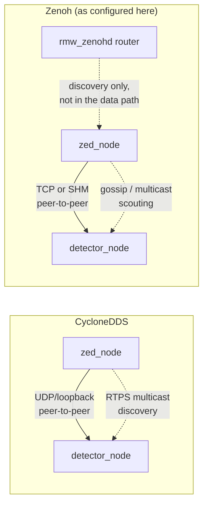

# Middleware Evaluation: Zenoh vs CycloneDDS

> **What this is.** A decision record for whether to replace CycloneDDS with
> `rmw_zenoh_cpp` as this robot's ROS 2 middleware, driven by the measured CPU
> bottleneck in [docs/TROUBLESHOOTING.md](../TROUBLESHOOTING.md) §5.
>
> **Provenance.** Upstream sources (REP-2000, `ros2/rosdistro`, the
> `ros2/rmw_zenoh` repository and its issue tracker, `zenoh.io` articles, and
> arXiv:2407.03091), read 2026-09-02. Every number below is attributed. Claims
> we could not source are quarantined in §9 rather than softened into prose.
>
> **Related.** [TROUBLESHOOTING.md §5](../TROUBLESHOOTING.md) (the measured
> bottleneck), [deploy/compose/zenoh_session_config.json5](../../deploy/compose/zenoh_session_config.json5)
> (the switchable config this document justifies keeping unused).

---

## 0. Verdict

**Do not switch. Keep CycloneDDS.**

The switchable configuration is wired up anyway
([§8](#8-how-to-run-the-ab-test-anyway)) so that this decision can be revisited
with an experiment rather than an argument.

| # | Reason | Evidence |
|---|---|---|
| 1 | Transport is not the bottleneck | The 30.45 → 19.84 Hz drop is publisher-side CPU starvation of `zed_node`, not link saturation (TROUBLESHOOTING §5) |
| 2 | The only like-for-like benchmark says Zenoh is **worse** here | rmw_zenoh#764: 51.4 % total CPU with SHM on vs **46.7 %** for CycloneDDS, and 2× the subscriber CPU |
| 3 | The favourable CPU result does not transfer | arXiv:2407.03091 measured 1–64 KB over a wireless mesh on Raspberry Pi 4B. Our payload is 3.69 MB — 58× larger than its maximum |
| 4 | The feature we would switch *for* has an open correctness bug in exactly our regime | rmw_zenoh#978: under high CPU load, service calls and TRANSIENT_LOCAL publications are **silently dropped**. We run at load average 7.1 on 6 cores |
| 5 | It is not a supported option on our distro | `rmw_zenoh_cpp` is absent from REP-2000's Jazzy table; the Jazzy package is `0.2.10-1`, status `developed`. Tier 1 begins at Kilted |

---

## 1. The question and why it was asked

The robot is CPU-bound, not GPU-bound. Running the perception stack alongside
the camera drops `camera/image_raw` from **30.451 Hz to 19.839 Hz** while the
GPU idles between 0 % and 21 %. The camera publishes 1280×720 BGRA — **3.69 MB
per frame, 107 MB/s** — across a process boundary to subscribers in a second
container.

That is a plausible middleware problem, so it is worth asking whether a
different transport would recover the lost frames. Zenoh is the obvious
candidate: it is the middleware ROS 2 is moving toward, and it advertises a
shared-memory transport that needs no external daemon.

The short answer is that the loss is **publisher-side**. `zed_node` alone
consumes 81.6 % of a core and the stack around it consumes another ~230 %; the
grab loop is being descheduled. Changing the transport does not give the
publisher more CPU — and per §5 it would take some away.

---

## 2. Maturity on ROS 2 Jazzy

| Fact | Value | Source |
|---|---|---|
| REP-2000 Jazzy RMW table | `rmw_zenoh_cpp` **absent**. Tier 1 is `rmw_fastrtps_cpp` (default), `rmw_cyclonedds_cpp`, `rmw_connextdds` | `rep-2000.rst` |
| REP-2000 Kilted | `rmw_zenoh_cpp` is **Tier 1**, all platforms and architectures. Default remains `rmw_fastrtps_cpp` | `rep-2000.rst` |
| Jazzy package version | `rmw_zenoh_cpp` **0.2.10-1**, status `developed` (not `released`) | `jazzy/distribution.yaml` |
| arm64 binaries | Built: `Jbin_unv8_uNv8__rmw_zenoh_cpp__ubuntu_noble_arm64__binary`, last success 2026-08-30 | build.ros2.org |
| Release cadence | 0.2.9 (2025-11-12) → 0.2.10 (2026-07-22) | Jazzy `CHANGELOG.rst` |
| Open issues / PRs | 51 open issues, 12 open PRs, 496 stars | `ros2/rmw_zenoh` |

Jazzy 0.2.10 is substantive — it moved to zenoh 1.8.0, added deadline and
liveliness *events* (#943), fixed a lock-order-inversion deadlock (#1014), and
added a shared transport SHM provider (#876). The project is clearly healthy.

The relevant point is narrower: on **Jazzy**, which is what this robot runs,
Zenoh is a community-supported package rather than a tier-1 RMW. Tier 1 arrives
in Kilted, and even there `rmw_fastrtps_cpp` remains the default.

---

## 3. Architecture



Points that are commonly misread:

- **The router is not a broker.** `rmw_zenohd` handles discovery and
  host-to-host bridging. Data between peers on one host flows directly.
- **The router is required by default**, because multicast scouting is disabled
  out of the box. On a single host it can be dropped — which is what
  [zenoh_session_config.json5](../../deploy/compose/zenoh_session_config.json5)
  does, by enabling multicast scouting and setting
  `ZENOH_ROUTER_CHECK_ATTEMPTS=-1`.
- **The default transport is TCP**, including on loopback (`tcp/[::]:7447`).
  Our UDP fragmentation tuning (`net.ipv4.ipfrag_*` in
  [provision.yml](../../deploy/ansible/provision.yml)) is therefore irrelevant
  under Zenoh, while `net.core.rmem_max` still matters for CycloneDDS.
- **Thread counts are comparable.** Zenoh runs ~6 tokio workers; CycloneDDS runs
  ~6 named threads. Neither is obviously lighter.

Zenoh's clearest architectural win is discovery traffic: 31 packets / 6,617 B
versus DDS's 686 packets / 251,576 B on a TurtleBot3 + RViz2 setup (zenoh.io,
2021). That matters for large fleets on constrained links. We run two containers
on one host, so it is worth approximately nothing to us.

---

## 4. The shared-memory transport

This is the only feature that could plausibly help a 107 MB/s loopback stream.

> **Why we do not already use CycloneDDS's own SHM.** CycloneDDS supports
> zero-copy shared memory via Iceoryx, and `ros-jazzy-iceoryx-posh` is already
> in both images as a dependency of `rmw-cyclonedds-cpp`. Enabling it needs
> `iox-roudi` running as a **third container** before the other two start, plus
> `CYCLONEDDS_SHAREDMEM_ENABLE=1` in both. That third daemon is the cost. Zenoh
> needing no equivalent daemon is its genuine advantage over Cyclone here \u2014 and
> the only reason this evaluation was worth doing.

| Question | Answer |
|---|---|
| External daemon required? | **No** — unlike Iceoryx's `iox-roudi`, which is why CycloneDDS SHM is not enabled here |
| Enabled by default? | **No** — upstream ships it off, commented "disabled by default until fully tested" |
| Node code changes needed? | **No** — implicit optimisation, no loaned-message API required |
| Does it skip serialisation? | **No** — it still serialises to CDR, but directly *into* the shared buffer, saving one copy |
| Default pool size | 48 MiB **per session** (`pool_size: 50331648`) |
| Size threshold | 512 bytes |
| Both ends must opt in? | Yes |
| Failure behaviour | Falls back to the network transport silently |

For Docker, both containers must share an IPC namespace. `robot.compose.yaml`
now sets `ipc: host` on both services, which also sidesteps Docker's 64 MB
default `/dev/shm` — far too small for 48 MiB × N processes.

> **Caveat.** With `mode: "lazy"`, an undersized `/dev/shm` does not raise an
> error. The first large message falls back to TCP and the system merely runs
> slower, which is the hardest kind of misconfiguration to notice.

> **This is the disqualifying issue.** From the `rmw_zenoh` README, verbatim:
> "In case of high CPU usage, such as at launch time in systems with a large
> number of Nodes, a known issue may cause some service calls or
> TRANSIENT_LOCAL historical publications to be **silently dropped**."
> ([issue #978](https://github.com/ros2/rmw_zenoh/issues/978), open.)
>
> High CPU usage with many nodes is not an edge case for us — it is the steady
> state. Silent loss of TRANSIENT_LOCAL publications means `/tf_static` and
> `/robot_description` can vanish. We have already lost two days to a missing
> `/tf_static` publisher (TROUBLESHOOTING §2); adopting a middleware with a
> known silent-drop bug on latched topics trades a bug we fixed for a bug we
> cannot fix.

---

## 5. Measured numbers

### 5.1 The only like-for-like comparison

[rmw_zenoh#764](https://github.com/ros2/rmw_zenoh/issues/764). ROS 2 Jazzy, two
Podman containers sharing host network and IPC namespaces, `v4l2_camera_node`
publishing 640×480 rgb8 (≈921.6 kB) at 29.55 Hz. rmw_zenoh 0.2.6 / zenoh 1.5
versus `rmw_cyclonedds_cpp` 2.2.3. SHM activity was verified with
`iftop -i lo`.

| Configuration | Publisher CPU % | Subscriber CPU % | **Total %** | Rate Hz | Rate stddev |
|---|---|---|---|---|---|
| Zenoh, SHM off | 44.9 | 14.2 | 59.1 | 29.551 | 0.00217 |
| Zenoh, SHM on | 40.7 | 10.7 | 51.4 | 29.551 | 0.00209 |
| **CycloneDDS** | 41.6 | **5.1** | **46.7** | 29.551 | **0.00205** |

CycloneDDS wins on total CPU, wins by 2× on subscriber CPU, and has the lowest
jitter. Zenoh with SHM enabled still costs ~4.7 percentage points more CPU than
CycloneDDS with no SHM at all.

The same issue reports that with 100 concurrent `ros2 topic hz` subscribers,
CycloneDDS "works fine" while under rmw_zenoh "many of the 100 immediately
abort" — with SHM both on and off.

> **Caveat.** This predates Jazzy 0.2.10, zenoh 1.8.0, and the shared transport
> SHM provider (#876). It has not been re-run publicly. It is the best available
> evidence, not the last word — which is precisely why §8 exists.

### 5.2 The numbers that get quoted, and why they do not apply

| Source | Headline | Why it does not transfer |
|---|---|---|
| zenoh.io (2023) | Zenoh 67 Gbps vs Cyclone ~26 Gbps throughput | Raw zenoh 0.7.0-rc, **not rmw_zenoh**. Ryzen 7 5800X, 100 GbE. **No CPU metric, no ARM, no SHM.** Its own latency table has **Cyclone winning: 8 µs vs 10 µs** at 64 B |
| arXiv:2407.03091 | "Zenoh uses ~2× less CPU" | ROS 2 Iron, Raspberry Pi 4B, outdoor wireless mesh, **1 KB–64 KB payloads only**. Also rates Zenoh worst on RAM at every size, and concludes "if the data throughput is more important, Cyclone might be more interesting" |
| GSoC 2024 (MoveIt) | Qualitative preference | No hard CPU numbers |

The 2× CPU claim is the one that circulates. Its maximum payload is 64 KB. Ours
is 3.69 MB — **58× larger**, and on a wired loopback rather than a lossy
wireless mesh. Nothing about that result predicts our case.

> **Conflict of interest.** ZettaScale develops and markets **both** CycloneDDS
> and Zenoh and sells a combined offering. Its published comparisons favour the
> newer product. Weight the vendor material accordingly; the independent
> like-for-like test in §5.1 is the one that matters.

---

## 6. Correctness and QoS gaps

Switching RMW is not transport-neutral. `rmw_zenoh_cpp` implements a subset of
DDS QoS, and the gaps are silent.

| QoS policy | `rmw_zenoh_cpp` behaviour |
|---|---|
| `LIVELINESS` | `AUTOMATIC` only; `MANUAL_BY_TOPIC` **not supported** |
| `DEADLINE` | **Unimplemented** |
| `LIFESPAN` | **Unimplemented** |
| `RELIABILITY` | RELIABLE applies to publishers only |
| `SYSTEM_DEFAULT` | Resolves to BEST_EFFORT |
| `KEEP_ALL` + `RELIABLE` | Sets `CongestionControl::BLOCK` — the publisher blocks |
| `DEPTH 0` | Silently becomes 42 |
| QoS incompatibility events | **No concept of them at all** |

That last row is the expensive one. DDS's incompatible-QoS callback is how you
discover that a publisher and subscriber disagree. Under Zenoh there is no such
event, so a mismatch presents as topics that simply do not deliver — the exact
diagnostic dead-end that cost us the `/tf_static` and QoS-override incidents.

Known bugs beyond #978:

| Issue | State | Effect |
|---|---|---|
| [#764](https://github.com/ros2/rmw_zenoh/issues/764) | open | 100 subscribers abort on subscribe |
| [#763](https://github.com/ros2/rmw_zenoh/issues/763) | closed | 100 % CPU across four cores for ~1 s when a remote node restarts |
| [#408](https://github.com/ros2/rmw_zenoh/issues/408) | closed | 100 % CPU and hangs when launching several nodes at once |
| router on IPv4-only hosts | — | Default listener `tcp/[::]:7447` crashes; must be *replaced*, not appended |
| tokio TLS teardown | — | Crash at termination; mitigated with an explicit `rclcpp::shutdown()`, which is impossible from composable nodes |

Operationally, `rmw_zenoh_cpp` **cannot interoperate with DDS nodes** at all —
including ZettaScale's own `zenoh-plugin-ros2dds`. A migration is all-or-nothing
across the camera container, the app container, the team-comm link, and any
laptop running RViz.

---

## 7. What to do instead

Ranked by expected frames recovered per unit of effort.

| # | Action | Rationale |
|---|---|---|
| 1 | Stop publishing 3.69 MB BGRA at 30 Hz. Use NV12 or mono8, or downscale | Removes the load rather than moving it. The single largest lever |
| 2 | Compose the Python perception nodes into the camera's component container | They run in a *separate* container today, so `use_intra_process_comms` never applies and every frame crosses the RMW. Composition removes the transport from the hot path entirely — the outcome switching RMW is *hoping* to approximate |
| 3 | Move detection to the idle GPU | RF-DETR nano: 5.84 ms, 171 qps, GPU at 0–21 % (TROUBLESHOOTING §6) |
| 4 | Measure the transport's actual share | Run the camera with 0 subscribers, then N, under CycloneDDS. If publisher CPU barely moves, no RMW change can help. **Do this before any A/B test** |
| 5 | Only then, A/B Zenoh on a branch | §8 |

Item 2 deserves emphasis. Intra-process communication passes a pointer. No RMW,
no serialisation, no copy. It strictly dominates any shared-memory transport,
and it requires no new middleware — only moving the nodes into the same
component container.

---

## 8. How to run the A/B test anyway

The configuration is wired up so this decision can be re-tested cheaply. It is
**not** enabled by default.

**Prerequisite that is deliberately not done:** `ros-jazzy-rmw-zenoh-cpp` is not
in [soccer-app-deps.apt](../../deploy/docker/soccer-app-deps.apt). Adding it to
the shipped images would grow them and imply support we are not offering. Add it
on the test branch only.

```bash
# 1. On a branch, add to deploy/docker/soccer-app-deps.apt:
#      ros-jazzy-rmw-zenoh-cpp
#    then rebuild both images.

# 2. Baseline first (§7 item 4) — how much CPU is the transport actually using?
docker compose -f deploy/compose/robot.compose.yaml up -d camera
ros2 topic hz /robot_1/camera/image_raw            # 0 extra subscribers
#   ... record zed_node CPU, then start the app container and record again.

# 3. Switch. BOTH services must use the same RMW.
pkill -9 -f ros && ros2 daemon stop                 # required when changing RMW
sudo RMW_IMPLEMENTATION=rmw_zenoh_cpp \
  docker compose -f deploy/compose/robot.compose.yaml up -d

# 4. Confirm the SHM transport is actually engaged, rather than silently
#    falling back to TCP (see the §4 caveat).
sudo iftop -i lo                                    # loopback traffic should collapse
ls -la /dev/shm                                     # expect ~48 MiB segments per process

# 5. Compare against the CycloneDDS baseline on the same measures.
```

Compare on all four axes from §5.1 — publisher CPU, subscriber CPU, rate, and
rate stddev. A throughput win that costs subscriber CPU is not a win for a
CPU-bound robot.

Watch specifically for the #978 failure mode: check that `/tf_static` and
`/robot_description` are still received after every node has started.

`ZENOH_ROUTER_CHECK_ATTEMPTS=-1` and multicast scouting are already set, so no
`rmw_zenohd` process is needed on a single host. If a second machine joins,
remove the scouting block from
[zenoh_session_config.json5](../../deploy/compose/zenoh_session_config.json5)
and run `ros2 run rmw_zenoh_cpp rmw_zenohd`.

---

## 9. What we did not verify

Recorded so that none of it is later mistaken for measurement.

| # | Unverified |
|---|---|
| 1 | No ARM64/Jetson `rmw_zenoh` vs `rmw_cyclonedds` benchmark appears to exist publicly |
| 2 | No published benchmark at multi-megabyte payloads; the largest found is ~921 kB |
| 3 | No steady-state CPU or RAM figure for `rmw_zenohd` itself |
| 4 | Whether 0.2.10 / zenoh 1.8.0 / PR #876 changes the §5.1 result — not re-run |
| 5 | Whether the Debian `zenoh_cpp_vendor` build enables the `uring` feature (claimed 24 % RTT reduction at 64 B, 14 % at 1 MiB) |
| 6 | Whether `rmw_zenoh_cpp` is planned as any release's default. Confirmed only: Tier 1 in Kilted; default remains `rmw_fastrtps_cpp` in both Jazzy and Kilted |
| 7 | Behaviour of either RMW with `use_intra_process_comms` in the loop — directly relevant to §7 item 2 |
| 8 | `rosbag2`, `foxglove_bridge` and `ros2_control` behaviour under `rmw_zenoh` |
| 9 | Whether CycloneDDS on loopback already avoids a copy for large messages |
| 10 | A February 2026 Discourse thread on a possible Zenoh memory leak — lead only, unread |

---

## 10. Decision log

| Date | Decision | Rationale |
|---|---|---|
| 2026-09-02 | Keep `rmw_cyclonedds_cpp` as the default RMW | §0 |
| 2026-09-02 | Add a switchable Zenoh config, unused by default and with the package deliberately not installed | Makes re-evaluation an experiment rather than a project, without paying image size or implying support |
| 2026-09-02 | Set `ipc: host` on both services | Required for any SHM transport to function; harmless otherwise, and both containers are already `privileged` + `network_mode: host` |
| 2026-09-02 | Prioritise node composition over middleware replacement | Intra-process transport passes a pointer; it strictly dominates any SHM transport and needs no new middleware (§7) |

**Revisit when** any of these becomes true:

- The robot upgrades to Kilted or later, where `rmw_zenoh_cpp` is Tier 1.
- [#978](https://github.com/ros2/rmw_zenoh/issues/978) is closed.
- §7 items 1–3 are done and the robot is still frame-starved.
- A published ARM64 benchmark at multi-megabyte payloads appears.
