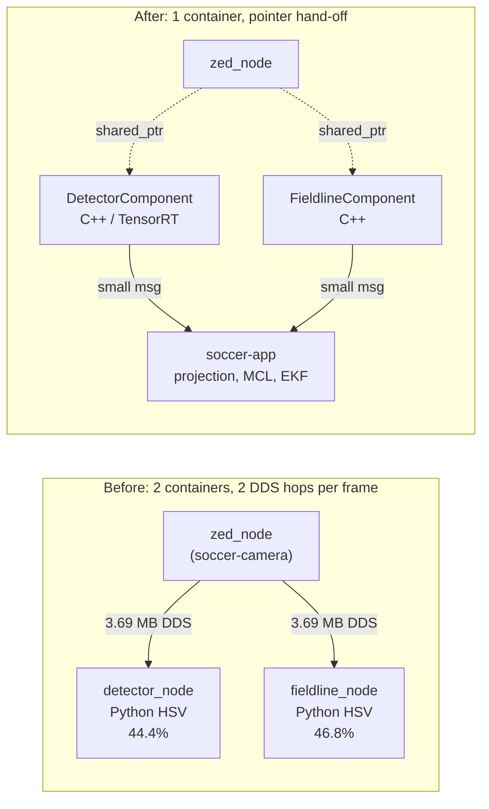

# GPU perception migration

> Replacing the CPU-bound Python HSV perception nodes with C++ components that
> run RF-DETR on TensorRT inside the camera container. This document records the
> measured baseline, the architecture and why it was chosen, the CPU budget that
> reserves headroom for the planned RL control loops, and a correctness bug found
> along the way that mattered more than the performance work.

---

## 1. Why this exists

Two Python nodes, [detector_node.py](../../ros2_ws/src/soccer_perception/soccer_perception/detector_node.py)
and [fieldline_node.py](../../ros2_ws/src/soccer_perception/soccer_perception/fieldline_node.py),
between them consumed **91.2 % of a CPU core** doing classical OpenCV on every
frame, in a different container from the camera, which meant every 1280x720
frame was serialised, pushed through CycloneDDS, and deserialised **twice**.

That is the headline problem. While measuring it, a worse one surfaced: the
field-line node has been feeding the localizer geometry computed from camera
intrinsics that do not match the camera (§2). Fix that first; the CPU work is
secondary.

---

## 2. The intrinsics bug (found while profiling, fixed here)

[fieldline_node.py](../../ros2_ws/src/soccer_perception/soccer_perception/fieldline_node.py)
built its ground-projection model from **hardcoded constants**:

```python
self._cam = PinholeCamera(
    fx=550.0, fy=550.0, cx=320.0, cy=240.0, width=640, height=480, ...)
```

The ZED Mini publishes 1280x720 and reports its real intrinsics on
`camera/camera_info`, which had **zero subscribers** — nothing in the graph was
reading them.

| Parameter | ZED reports | Hardcoded | Error |
|---|---|---|---|
| width x height | 1280 x 720 | 640 x 480 | 2x / 1.5x |
| fx, fy | 732.906 | 550.0 | -25 % |
| cx | 623.876 | 320.0 | -303.9 px |
| cy | 354.687 | 240.0 | -114.7 px |

Propagated through the flat-ground homography, using the node's own mounting
geometry (0.30 m height, 0.35 rad tilt):

| Pixel (u, v) | Correct (x, y) m | As shipped (x, y) m | Error |
|---|---|---|---|
| (640, 700) | 3.31, -0.07 | 0.83, -0.39 | **2.50 m** |
| (400, 650) | 9.08, 2.57 | 1.00, -0.12 | **8.51 m** |
| (900, 650) | 9.08, -3.17 | 1.00, -0.89 | **8.39 m** |
| (200, 700) | 3.31, 1.74 | 0.83, 0.15 | **2.95 m** |
| (1100, 700) | 3.31, -1.95 | 0.83, -0.96 | **2.67 m** |
| (640, 600) | above horizon | 1.28, -0.64 | fabricated |
| (640, 500) | above horizon | 3.27, -1.73 | fabricated |

Two distinct failure modes:

1. Every projected field-line point was wrong by **2.5 m to 8.5 m**.
2. Pixels **above the horizon** — which have no ground intersection at all —
   were silently converted into confident ground points. The wrong intrinsics
   move the horizon far enough up the image that a large band of pixels that
   should be rejected instead produce plausible-looking coordinates.

The MCL has therefore been localizing against partly fictional geometry. Any
previous conclusion about localization accuracy is suspect.

> **This is why the fix is a rewrite, not a constant.** Hardcoding intrinsics
> cannot be made safe; the node must take them from `camera_info` and must refuse
> to produce output before it has them.

[camera_model.hpp](../../ros2_ws/src/soccer_perception_gpu/include/soccer_perception_gpu/camera_model.hpp)
implements exactly that:

- `valid()` is false until the first `CameraInfo` arrives, and
  `FieldlineComponent` **publishes nothing** while invalid (throttled warning
  instead of silent wrong data).
- Degenerate `CameraInfo` (zero/negative focal length) is rejected rather than
  accepted.
- `project_flat_ground()` returns `std::nullopt` at or above the horizon instead
  of extrapolating.

Eight regression tests in
[test_camera_model.cpp](../../ros2_ws/src/soccer_perception_gpu/test/test_camera_model.cpp)
lock this in, including `HardcodedVgaIntrinsicsWouldMisprojectByMetres`, which
fails if anyone reintroduces the VGA constants.

---

## 3. Architecture

### 3.1 The transport problem

`camera/image_raw` is 1280x720 `bgra8` = **3.69 MB per frame**, measured at
**66.32 MB/s** on the wire at 18.1 Hz. It had exactly two subscribers, both
Python, both in the *other* container. Every frame therefore paid:

- one serialise in the ZED process,
- two DDS traversals plus two deserialises,
- two `cv_bridge` conversions into NumPy.



Only the small outputs (`detections`, `field_features`) still cross the
container boundary. The 66 MB/s image stream never leaves the process.

### 3.2 Why C++ and not Python

This is not a style preference; it is a hard constraint.

ROS 2 intra-process communication passes a `shared_ptr` to the subscriber
without serialising. **`rclpy` does not implement it.** A Python subscriber
always gets a serialised message, even in the same process. REP-2007 (Type
Adaptation), which is what would let a node receive a CUDA buffer or `cv::Mat`
directly, is `Final` but is **`rclcpp`-only** — there is no `rclpy` equivalent
and none proposed.

So: zero-copy requires C++ composition. There is no Python path to it. Both
nodes were rewritten as `rclcpp_components` plugins and are loaded into the
existing ZED `component_container_isolated` by
[camera.launch.py](../../ros2_ws/src/soccer_bringup/launch/camera.launch.py)
with `use_intra_process_comms: true`.

### 3.3 Why not Isaac ROS / NITROS

Isaac ROS 4.6.0 (2026-08-18) does support ROS 2 Jazzy, JetPack 7.2 and Orin, and
`isaac_ros_tensor_rt` would give us a maintained TensorRT node with NITROS
zero-copy type negotiation. It was still rejected:

| Consideration | Verdict |
|---|---|
| What we would gain | A TensorRT wrapper node — roughly the 200 lines in [trt_engine.cpp](../../ros2_ws/src/soccer_perception_gpu/src/trt_engine.cpp) |
| What we would take on | The GXF runtime, `isaac_ros_nitros`, `isaac_ros_managed_nitros`, `isaac-ros-cli`, and NVIDIA's release cadence as a hard dependency |
| Zero-copy benefit over plain composition | Marginal here: we have exactly one producer and two consumers in one process, which plain intra-process comms already handles |
| Image size | Several GB added to an image already at 48 GB across the repo, on a device with 114 GB free |
| Decode flexibility | RF-DETR's sigmoid-per-query output is not a stock detection decoder; we would be writing custom decode regardless |

Plain `rclcpp` composition gets the same transport win with no new runtime.
Revisit only if we adopt several Isaac ROS packages at once.

---

## 4. The detector

`DetectorComponent` runs the already-benchmarked RF-DETR nano FP16 engine.

Engine contract, read from the engine at load time rather than assumed:

| Binding | Shape | Meaning |
|---|---|---|
| `input` | 1x3x384x384 fp32 | RGB, `[0,1]`, letterboxed |
| `dets` | 1x300x4 fp32 | `cxcywh`, normalised to the letterbox canvas |
| `labels` | 1x300x91 fp32 | per-class logits — **sigmoid, not softmax** |

RF-DETR is a DETR variant: each of the 300 queries scores every class
independently, so the decoder applies a sigmoid per class and thresholds, rather
than taking a softmax argmax. Getting this wrong yields plausible-looking but
systematically wrong confidences.

Detections are un-letterboxed back to source pixels by
`Letterbox::to_source()` before publishing, so downstream consumers keep working
in full-resolution image coordinates and `projection_node` needs no change.

**Verified live on hardware**, camera pointed at a room, classes temporarily
widened to common COCO objects to exercise the decode path end to end:

```
- probability: 0.463  xmin: 930  ymin:  9  xmax: 1073  ymax: 176  class_id: plant
- probability: 0.335  xmin: 781  ymin: 49  xmax:  913  ymax: 180  class_id: plant
- probability: 0.327  xmin: 811  ymin: 472 xmax: 1088  ymax: 572  class_id: chair
```

Boxes land in-bounds for a 1280x720 frame, span the full image width (so the
letterbox scale and padding un-mapping are right), and `xbase`/`ybase` are the
bottom-centre contact point the projector expects.

### 4.1 Class limitation, stated plainly

The stock export is COCO-trained. We map class 37 (`sports ball`) to `ball` and
class 1 (`person`) to `robot`. **`person` is a poor proxy for a kneeling or
fallen humanoid robot, and there is no goalpost class at all.** This buys the
performance and architecture win now; it does not deliver competition-grade
detection. See §8.

---

## 5. The field-line node

The detector's replacement is a straight swap. The field-line node is not,
because there is no trained segmentation model yet. The migration is therefore
staged, and the component supports both backends behind one interface.

### Stage 1 (implemented): C++ with the classical backend, at half resolution

Measured cost of the classical pipeline on a **real captured frame** (an early
measurement on synthetic noise gave a 136 ms `findContours` outlier — a
pathological contour count that does not occur on real imagery; all numbers here
are from real frames):

| Stage | ms at 1280x720 |
|---|---|
| BGR to HSV (shared prologue) | 6.85 |
| `inRange` grass | 1.76 |
| `inRange` white | 1.41 |
| `dilate` 25x25 | 1.29 |
| `bitwise_and` | 0.26 |
| `np.where` | 4.46 |
| **total** | **16.03 (29.0 % of a core at 18.1 Hz)** |

Two independent wins, neither needing a neural network:

- **Half resolution.** Field lines are thick, high-contrast structures; 640x360
  loses nothing that matters. 29.0 % to **9.3 %** of a core. The
  `fallback_downscale` parameter controls this and scales the morphology kernel
  with it. At 384x216 it is 4.6 %, if more is ever needed.
- **No duplicated prologue.** The detector no longer computes HSV at all, so the
  6.85 ms BGR-to-HSV conversion happens once instead of twice.

### Stage 2 (supported, not yet trained): TensorRT segmentation

`FieldlineComponent` already has the TensorRT path written and selects it
automatically when `engine_path` is non-empty: sigmoid for a single-channel
mask, argmax against `line_class` for multi-channel. Training and exporting that
model is the remaining work; no code change is required to adopt it.

This ordering is deliberate. Swapping a working classical detector for an
untrained network would trade a measured 9.3 % of a core for unknown accuracy.

---

## 6. Measured results

### 6.1 Baseline, 2026-09-02, post-cold-boot, `MAXN_SUPER`

Per-process CPU, as a percentage of **one** core (the machine has six):

| Process | % of one core |
|---|---|
| `zed_node_main` | 76.3 |
| `mcl_node` | 52.8 |
| `fieldline_node` | 46.8 |
| `detector_node` | 44.4 |
| `ekf_node` | 42.8 |
| `ros2_control_node` | 13.5 |
| `projection_node` | 13.3 |
| `teamcomm_node` | 7.0 |
| `gc_bridge_node` | 5.2 |
| `robot_state_publisher` | 3.0 |
| **container totals** | **soccer-app 302.0 + soccer-camera 77.5 = 379.5** |

System: 63.2 % of six cores. GPU mean 12.9 % (median 3 %, p90 45 %). RAM 3593 MB
of 7485. VDD_IN mean 11.4 W, peak 13.4 W. Junction 59 degC.

Topic rates: `image_raw` 18.1 Hz, `depth` 19.0 Hz, `detections` 16.3 Hz,
`field_features` 16.8 Hz.

The camera never reached 30 Hz. GPU load was 12.9 % mean while four CPU-bound
Python nodes saturated the cores — the bottleneck was never the GPU.

### 6.2 Detector, measured side by side on live camera

Both detectors running simultaneously on the same stream, before the migration
was wired up:

| | Python HSV | C++ TensorRT (over DDS) |
|---|---|---|
| CPU | 51.7 % of a core | **21.1 %** |
| Output rate | 15.8 Hz | **17.2 Hz** |

**2.45x less CPU while keeping up better with the camera** — and this measurement
still pays the full DDS cost, because the test node was run standalone rather
than composed.

### 6.3 After the migration, measured on the same hardware

Stack restarted with the components composed into the camera container.

**Containers:**

| | Baseline | After | Delta |
|---|---|---|---|
| `soccer-app` | 302.0 % | **129.1 %** | -172.8 |
| `soccer-camera` | 77.5 % | **105.6 %** | +28.0 |
| **total** | **379.5 %** | **234.7 %** | **-144.8** |
| of six cores | 63.2 % | **39.1 %** | |

**1.45 cores freed** — roughly double the 0.74 projected in §7.1, because the
projection did not anticipate the `mcl_node` reduction below.

**Per process** (the two perception components no longer appear separately: they
are threads inside the ZED container process, which is the point):

| Process | Baseline | After |
|---|---|---|
| `zed_node_main` **incl. composed detector + fieldline** | 76.3 | **116.7** |
| `detector_node` | 44.4 | composed |
| `fieldline_node` | 46.8 | composed |
| *perception subtotal* | *167.5* | ***116.7*** *(-50.8)* |
| `mcl_node` | 52.8 | **37.4** |
| `ekf_node` | 42.8 | 42.8 |
| `projection_node` | 13.3 | 20.8 |
| `ros2_control_node` | 13.5 | 12.7 |
| `teamcomm_node` | 7.0 | 3.7 |

Two second-order effects worth understanding:

- **`mcl_node` fell 52.8 % to 37.4 %** without being touched. It now receives
  half-resolution field-line points *and* no longer receives the fabricated
  above-horizon points (§2). Some of that former cost was the filter processing
  invalid observations.
- **`projection_node` rose 13.3 % to 20.8 %** because `detections` went from
  16.3 Hz to 22.7 Hz. It is doing more real work, not less efficient work.

**Topic rates:**

| Topic | Baseline | After |
|---|---|---|
| `camera/image_raw` | 18.1 Hz | **20.0 Hz** |
| `detections` | 16.3 Hz | **22.7 Hz** |
| `field_features` | 16.8 Hz | **22.2 Hz** |

`detections` at 22.7 Hz exceeds the 20.0 Hz measured for `image_raw` because the
two are measured differently: the components receive frames **intra-process** at
the ZED's true publish rate, while `image_raw` was measured from the app
container across DDS. The gap is direct evidence that the pointer hand-off
delivers frames the DDS path was dropping.

**System:**

| | Baseline | After |
|---|---|---|
| GPU mean | 12.9 % | **34.7 %** |
| GPU p90 / max | 45 % / 65 % | 63 % / 88 % |
| RAM | 3593 MB | 3677 MB |
| VDD_IN mean | 11.4 W | 11.9 W |
| Junction temp | 59 degC | 62.9 degC |

Work moved from CPU to GPU, as intended, for +0.5 W and +4 degC.

### 6.4 Correction to an earlier claim

An earlier note in this work claimed `zed_node/point_cloud/cloud_registered` was
wasting 18.3 MB/s with zero subscribers. **That was wrong.** The ZED wrapper only
publishes the cloud while something is subscribed; the 18.3 MB/s appeared because
`ros2 topic hz` was itself the subscriber. Idle cost is approximately zero.

It is still disabled in
[zed_params_override.yaml](../../deploy/compose/zed_params_override.yaml), because
an advertised unused topic is a footgun: any casual `ros2 topic echo` costs the
grab loop 1.84 MB per sample. That is a robustness change, not a performance one,
and should not be counted as a saving.

---

## 7. CPU budget and RL headroom

The reservation is **1.5 cores (150 %) for RL control and neural-network
components**, held against the worst case since the control rate and placement
are not yet decided.

### 7.1 Where the cycles go

| Change | Mechanism | Saving (% of one core) | Basis |
|---|---|---|---|
| Detector: Python HSV to C++ TensorRT | GPU does the work; no rclpy, no NumPy | **23.3** | measured (44.4 to 21.1) |
| Compose detector into camera container | removes one 3.69 MB deserialise + `cv_bridge` copy per frame | **6 to 10** | projected |
| Fieldline: Python to C++ | removes rclpy + `cv_bridge` + DDS overhead | **17.8** | measured overhead share |
| Fieldline: full to half resolution | 4x fewer pixels | **19.7** | measured (29.0 to 9.3) |
| Deduplicate the BGR-to-HSV prologue | detector no longer needs HSV | **6.2** | measured (6.85 ms at 18.1 Hz) |
| **Total** | | **73 to 77** | |

Approximately **0.75 of a core** on this accounting, most of it measured rather
than assumed. The realised figure was **1.45 cores** (§7.2): the projection did
not anticipate the knock-on `mcl_node` reduction described in §6.3.

### 7.2 Result

| | Baseline | **Measured after** | Delta |
|---|---|---|---|
| System CPU (of 600 %) | 379.5 | **234.7** | -144.8 |
| As a fraction of six cores | 63.2 % | **39.1 %** | |
| Free | 220.5 % (2.21 cores) | **365.3 % (3.65 cores)** | +1.45 |
| Free after the 1.5-core RL reservation | 0.71 core | **2.15 cores** | **+1.44** |

The RL reservation goes from *barely covered* to *covered three times over*.
The measured saving beat the §7.1 projection by roughly 2x, mostly from the
unanticipated `mcl_node` reduction (§6.3).

> **GPU, not CPU, is now the constraint to watch for RL.** GPU mean went 12.9 %
> to 34.7 %, p90 to 63 %, max to 88 %. An RL policy network shares that GPU with
> RF-DETR and the ZED's neural depth. CPU headroom is ample; **budget the policy
> network against GPU time, and measure it against the 88 % peak rather than the
> 34.7 % mean.**

### 7.3 Levers if that is not enough

Tunable without redesign, in order of yield per unit of effort:

| Lever | Yield | Cost of pulling it |
|---|---|---|
| `fallback_downscale: 2` to `3` (640x360 to 384x216) | ~4.7 % core | coarser line points |
| CUDA preprocessing kernel (§8) | ~5 % core | ~1 day of work |
| Cap perception at 15 Hz instead of camera rate | ~15 % core | slower reaction |
| RF-DETR nano to a smaller input (384 to 320) | ~2 % core CPU, more GPU headroom | shorter detection range |
| Move `ekf_node` to C++ | up to ~25 % core | real rewrite |
| Move `mcl_node` to C++, or cut particle count | up to ~35 % core | real rewrite or accuracy loss |

### 7.4 The honest caveat

**After this migration, perception is no longer the bottleneck — localization
is.** `ekf_node` (42.8 %) and `mcl_node` (37.4 %) together burn 80.2 % of a core,
more than any other pair outside the camera process. They are the next target,
and §2 means their accuracy needs re-validating anyway now that they are
receiving correct geometry for the first time.

Memory is not a concern: 3677 MB of 7485 MB used, zero swap.

> **Update.** This has since been done. See
> [localization_tuning.md](localization_tuning.md): the pair now costs 46.0 % of
> a core instead of 79.8 %, and the noise models have been rederived from the
> corrected geometry. The headline finding is that almost none of the EKF's cost
> was arithmetic — it was waking up 200 times a second. The field-line range gate
> has also moved from 6 m to 4 m, because ground projection error grows as
> $r^2/h$ and reaches 1.12 m at 6 m.

---

## 8. Upgrade paths, in priority order

1. **Fine-tune RF-DETR on soccer data.** The largest *accuracy* win available.
   Stock COCO gives no goalpost class and a weak `person`-as-robot proxy (§4.1).
   Nothing in the architecture changes — export a new engine, point
   `engine_path` at it, update `class_ids` / `class_names`.
2. **Train the field-line segmentation model** to enable the Stage 2 path that is
   already implemented (§5).
3. **CUDA preprocessing.** Letterbox and normalisation currently cost about 6 %
   of a core on the CPU (3.52 ms measured for a 384x384 `blobFromImage`). A CUDA
   kernel writing straight into the input binding would cut this to roughly 1 %.
   Note `INTER_LINEAR` is used deliberately: `INTER_AREA` measured 10.41 ms
   against 2.21 ms for the same resize.
4. **Revisit `mcl_node` / `ekf_node`** (§7.4). Done — see
   [localization_tuning.md](localization_tuning.md).

---

## 9. Operational notes

### 9.1 TensorRT version locking, and why the headers are pinned

A TensorRT engine is locked to the runtime version that built it. The image has
`libnvinfer10` **10.16.2.10**, so the headers must match exactly.

The Ubuntu/CUDA `sbsa` repo only carries `libnvinfer-headers-dev` 10.16.1.11, and
its default candidate is **11.2.1.2**, which cannot load our engines. NVIDIA's
Jetson `r39.2` repo carries the exact **10.16.2.10**.
[Dockerfile.jetson](../../deploy/docker/Dockerfile.jetson) therefore re-adds that
repo pinned, installs the exact version, and strips the repo again.

> **Correction (2026-09-02).** An earlier check concluded no matching dev package
> existed and that 10.16.1.11 would have to do. That was wrong — it only inspected
> the default repos, which the Dockerfile deliberately removes. The exact match
> exists and is what is now pinned.

`TrtEngine` reports both versions on load and includes both in the exception
message if deserialisation fails, so a future mismatch is self-diagnosing:

```
RF-DETR ready: 384x384 input, 300 queries, 91 classes
               (TensorRT 101602, headers 101602)
```

### 9.2 Engines are not baked into the image

They are device- and version-locked and must be rebuildable without a Docker
build, so they live on a read-only bind mount:
`${SOCCER_MODELS_DIR:-${HOME}/rfdetr-bench-models}` to `/models`.

Use `${HOME}`, never `~` — Compose does not expand a tilde in a bind path and
will silently create a directory named `~`.

### 9.3 Failure behaviour

Both components are loaded into the **camera** container. A perception failure
must never take down the camera driver, so neither constructor throws: a missing
or unloadable engine is logged as an error and the node stays live, publishing
empty results with a throttled warning so the degraded state cannot be mistaken
for "nothing in view". `camera.launch.py` also returns a bare camera driver if
`soccer_perception_gpu` is absent, or if `perception:=false`.

`FieldlineComponent` is stricter still: no `camera_info`, no output. Silence is
the correct behaviour when the alternative is wrong geometry (§2).

---

## 10. Decision log

| Decision | Rationale |
|---|---|
| C++ components, not Python | `rclpy` has no intra-process path and REP-2007 is `rclcpp`-only. Zero-copy is unreachable from Python. |
| Composed into the camera container | Deletes 66 MB/s of serialise/transport/deserialise. Moving perception to the app container would reintroduce exactly the cost being removed. |
| Plain `rclcpp` composition, not Isaac ROS | Same transport win without adopting the GXF runtime and four packages for one wrapper node we can write in 200 lines. |
| Intrinsics from `camera_info`, never hardcoded | The hardcoded VGA values caused 2.5 to 8.5 m projection errors and fabricated above-horizon points. Locked by a regression test. |
| Refuse to publish before `camera_info` | Silence beats confidently wrong geometry into the localizer. |
| Field-line: C++ classical first, TensorRT later | Half resolution alone recovers 19.7 % of a core with no accuracy risk. Both backends are implemented; only training is outstanding. |
| Keep the classical backend permanently | It is the fallback when an engine is missing or fails to load. |
| Engines on a bind mount, not in the image | Version- and device-locked; must be rebuildable without a Docker build. |
| TensorRT headers pinned to 10.16.2.10 from the Jetson repo | Exact runtime match; the default repo would pull 11.x and break every engine. |
| Point cloud un-advertised | Footgun removal, not a performance saving — the corrected measurement shows idle cost is ~0 (§6.3). |
| Reserve 1.5 cores for RL | User-specified worst-case budget while the control rate is undecided. §7.3 lists the levers if it proves tight. |
